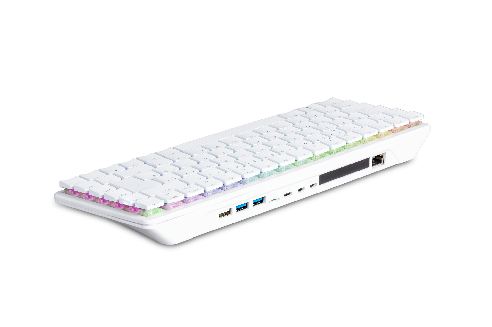

== Introduction

Raspberry Pi makes computers in several different **series**:

* **<<flagship-series, Single-board computers (SBCs)>>.** The flagship Raspberry Pi series offers high-performance hardware, a full Linux operating system, and a variety of common ports in a form factor roughly the size of a credit card.
* **<<keyboard-computers, Keyboard computers (X00)>>.** Raspberry Pi keyboard computers combine SBC hardware, a full Linux operating system, and common ports inside a compact keyboard case.
* **<<zero-series, Zero>>.** Small and affordable models in a minimal form factor that provide a full Linux operating system and essential ports with low power consumption.
* **<<compute-module-series, Compute Module (CM)>>.** Boards designed for embedded and industrial applications that provide the same hardware as flagship SBCs but in a smaller form factor with no on-board connectors. Instead, they connect to a separate baseboard that supplies the necessary ports and pins.
* **<<pico-series, Pico (microcontrollers)>>.** Small and versatile boards that don't run Linux. Instead of removable storage, programs are flashed directly onto on-board memory. Pico microcontrollers are ideal for real-time control and lightweight embedded projects.

[[flagship-series]]
=== Flagship single-board computer (SBC) series

*Model B* indicates the presence of an Ethernet port.
*Model A* indicates a lower-cost model in a smaller form factor with no Ethernet port, reduced RAM, and fewer USB ports to limit board height.

IMPORTANT: Raspberry Pi 2 Model B revisions 1.1 and 1.2 have reached End-of-Life (EoL) due to the discontinuation of the core SoC used in these products. The official EoL date was 16 October 2025. Raspberry Pi 2 Model B revision 1.3 offers the same mechanical footprint and a BCM2837B0 processor, and so is recommended for existing designs. For more information, see the official https://pip.raspberrypi.com/documents/RP-009284-PC-2[Obsolescence Notice].

[cols="6a,3,2,3,5"]
|===
| Model | SoC | Memory | GPIO | Connectivity

^.^a|
.Raspberry Pi Model B
image::images/model-b.jpg[alt="Raspberry Pi Model B"]
| xref:processors.adoc#bcm2835[BCM2835]
a|
256 MB

512 MB | 26-pin GPIO header
a|
* HDMI
* 2 × USB 2.0
* standard 15-pin, 1.0 mm pitch, 16 mm width, CSI (camera) port
* standard 15-pin, 1.0 mm pitch, 16 mm width, DSI (display) port
* 3.5 mm audio jack
* RCA composite video
* 100 Mb/s Ethernet RJ45
* SD card slot
* micro-USB power
^.^a|
.Raspberry Pi Model A
image::images/model-a.jpg[alt="Raspberry Pi Model A",width="80%"]
| xref:processors.adoc#bcm2835[BCM2835] | 256 MB | 26-pin GPIO header
a|
* HDMI
* USB 2.0
* standard 15-pin, 1.0 mm pitch, 16 mm width, CSI (camera) port
* standard 15-pin, 1.0 mm pitch, 16 mm width, DSI (display) port
* 3.5 mm audio jack
* RCA composite video
* SD card slot
* micro-USB power
^.^a|
.Raspberry Pi Model B+
image::images/model-b-plus.jpg[alt="Raspberry Pi Model B+"]
| xref:processors.adoc#bcm2835[BCM2835] | 512 MB | 40-pin GPIO header
a|
* HDMI
* 4 × USB 2.0
* standard 15-pin, 1.0 mm pitch, 16 mm width, CSI (camera) port
* standard 15-pin, 1.0 mm pitch, 16 mm width, DSI (display) port
* 3.5 mm AV jack
* 100 Mb/s Ethernet RJ45
* microSD card slot
* micro-USB power
^.^a|
.Raspberry Pi Model A+
image::images/model-a-plus.jpg[alt="Raspberry Pi Model A+"]
| xref:processors.adoc#bcm2835[BCM2835]
a|
256 MB

512 MB | 40-pin GPIO header
a|
* HDMI
* USB 2.0
* standard 15-pin, 1.0 mm pitch, 16 mm width, CSI (camera) port
* standard 15-pin, 1.0 mm pitch, 16 mm width, DSI (display) port
* 3.5 mm AV jack
* microSD card slot
* micro-USB power
^.^a|
.Raspberry Pi 2 Model B
image::images/2-model-b.jpg[alt="Raspberry Pi 2 Model B"]
a|
* revision 1.1: xref:processors.adoc#bcm2836[BCM2836]
* revision 1.2: xref:processors.adoc#bcm2837[BCM2837]
* revision 1.3: xref:processors.adoc#bcm2837b0[BCM2837B0]
| 1 GB | 40-pin GPIO header
a|
* HDMI
* 4 × USB 2.0
* standard 15-pin, 1.0 mm pitch, 16 mm width, CSI (camera) port
* standard 15-pin, 1.0 mm pitch, 16 mm width, DSI (display) port
* 3.5 mm AV jack
* 100 Mb/s Ethernet RJ45
* microSD card slot
* micro-USB power
^.^a|
.Raspberry Pi 3 Model B
image::images/3-model-b.jpg[alt="Raspberry Pi 3 Model B"]
a|
* revision 1.1: xref:processors.adoc#bcm2837[BCM2837]
* revision 1.2: xref:processors.adoc#bcm2837b0[BCM2837B0]
| 1 GB | 40-pin GPIO header
a|
* HDMI
* 4 × USB 2.0
* standard 15-pin, 1.0 mm pitch, 16 mm width, CSI (camera) port
* standard 15-pin, 1.0 mm pitch, 16 mm width, DSI (display) port
* 3.5 mm AV jack
* 100 Mb/s Ethernet RJ45
* 2.4 Ghz single-band 802.11n Wi-Fi (35 Mb/s)
* Bluetooth 4.1, Bluetooth Low Energy (BLE)
* microSD card slot
* micro-USB power
^.^a|
.Raspberry Pi 3 Model B+
image::images/3-model-b-plus.jpg[alt="Raspberry Pi 3 Model B+"]
| xref:processors.adoc#bcm2837b0[BCM2837B0] | 1 GB | 40-pin GPIO header
a|
* HDMI
* 4 × USB 2.0
* standard 15-pin, 1.0 mm pitch, 16 mm width, CSI (camera) port
* standard 15-pin, 1.0 mm pitch, 16 mm width, DSI (display) port
* 3.5 mm AV jack
* 300 Mb/s Ethernet RJ45 with PoE support
* 2.4/5 GHz dual-band 802.11ac Wi-Fi (100 Mb/s)
* Bluetooth 4.2, Bluetooth Low Energy (BLE)
* microSD card slot
* micro-USB power
^.^a|
.Raspberry Pi 3 Model A+
image::images/3-model-a-plus.jpg[alt="Raspberry Pi 3 Model A+"]
| xref:processors.adoc#bcm2837b0[BCM2837B0] | 512 MB | 40-pin GPIO header
a|
* HDMI
* USB 2.0
* standard 15-pin, 1.0 mm pitch, 16 mm width, CSI (camera) port
* standard 15-pin, 1.0 mm pitch, 16 mm width, DSI (display) port
* 3.5 mm AV jack
* 2.4/5 Ghz dual-band 802.11ac Wi-Fi (100 Mb/s)
* Bluetooth 4.2, Bluetooth Low Energy (BLE)
* microSD card slot
* micro-USB power
^.^a|
.Raspberry Pi 4 Model B
image::images/4-model-b.jpg[alt="Raspberry Pi 4 Model B"]
| xref:processors.adoc#bcm2711[BCM2711]
a|
1 GB

2 GB

4 GB

8 GB | 40-pin GPIO header
a|
* 2 × micro-HDMI
* 2 × USB 2.0
* 2 × USB 3.0
* standard 15-pin, 1.0 mm pitch, 16 mm width, CSI (camera) port
* standard 15-pin, 1.0 mm pitch, 16 mm width, DSI (display) port
* 3.5 mm AV jack
* Gigabit (1 Gb/s) Ethernet RJ45 with PoE+ support
* 2.4/5 GHz dual-band 802.11ac Wi-Fi (120 Mb/s)
* Bluetooth 5, Bluetooth Low Energy (BLE)
* microSD card slot
* USB-C power; 5 V at 3 A (15W)
^.^a|
.Raspberry Pi 5
image::images/5.jpg[alt="Raspberry Pi 5"]
| xref:processors.adoc#bcm2712[BCM2712]
a|
1 GB

2 GB

4 GB

8 GB

16 GB | 40-pin GPIO header
a|
* 2 × micro-HDMI
* 2 × USB 2.0
* 2 × USB 3.0
* 2 × mini 22-pin, 0.5 mm (fine) pitch, 11.5 mm width, combined CSI (camera)/DSI (display) ports
* single-lane https://datasheets.raspberrypi.com/pcie/pcie-connector-standard.pdf[PCIe FFC connector]
* https://datasheets.raspberrypi.com/debug/debug-connector-specification.pdf[UART connector]
* RTC battery connector
* xref:raspberry-pi.adoc#raspberry-pi-5-fan-connector-pinout[four-pin JST-SH PWM fan connector]
* Gigabit (1 Gb/s) Ethernet RJ45 with PoE+ support
* 2.4/5 GHz dual-band 802.11ac Wi-Fi 5 (300 Mb/s)
* Bluetooth 5, Bluetooth Low Energy (BLE)
* microSD card slot
* USB-C power; 5 V at 5 A (25W); or 5 V at 3 A (15 W) with a 600 mA peripheral limit
|===

For more information about the ports on the Raspberry Pi flagship series, see the xref:raspberry-pi.adoc#schematics-and-mechanical-drawings[Schematics and mechanical drawings].

[[keyboard-computers]]
=== Keyboard computer (X00) series

Keyboard series devices use model identifiers of the form `<X00>`, where `X` indicates the corresponding flagship single-board computer (SBC) series device. For example, Raspberry Pi 400 is the keyboard version of Raspberry Pi 4. For more detailed information about Raspberry Pi keyboard computers, see xref:keyboard-computers.adoc[Keyboard computers].

[cols="6a,2,2,3,5"]
|===
| Model | SoC | Memory | GPIO | Connectivity

^.^a|
.Raspberry Pi 400
image::images/400.jpg[alt="Raspberry Pi 400"]
| xref:processors.adoc#bcm2711[BCM2711] | 4 GB | 40-pin GPIO header
a|
* 2 × micro-HDMI
* USB 2.0
* 2 × USB 3.0
* Gigabit (1 Gb/s) Ethernet RJ45
* 2.4/5 GHz dual-band 802.11ac Wi-Fi (120 Mb/s)
* Bluetooth 5, Bluetooth Low Energy (BLE)
* microSD card slot
* USB-C power; 5 V at 3 A (15W)
^.^a|
.Raspberry Pi 500
image::images/500.png[alt="Raspberry Pi 500"]
| xref:processors.adoc#bcm2712[BCM2712] | 8 GB | 40-pin GPIO header
a|
* 2 × micro-HDMI
* USB 2.0
* 2 × USB 3.0
* Gigabit (1 Gb/s) Ethernet RJ45
* 2.4/5 GHz dual-band 802.11ac Wi-Fi 5 (300 Mb/s)
* Bluetooth 5, Bluetooth Low Energy (BLE)
* microSD card slot
* USB-C power; 5 V at 5 A (25W); or 5 V at 3 A (15W) with a 600 mA peripheral limit
^.^a|
.Raspberry Pi 500+

| xref:processors.adoc#bcm2712[BCM2712] | 16 GB | 40-pin GPIO header
a|
* 2 × micro-HDMI
* USB 2.0
* 2 × USB 3.0
* Gigabit (1 Gb/s) Ethernet RJ45
* 2.4/5 GHz dual-band 802.11ac Wi-Fi 5 (300 Mb/s)
* Bluetooth 5, Bluetooth Low Energy (BLE)
* microSD card slot
* Internal M.2 SSD (256 GB)
* USB-C power; 5 V at 5 A (25W)
|===

[[zero-series]]
=== Zero series

Models with the *H* suffix have header pins pre-soldered to the GPIO header. Models that lack the *H* suffix don't come with header pins attached to the GPIO header; the user must solder pins manually or attach a third-party pin kit.

All Zero models have the following connectivity:

* A microSD card slot
* A mini HDMI port
* 2 × micro-USB ports (one for input power, one for external devices)

Since version 1.3 of the original Zero, all Zero models also include a mini 22-pin, 0.5 mm (fine) pitch, 11.5 mm width, CSI (camera) port.

[cols="3a,1,1,1,2"]
|===
| Model | SoC | Memory | GPIO | Wireless Connectivity

^.^a|
.Raspberry Pi Zero
image::images/zero.jpg[alt="Raspberry Pi Zero"]
| xref:processors.adoc#bcm2835[BCM2835] | 512 MB | 40-pin GPIO header (unpopulated) ^| none
^.^a|
.Raspberry Pi Zero W
image::images/zero-w.jpg[alt="Raspberry Pi Zero W"]
| xref:processors.adoc#bcm2835[BCM2835] | 512 MB | 40-pin GPIO header (unpopulated)
a|
* 2.4 GHz single-band 802.11n Wi-Fi (35 Mb/s)
* Bluetooth 4.0, Bluetooth Low Energy (BLE)
^.^a|
.Raspberry Pi Zero WH
image::images/zero-wh.jpg[alt="Raspberry Pi Zero WH"]
| xref:processors.adoc#bcm2835[BCM2835] | 512 MB | 40-pin GPIO header
a|
* 2.4 GHz single-band 802.11n Wi-Fi (35 Mb/s)
* Bluetooth 4.0, Bluetooth Low Energy (BLE)
^.^a|
.Raspberry Pi Zero 2 W
image::images/zero-2-w.jpg[alt="Raspberry Pi Zero 2 W"]
| xref:processors.adoc#rp3a0[RP3A0] | 512 MB | 40-pin GPIO header (unpopulated)
a|
* 2.4 GHz single-band 802.11n Wi-Fi (35 Mb/s)
* Bluetooth 4.2, Bluetooth Low Energy (BLE)
^.^a|
.Raspberry Pi Zero 2 WH
image::images/zero-2-wh.png[alt="Raspberry Pi Zero 2 WH"]
| xref:processors.adoc#rp3a0[RP3A0] | 512 MB | 40-pin GPIO header
a|
* 2.4 GHz single-band 802.11n Wi-Fi (35 Mb/s)
* Bluetooth 4.2, Bluetooth Low Energy (BLE)
|===

[[compute-module-series]]
=== Compute Module series

IMPORTANT: Raspberry Pi Compute Module 3 (CM3) and Compute Module 3 Lite (CM3Lite) have reached End-of-Life (EoL) due to the discontinuation of the core SoC used in these products. The official EoL date was 16 October 2025. The closest equivalent to CM3 is Raspberry Pi Compute Module 3+, which offers the same mechanical footprint, improved thermal design, and a BCM2837B0 processor, and so is recommended for existing designs. For new designs requiring the SODIMM form factor, we recommend Compute Module 4S. For all other new designs, we recommend Compute Module 4 or Compute Module 5. For more information, see the official https://pip.raspberrypi.com/documents/RP-009286-PC[Obsolescence Notice].

For more detailed information about the Raspberry Pi Compute Module hardware, see xref:compute-module.adoc[Compute Module hardware].

[cols="3a,1,1,1,1,2"]
|===
| Model | SoC | Memory | Storage | Form factor | Wireless Connectivity

^.^a|
.Raspberry Pi Compute Module 1
image::images/compute-module-1.jpg[alt="Raspberry Pi Compute Module 1"]
| xref:processors.adoc#bcm2835[BCM2835] | 512 MB
| 4 GB | DDR2 SODIMM ^| none
^.^a|
.Raspberry Pi Compute Module 3
image::images/compute-module-3.jpg[alt="Raspberry Pi Compute Module 3"]
| xref:processors.adoc#bcm2837[BCM2837] | 1 GB
a|
0 GB (Lite)

4 GB | DDR2 SODIMM ^| none
^.^a|
.Raspberry Pi Compute Module 3+
image::images/compute-module-3-plus.jpg[alt="Raspberry Pi Compute Module 3+"]
| xref:processors.adoc#bcm2837b0[BCM2837B0] | 1 GB
a|
0 GB (Lite)

8 GB

16 GB

32 GB | DDR2 SODIMM ^| none
^.^a|
.Raspberry Pi Compute Module 4S
image::images/compute-module-4s.jpg[alt="Raspberry Pi Compute Module 4S"]
| xref:processors.adoc#bcm2711[BCM2711]
a|
1 GB

2 GB

4 GB

8 GB
a|
0 GB (Lite)

8 GB

16 GB

32 GB | DDR2 SODIMM ^| none
^.^a|
.Raspberry Pi Compute Module 4
image::images/compute-module-4.jpg[alt="Raspberry Pi Compute Module 4"]
| xref:processors.adoc#bcm2711[BCM2711]
a|
1 GB

2 GB

4 GB

8 GB
a|
0 GB (Lite)

8 GB

16 GB

32 GB
| dual 100-pin high density connectors
a| optional:

* 2.4/5 GHz dual-band 802.11ac Wi-Fi 5 (300 Mb/s)
* Bluetooth 5, Bluetooth Low Energy (BLE)

^.^a|
.Raspberry Pi Compute Module 5
image::images/compute-module-5.png[alt="Raspberry Pi Compute Module 5"]
| xref:processors.adoc#bcm2712[BCM2712]
a|
2 GB

4 GB

8 GB

16 GB
a|
0 GB (Lite)

16 GB

32 GB

64 GB
| dual 100-pin high density connectors
a| optional:

* 2.4/5 GHz dual-band 802.11ac Wi-Fi 5 (300 Mb/s)
* Bluetooth 5, Bluetooth Low Energy (BLE)
|===

NOTE: Compute Modules that use the physical DDR2 SODIMM form factor are *not* compatible with DDR2 SODIMM electrical specifications.

[[pico-series]]
=== Pico microcontrollers

Models with the *H* suffix have header pins pre-soldered to the GPIO header. Models that lack the *H* suffix do not come with header pins attached to the GPIO header; the user must solder pins manually or attach a third-party pin kit.

[cols="3a,1,1,1,1,2"]
|===
| Model | SoC | Memory | Storage | GPIO | Wireless Connectivity

|
.Raspberry Pi Pico
image::images/pico.png[alt="Raspberry Pi Pico"]
| xref:../microcontrollers/silicon.adoc#rp2040[RP2040] | 264 KB | 2 MB | two 20-pin GPIO headers (unpopulated) ^| none
|
.Raspberry Pi Pico H
image::images/pico-h.png[alt="Raspberry Pi Pico H"]
| xref:../microcontrollers/silicon.adoc#rp2040[RP2040] | 264 KB | 2 MB | two 20-pin GPIO headers ^| none
|
.Raspberry Pi Pico W
image::images/pico-w.png[alt="Raspberry Pi Pico W"]
| xref:../microcontrollers/silicon.adoc#rp2040[RP2040] | 264 KB | 2 MB | two 20-pin GPIO headers (unpopulated)
a|
* 2.4 GHz single-band 802.11n Wi-Fi (10 Mb/s)
* Bluetooth 5.2, Bluetooth Low Energy (BLE)
|
.Raspberry Pi Pico WH
image::images/pico-wh.png[alt="Raspberry Pi Pico WH"]
| xref:../microcontrollers/silicon.adoc#rp2040[RP2040] | 264 KB | 2 MB | two 20-pin GPIO headers
a|
* 2.4 GHz single-band 802.11n Wi-Fi (10 Mb/s)
* Bluetooth 5.2, Bluetooth Low Energy (BLE)
|
.Raspberry Pi Pico 2
image::images/pico-2.png[alt="Raspberry Pi Pico 2"]
| xref:../microcontrollers/silicon.adoc#rp2350[RP2350] | 520 KB | 4 MB | two 20-pin GPIO headers (unpopulated) ^| none
|
.Raspberry Pi Pico 2 W
image::images/pico-2-w.png[alt="Raspberry Pi Pico 2 W"]
| xref:../microcontrollers/silicon.adoc#rp2350[RP2350] | 520 KB | 4 MB | two 20-pin GPIO headers (unpopulated) a|
* 2.4 GHz single-band 802.11n Wi-Fi (10 Mb/s)
* Bluetooth 5.2, Bluetooth Low Energy (BLE)

|===

For more information about Raspberry Pi Pico models, see xref:../microcontrollers/pico-series.adoc[the Pico documentation].
