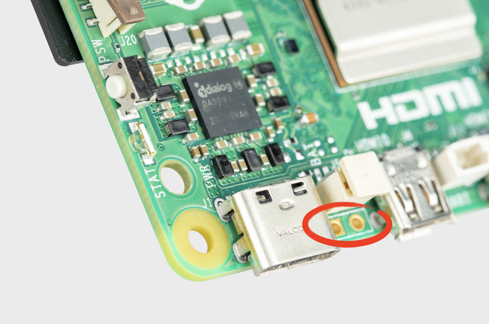

== Power button

NOTE: This section only applies to Raspberry Pi models with a power button, such as the Raspberry Pi 5.

When you plug your Raspberry Pi into power for the first time, it will automatically turn on and boot into the operating system without having to push the button.

If you run Raspberry Pi Desktop, you can initiate a clean shutdown by briefly pressing the power button. A window will appear asking whether you want to shutdown, reboot, or logout.

Select an option or press the power button again to initiate a clean shutdown.

NOTE: If you run Raspberry Pi Desktop, you can press the power button twice in quick succession to shut down. If you run Raspberry Pi OS Lite without a desktop, press the power button a single time to initiate a shutdown.

=== Restart

If the Raspberry Pi board is turned off, but still connected to power, pressing the power button restarts the board.

NOTE: Resetting the Power Management Integrated Circuit (PMIC) can also restart the board. Connecting a HAT can reset the PMIC. Always disconnect your device from the power supply before connecting a HAT.

=== Hard shutdown

To force a hard shutdown, press and hold the power button.

=== Add your own power button

.The J2 jumper

The J2 jumper is located between the RTC battery connector and the board edge. This breakout allows you to add your own power button to Raspberry Pi 5 by adding a Normally Open (NO) momentary switch bridging the two pads. Briefly closing this switch will perform the same actions as the onboard power button.
