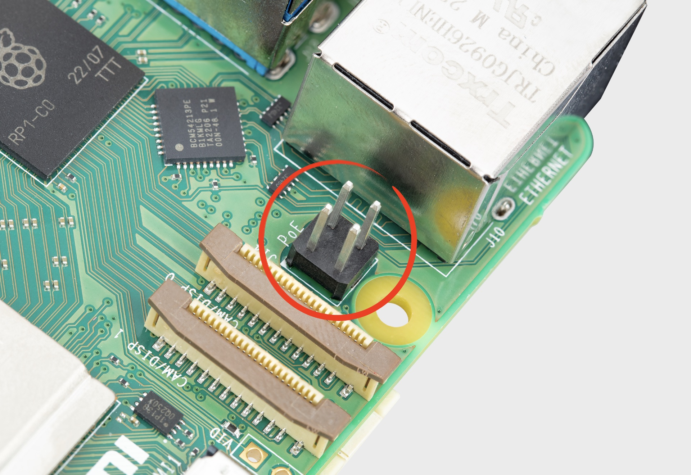

== Power supply

The power supply requirements differ by Raspberry Pi model. All models require a 5.1V supply, but the current required generally increases according to model. All models up to the Raspberry Pi 3 require a micro USB power connector, while Raspberry Pi 4, Raspberry Pi 400, and Raspberry Pi 5 use a USB-C connector.

[[powering-raspberry-pi-5]]

The current consumed by each Raspberry Pi depends on the peripherals connected.

=== Recommended power supplies

For Raspberry Pi 1, Raspberry Pi 2, and Raspberry Pi 3, we recommend the https://www.raspberrypi.com/products/micro-usb-power-supply/[2.5A micro USB supply]. For Raspberry Pi 4 and Raspberry Pi 400, we recommend the https://www.raspberrypi.com/products/type-c-power-supply/[3A USB-C Supply for Raspberry Pi 4]. For Raspberry Pi 5, we recommend the https://www.raspberrypi.com/products/27w-power-supply/[27 W USB-C Power Supply].

NOTE: No Raspberry Pi models support USB-PPS.

NOTE: If you use a third-party USB-PD multi-port power supply, plugging an additional device into the supply when your Raspberry Pi is connected causes a renegotiation between the supply and the Raspberry Pi. If the Raspberry Pi is powered, this happens seamlessly. If the Raspberry Pi is powered down, this renegotiation may cause the Raspberry Pi to boot.

=== Power over Ethernet (PoE) connector

.Raspberry Pi 5 PoE header

The Ethernet jack on Raspberry Pi 5 is PoE+ capable, supporting the IEEE 802.3at-2009 PoE standard.

The Ethernet jack on Raspberry Pi 4B and Pi 3B+ is PoE capable, supporting the IEEE 802.3af-2003 PoE standard.

All Raspberry Pi models with a PoE-capable Ethernet jack require a HAT to draw power through the Ethernet port. For models that support PoE, we recommend the https://www.raspberrypi.com/products/poe-hat/[PoE HAT]. For models that support PoE+, we recommend the https://www.raspberrypi.com/products/poe-plus-hat/[PoE+ HAT].

=== Typical power requirements

|===
| Product | Recommended PSU current capacity | Maximum total USB peripheral current draw | Typical bare-board active current consumption

| Raspberry Pi 1 Model A
| 700mA
| 500mA
| 200mA

| Raspberry Pi 1 Model B
| 1.2A
| 500mA
| 500mA

| Raspberry Pi 1 Model A+
| 700mA
| 500mA
| 180mA

| Raspberry Pi 1 Model B+
| 1.8A
| 1.2A
| 330mA

| Raspberry Pi 2 Model B
| 1.8A
| 1.2A
| 350mA

| Raspberry Pi 3 Model B
| 2.5A
| 1.2A
| 400mA

| Raspberry Pi 3 Model A+
| 2.5A
| Limited by PSU, board, and connector ratings only.
| 350mA

| Raspberry Pi 3 Model B+
| 2.5A
| 1.2A
| 500mA

| Raspberry Pi 4 Model B
| 3.0A
| 1.2A
| 600mA

| Raspberry Pi 5
| 5.0A
| 1.6A (600mA if using a 3A power supply)
| 800mA

| Pi 400
| 3.0A
| 1.2A
| 800mA

| Pi 500
| 5.0A
| 1.6A (600mA if using a 3A power supply)
| 800mA

| Pi 500+
| 5.0A
| 1.6A
| 800mA (with LEDs off and SSD inactive)

| Zero
| 1.2A
| Limited by PSU, board, and connector ratings only
| 100mA

| Zero W
| 1.2A
| Limited by PSU, board, and connector ratings only.
| 150mA

| Zero 2 W
| 2A
| Limited by PSU, board, and connector ratings only.
| 350mA
|===

NOTE: The Raspberry Pi 5 provides 1.6A of power to downstream USB peripherals when connected to a power supply capable of 5A at +5V (25W). When connected to any other compatible power supply, the Raspberry Pi 5 restricts downstream USB devices to 600mA of power.

Most Raspberry Pis provide enough current to USB peripherals to power most USB devices, including keyboards, mice, and adapters. However, some devices require additional current, including modems, external disks, and high-powered antenna. To connect a USB device with power requirements that exceed the values specified in the table above, connect it using an externally-powered USB hub.

The power requirements of the Raspberry Pi increase as you make use of the various interfaces on the Raspberry Pi. Combined, the GPIO pins can draw 50mA safely; each pin can individually draw up to 16mA. The HDMI port uses 50mA. The Camera Module requires 250mA. USB keyboards and mice can take as little as 100mA or as much as 1000mA. Check the power rating of the devices you plan to connect to the Raspberry Pi and purchase a power supply accordingly. If you're not sure, use an externally-powered USB hub.

Run the following command to check the status of power output to the USB ports:

[source,console]
----
$ vcgencmd get_config usb_max_current_enable
----

The following table describes the amount of power (in amps) drawn by different Raspberry Pi models during various workloads:

|===
| | | Raspberry Pi 1B+ | Raspberry Pi 2B | Raspberry Pi 3B | Raspberry Pi Zero | Raspberry Pi 4B
| Boot | Max | 0.26 | 0.40 | 0.75 | 0.20 | 0.85
| | Avg | 0.22 | 0.22 | 0.35 | 0.15 | 0.7
| Idle | Avg | 0.20 | 0.22 | 0.30 | 0.10 | 0.6
| Video playback (H.264) | Max | 0.30 | 0.36 |0.55 |0.23 | 0.85
| | Avg | 0.22 | 0.28 | 0.33 | 0.16 | 0.78
| Stress | Max | 0.35 | 0.82 | 1.34 | 0.35 | 1.25
| | Avg | 0.32 | 0.75 | 0.85 | 0.23 | 1.2
| Halt current | | | | 0.10 | 0.055 | 0.023
|===

NOTE: These measurements used a standard Raspberry Pi OS image (current as of 26 Feb 2016, or June 2019 for the Raspberry Pi 4), at room temperature, with the Raspberry Pi connected to a HDMI monitor, USB keyboard, and USB mouse. The Raspberry Pi 3 Model B was connected to a wireless LAN access point, the Raspberry Pi 4 was connected to Ethernet. All these power measurements are approximate and do not take into account power consumption from additional USB devices; power consumption can easily exceed these measurements if multiple additional USB devices or a HAT are connected to the Raspberry Pi.

[.whitepaper, title="Extra PMIC features on Raspberry Pi 4, Raspberry Pi 5 and Compute Module 4", subtitle="", link=https://pip.raspberrypi.com/documents/RP-004340-WP-Extra-PMIC-features-on-Raspberry-Pi-4-and-Compute-Module-4.pdf]
****
A number of different PMIC devices have been used on Raspberry Pi 4, Raspberry Pi 5 and CM4. All the PMICs provide extra functionality alongside that of voltage supply. This document describes how to access these features in software.
****

==== Decrease Raspberry Pi 5 wattage when turned off

By default, the Raspberry Pi 5 consumes around 1 W to 1.4 W of power when turned off. This can be decreased by manually editing the EEPROM configuration with `sudo rpi-eeprom-config -e`. Change the settings to the following:

[source,ini]
----
BOOT_UART=1
POWER_OFF_ON_HALT=1
BOOT_ORDER=0xf416
----

This should drop the power consumption when powered down to around 0.01W.

=== Power supply warnings

On all models of Raspberry Pi since the Raspberry Pi B+ (2014) except the Zero range, there is low-voltage detection circuitry that will detect if the supply voltage drops below 4.63V (±5%). This will result in an entry being added to the kernel log.

If you see warnings, switch to a higher quality power supply and cable. Low quality power supplies can corrupt storage or cause unpredictable behaviour within the Raspberry Pi.

Voltages can drop for a variety of reasons. You may have plugged in too many high-demand USB devices. The power supply could be inadequate. Or the power supply cable could use wires that are too thin.

[.whitepaper, title="Making a more resilient file system", subtitle="", link=https://pip.raspberrypi.com/documents/RP-003610-WP-Making-a-more-resilient-file-system.pdf]
****
Raspberry Pi devices are frequently used as data storage and monitoring devices, often in places where sudden power-downs may occur. As with any computing device, power dropouts can cause storage corruption.

This white paper provides some options on how to prevent data corruption under these and other circumstances by selecting appropriate file systems and setups to ensure data integrity.
****

=== Power supplies and Raspberry Pi OS

The bootloader passes information about the power supply via device-tree `/proc/device-tree/chosen/power`. Users will typically not read this directly.

max_current:: The max current in mA
uspd_power_data_objects:: A dump of the PDOs - debug for advanced users
usb_max_current_enable:: Whether the current limiter was set to high or low
usb_over_current_detected:: Whether any USB over current occurred during boot before transferring control to the OS
reset_event:: The PMIC reset reason e.g. watchdog, over- or under-voltage, over-temperature

The PMIC has built-in ADCs that, among other things, can measure the supply voltage `EXT5V_V`. Use the following command to view ADC measurements:

[source,console]
----
$ vcgencmd pmic_read_adc
----

You can't see USB current or anything else connected directly to 5V, because this bypasses the PMIC. You should not expect this to add up to the wattage of the source power supply. However, it can be useful to monitor things like the core voltage.

=== Back-powering

The USB specification requires that USB devices must not supply current to upstream devices. If a USB device does supply current to an upstream device, then this is called back-powering. Often this happens when a badly-made powered USB hub is connected, and will result in the powered USB hub supplying power to the host Raspberry Pi. This is not recommended since the power being supplied to the Raspberry Pi via the hub will bypass the protection circuitry built into the Raspberry Pi, leaving it vulnerable to damage in the event of a power surge.
