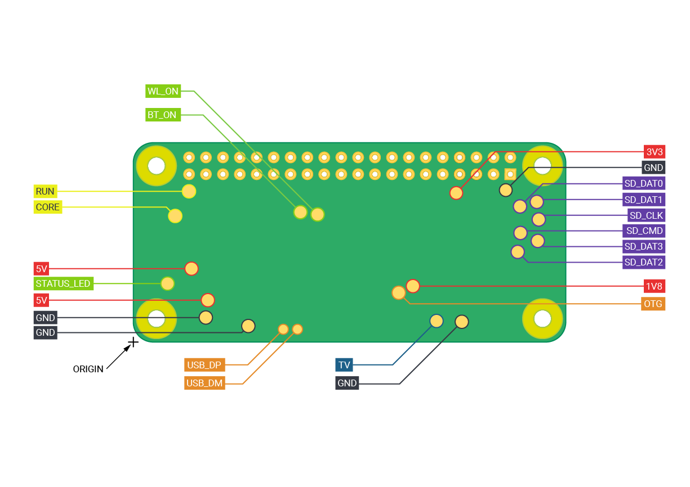

== Schematics and Mechanical Drawings

Schematics for the various Raspberry Pi board versions:

=== Raspberry Pi 4 Model B

* https://datasheets.raspberrypi.com/rpi4/raspberry-pi-4-reduced-schematics.pdf[Schematics, Revision 4.0]
* https://datasheets.raspberrypi.com/rpi4/raspberry-pi-4-mechanical-drawing.pdf[Mechanical Drawings, PDF]
* https://datasheets.raspberrypi.com/rpi4/raspberry-pi-4-mechanical-drawing.dxf[Mechanical Drawings, DXF]

=== Raspberry Pi 3 Model B+

* https://datasheets.raspberrypi.com/rpi3/raspberry-pi-3-b-plus-reduced-schematics.pdf[Schematics, Revision 1.0]
* https://datasheets.raspberrypi.com/rpi3/raspberry-pi-3-b-plus-mechanical-drawing.pdf[Mechanical Drawings, PDF]
* https://datasheets.raspberrypi.com/rpi3/raspberry-pi-3-b-plus-mechanical-drawing.dxf[Mechanical Drawings, DXF]
* https://datasheets.raspberrypi.com/case/raspberry-pi-3-b-plus-case-mechanical-drawing.pdf[Case Drawings, PDF]

=== Raspberry Pi 3 Model B

* https://datasheets.raspberrypi.com/rpi3/raspberry-pi-3-b-reduced-schematics.pdf[Schematics, Revision 1.2]
* https://datasheets.raspberrypi.com/rpi3/raspberry-pi-3-b-mechanical-drawing.pdf[Mechanical Drawings, PDF]
* https://datasheets.raspberrypi.com/rpi3/raspberry-pi-3-b-mechanical-drawing.dxf[Mechanical Drawings, DXF]

=== Raspberry Pi 2 Model B

* https://datasheets.raspberrypi.com/rpi2/raspberry-pi-2-b-reduced-schematics.pdf[Schematics, Revision 1.2]

=== Raspberry Pi 1 Model B+

* https://datasheets.raspberrypi.com/rpi/raspberry-pi-b-plus-reduced-schematics.pdf[Schematics, Revision 1.2]
* https://datasheets.raspberrypi.com/rpi/raspberry-pi-b-plus-mecahnical-drawing.pdf[Mechanical Drawings, PDF]
* https://datasheets.raspberrypi.com/rpi/raspberry-pi-b-plus-mecahnical-drawing.dxf[Mechanical Drawings, DXF]

=== Raspberry Pi 3 Model A+

* https://datasheets.raspberrypi.com/rpi3/raspberry-pi-3-a-plus-reduced-schematics.pdf[Schematics, Revision 1.0]
* https://datasheets.raspberrypi.com/rpi3/raspberry-pi-3-a-plus-mechanical-drawing.pdf[Mechanical Drawings, PDF]
* https://datasheets.raspberrypi.com/case/raspberry-pi-3-a-plus-case-mechanical-drawing.pdf[Case Drawings, PDF]

NOTE: Mechanical drawings for the Raspberry Pi 3 Model A+ are also applicable to the Raspberry Pi 1 Model A+.

=== Raspberry Pi 1 Model A+

* https://datasheets.raspberrypi.com/rpi/raspberry-pi-a-plus-reduced-schematics.pdf[Schematics, Revision 1.1]

=== Raspberry Pi Zero

* https://datasheets.raspberrypi.com/rpizero/raspberry-pi-zero-reduced-schematics.pdf[Schematics, Revision 1.3]
* https://datasheets.raspberrypi.com/rpizero/raspberry-pi-zero-mechanical-drawing.pdf[Mechanical Drawings, PDF]
* https://datasheets.raspberrypi.com/case/raspberry-pi-zero-case-mechanical-drawing.pdf[Case Drawings, PDF - Blank Lid]
* https://datasheets.raspberrypi.com/case/raspberry-pi-zero-case-with-gpio-mechanical-drawing.pdf[Case Drawings, PDF - GPIO Lid]
* https://datasheets.raspberrypi.com/case/raspberry-pi-zero-case-with-camera-mechanical-drawing.pdf[Case Drawings, PDF - Camera Lid]

=== Raspberry Pi Zero W

* https://datasheets.raspberrypi.com/rpizero/raspberry-pi-zero-w-reduced-schematics.pdf[Schematics, Revision 1.1]
* https://datasheets.raspberrypi.com/rpizero/raspberry-pi-zero-w-mechanical-drawing.pdf[Mechanical Drawings, PDF]

=== Raspberry Pi Zero 2 W

* https://datasheets.raspberrypi.com/rpizero2/raspberry-pi-zero-2-w-reduced-schematics.pdf[Schematics]
* https://datasheets.raspberrypi.com/rpizero2/raspberry-pi-zero-2-w-mechanical-drawing.pdf[Mechanical Drawings, PDF]
* https://datasheets.raspberrypi.com/rpizero2/raspberry-pi-zero-2-w-test-pads.pdf[Test Pad Positions]

==== Test Pad Locations

The Raspberry Pi Zero 2 W has a number of test pad locations used during production of the board. 

|===
| Label | Function | X (mm from origin) | Y (mm from origin)

| STATUS_LED	| Power state of LED (LOW = ON)	| 5.15	| 8.8
| CORE	| Processor power	| 6.3	| 18.98
| RUN	| Connect to GND to reset	| 8.37	| 22.69
| 5V	| 5V Input	| 8.75	| 11.05
| 5V	| 5V Input	| 11.21	| 6.3
| GND	| Ground pin	| 10.9	| 3.69
| GND	| Ground pin	| 17.29	| 2.41
| USB_DP	| USB port	| 22.55	| 1.92
| USB_DM |	USB port	| 24.68	| 1.92
| OTG	| On-the-go ID pin	| 39.9	| 7.42
| 1V8	| 1.8V analog supply	| 42.03	| 8.42
| TV	| Composite TV out	| 45.58	| 3.17
| GND	| Ground pin	| 49.38	| 3.05
| GND	| Ground pin	| 55.99	| 22.87
| 3V3	| 3.3V I/O supply	| 48.55	| 22.44
| SD_CLK	| SD Card clock pin	| 60.95	| 18.45
| SD_CMD	| SD Card command pin	| 58.2	| 16.42
| SD_DAT0	| SD data pin	| 58.13	| 20.42
| SD_DAT1	| SD data pin	| 60.65	| 21.1
| SD_DAT2	| SD data pin	| 57.78	| 13.57
| SD_DAT3	| SD data pin	| 60.8	| 15.22
| BT_ON	| Bluetooth power status	| 25.13	| 19.55
| WL_ON	| Wireless LAN power status	| 27.7	| 19.2

|===
