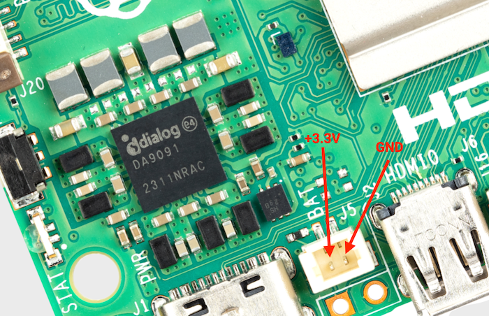

== Real Time Clock (RTC)

The Raspberry Pi 5 includes an RTC module. This can be battery powered through the J5 (BAT) connector on the board. When the components are facing up and the logo is in the correct orientation, the J5 connector is located towards the near left corner of the board and to the right of the USB-C power connector.

.The J5 battery connector

You can set a wake alarm, which switches the board to a very low-power state (approximately 3 mA). When the alarm time is reached, the board powers back on. This can be useful for periodic jobs like time-lapse imagery.

To support the low-power mode for wake alarms:

. Edit the bootloader configuration.
+
[source,console]
----
$ sudo -E rpi-eeprom-config --edit
----

. Add the following two lines.
+
[source,ini]
----
POWER_OFF_ON_HALT=1
WAKE_ON_GPIO=0
----

You can test the functionality with:

[source,console]
----
$ echo +600 | sudo tee /sys/class/rtc/rtc0/wakealarm
$ sudo halt
----

This command halts the board into a very low-power state, then wakes and restarts after 10 minutes.

The RTC also provides the time on boot, for example, in `dmesg`, for use cases that lack access to NTP:

----
[    1.295799] rpi-rtc soc:rpi_rtc: setting system clock to 2023-08-16T15:58:50 UTC (1692201530)
----

NOTE: The RTC is still usable even when there's no backup battery attached to the J5 connector.

=== Add a backup battery

.Lithium-manganese rechargeable RTC battery
image::images/rtc-battery.jpg[alt="Lithium-manganese rechargeable RTC battery",width="70%"]

The official battery part is a rechargeable lithium manganese coin cell, with a pre-fitted two-pin JST-SH plug and an adhesive mounting pad. This is suitable for powering the RTC when the main power supply for the board is disconnected. Since the current draw when powered down measures in single-digit µA, the retention time measures in months.

NOTE: We don't recommend using a primary (non-rechargeable) lithium cell for the RTC. The RTC backup current consumption is higher than most dedicated RTC modules and results in a short service life.

WARNING: Don't use a Lithium Ion cell for the RTC.

=== Enable battery charging

The RTC is equipped with a constant-current (3 mA) constant-voltage charger.

Charging of the battery is disabled by default. There are `sysfs` files that show the charging voltage and limits:

----
$ grep . /sys/class/rtc/rtc0/charging_voltage*

/sys/class/rtc/rtc0/charging_voltage:0
/sys/class/rtc/rtc0/charging_voltage_max:4400000
/sys/class/rtc/rtc0/charging_voltage_min:1300000
----

To charge the battery at a set voltage, add https://github.com/raspberrypi/firmware/blob/master/boot/overlays/README#L400[`rtc_bbat_vchg`] to `/boot/firmware/config.txt`:

[source,ini]
----
dtparam=rtc_bbat_vchg=3000000
----

Reboot with `sudo reboot` to use the new voltage setting. Check the `sysfs` files to ensure that the charging voltage was correctly set.

=== Disable battery charging

To stop charging, remove any lines that contain https://github.com/raspberrypi/firmware/blob/master/boot/overlays/README#L400[`rtc_bbat_vchg`] from `config.txt`.
