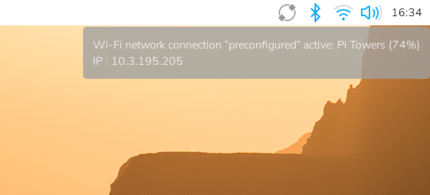

[[ip-address]]
=== How to Find your IP Address

To find the local IP of your Raspberry Pi, use one of the following methods.

==== Desktop

Hover over the network icon in the system tray, and a tooltip will appear. This tooltip displays the name of the network you're currently connected to and your IP address.

==== Command Line

Run the following command to output your IP address to the command line:

----
hostname -I
----

==== Boot Output

If you use a display with your Raspberry Pi and you boot to the command line instead of the desktop, the boot sequence will include your IP address as one of the last few output messages before your login prompt.

==== Router devices list

In a web browser, navigate to your router's IP address. This is often `http://192.168.1.1`, but you may be able to find it printed on a label on your router. This will take you to a control panel. Then log in using your credentials, which is usually also printed on the router or sent to you in the accompanying paperwork. Browse to the list of connected devices or similar (all routers are different), and you should see some devices you recognise. Some devices are detected as PCs, tablets, phones, printers, etc. so you should recognise some and rule them out to figure out which is your Raspberry Pi. Also note the connection type; if your Raspberry Pi is connected with a wire there should be fewer devices to choose from.

==== Network Manager

You can use the built-in Network Manager CLI (`nmcli`) to access details about your network. Run the following command:

----
nmcli device show
----

You should see output similar to the following:

----
GENERAL.DEVICE:                         wlan0
GENERAL.TYPE:                           wifi
GENERAL.HWADDR:                         D0:3B:FF:41:AB:8A
GENERAL.MTU:                            1500
GENERAL.STATE:                          100 (connected)
GENERAL.CONNECTION:                     exampleNetworkName
GENERAL.CON-PATH:                       /org/freedesktop/NetworkManager/ActiveConnection/2
IP4.ADDRESS[1]:                         192.168.1.42/24
IP4.GATEWAY:                            192.168.1.1
IP4.ROUTE[1]:                           dst = 192.168.1.0/24, nh = 0.0.0.0, mt = 600
IP4.ROUTE[2]:                           dst = 0.0.0.0/0, nh = 192.168.1.1, mt = 600
IP4.DNS[1]:                             192.168.1.3
IP6.ADDRESS[1]:                         ab80::11ab:b1fc:bb7e:a8a5/64
IP6.GATEWAY:                            --
IP6.ROUTE[1]:                           dst = ab80::/64, nh = ::, mt = 1024

GENERAL.DEVICE:                         lo
GENERAL.TYPE:                           loopback
GENERAL.HWADDR:                         00:00:00:00:00:00
GENERAL.MTU:                            65536
GENERAL.STATE:                          100 (connected (externally))
GENERAL.CONNECTION:                     lo
GENERAL.CON-PATH:                       /org/freedesktop/NetworkManager/ActiveConnection/1
IP4.ADDRESS[1]:                         127.0.0.1/8
IP4.GATEWAY:                            --
IP6.ADDRESS[1]:                         ::1/128
IP6.GATEWAY:                            --

GENERAL.DEVICE:                         p2p-dev-wlan0
GENERAL.TYPE:                           wifi-p2p
GENERAL.HWADDR:                         (unknown)
GENERAL.MTU:                            0
GENERAL.STATE:                          30 (disconnected)
GENERAL.CONNECTION:                     --
GENERAL.CON-PATH:                       --

GENERAL.DEVICE:                         eth0
GENERAL.TYPE:                           ethernet
GENERAL.HWADDR:                         D0:3B:FF:41:AB:89
GENERAL.MTU:                            1500
GENERAL.STATE:                          20 (unavailable)
GENERAL.CONNECTION:                     --
GENERAL.CON-PATH:                       --
WIRED-PROPERTIES.CARRIER:               off
IP4.GATEWAY:                            --
IP6.GATEWAY:                            --
----

This command outputs information about the various network interfaces accessible on your Raspberry Pi. Check the `GENERAL.TYPE` row to see which kind of network interface each block describes. For example, "ethernet" is the ethernet port on your device, and "wifi" refers to the WiFi chip built into some devices. You'll look at different blocks of output to find your IP address depending on the way your device accesses the internet:

* if your device connects to the internet using WiFi, check the "wifi" block
* if your device connects to the internet using the ethernet port, check the "eth0" block

Once you've identified the correct network interface block, look for a field named `IP4.ADDRESS[1]` for an IPv4 address or `IP6.ADDRESS[1]` for an IPv6 address. You can ignore the trailing slash and number (e.g. `/24`) in those fields.

In the example above, the Raspberry Pi uses WiFi to access the internet. Check the block where the `GENERAL.TYPE` field reads "wifi" to find the IP address. In this case, you can access this device using the IPv4 address in the `IP4.ADDRESS[1]` field: `192.168.1.42`.

==== Resolving `raspberrypi.local` with mDNS

On Raspberry Pi OS, multicast DNS is supported out-of-the-box by the Avahi service.

If your device supports mDNS, you can reach your Raspberry Pi by using its hostname and the `.local` suffix.
The default hostname on a fresh Raspberry Pi OS install is `raspberrypi`, so by default any Raspberry Pi running Raspberry Pi OS responds to:

[,bash]
----
ping raspberrypi.local
----

If the Raspberry Pi is reachable, `ping` will show its IP address:

----
PING raspberrypi.local (192.168.1.131): 56 data bytes
64 bytes from 192.168.1.131: icmp_seq=0 ttl=255 time=2.618 ms
----

If you change the system hostname of the Raspberry Pi (e.g., by editing `/etc/hostname`), Avahi will also change the `.local` mDNS address.

If you don't remember the hostname of the Raspberry Pi, but have a system with Avahi installed, you can browse all the hosts and services on the LAN with the https://linux.die.net/man/1/avahi-browse[`avahi-browse`] command.

==== nmap command

The `nmap` command (Network Mapper) is a free and open-source tool for network discovery, available for Linux, macOS, and Windows.

* To install on *Linux*, install the `nmap` package e.g. `apt install nmap`.
* To install on *macOS* or *Windows*, see the http://nmap.org/download.html[nmap.org download page].

To use `nmap` to scan the devices on your network, you need to know the subnet you are connected to. First find your own IP address, in other words the one of the computer you're using to find your Raspberry Pi's IP address:

* On *Linux*, type `hostname -I` into a terminal window
* On *macOS*, go to `System Preferences` then `Network` and select your active network connection to view the IP address
* On *Windows*, go to the Control Panel, then under `Network and Sharing Center`, click `View network connections`, select your active network connection and click `View status of this connection` to view the IP address

Now you have the IP address of your computer, you will scan the whole subnet for other devices. For example, if your IP address is `192.168.1.5`, other devices will be at addresses like `192.168.1.2`, `192.168.1.3`, `192.168.1.4`, etc. The notation of this subnet range is `192.168.1.0/24` (this covers `192.168.1.0` to `192.168.1.255`).

Now use the `nmap` command with the `-sn` flag (ping scan) on the whole subnet range. This may take a few seconds:

[,bash]
----
nmap -sn 192.168.1.0/24
----

Ping scan just pings all the IP addresses to see if they respond. For each device that responds to the ping, the output shows the hostname and IP address like so:

----
Starting Nmap 6.40 ( http://nmap.org ) at 2014-03-10 12:46 GMT
Nmap scan report for hpprinter (192.168.1.2)
Host is up (0.00044s latency).
Nmap scan report for Gordons-MBP (192.168.1.4)
Host is up (0.0010s latency).
Nmap scan report for ubuntu (192.168.1.5)
Host is up (0.0010s latency).
Nmap scan report for raspberrypi (192.168.1.8)
Host is up (0.0030s latency).
Nmap done: 256 IP addresses (4 hosts up) scanned in 2.41 seconds
----

Here you can see a device with hostname `raspberrypi` has IP address `192.168.1.8`. Note, to see the hostnames, you must run nmap as root by prepending `sudo` to the command.

==== Getting IPv6 addresses by pinging from a second device 

First find your own IP address(es), in other words the one of the computer you're using to find your Raspberry Pi's IP address
by `hostname -I`

`fd00::ba27:ebff:feb6:f293 2001:db8:494:9d01:ba27:ebff:feb6:f293`

The example shows two IP addresses. The first one is a so called unique local unicast address(`fc00::/7`). The second one is the global unicast address(`2000::/3`). It is also possible to see only one of them depending on your network (router) configuration. Both addresses are valid for reaching the Raspberry Pi within your LAN. The address out of `2000::/3` is accessible world wide, provided your router's firewall is opened.

Now use one of IPs from the first step to ping all local nodes:

----
ping -c 2 -I 2001:db8:494:9d01:ba27:ebff:feb6:f293  ff02::1
ping -c 2 -I 2001:db8:494:9d01:ba27:ebff:feb6:f293  ff02::1%eth0
----

`-c 2` stands for sending two echo requests

`-I` with the IP address, it sets the interface and the source address of the echo request,
it is necessary to choose the interface's IP address,
`eth0` isn't sufficient - the answer would be the local link address(`fe80::/10`), we need the global or local unicast address

`ff02::1` is a well known multicast address for all nodes on the link, so it behaves like a local broadcast, usually it is defined in `/etc/hosts` so you can also use the name (`ip6-allnodes` or `ipv6-allnodes`) instead of the literal address

Some newer systems expect the interface ID behind the multicast address.

----
ping -c 2 -I 2001:db8:494:9d01:ba27:ebff:feb6:f293 ip6-allnodes
PING ip6-allnodes(ip6-allnodes (ff02::1)) from 2001:db8:494:9d01:ba27:ebff:feb6:f293 : 56 data bytes
64 bytes from 2001:db8:494:9d01:ba27:ebff:feb6:f293: icmp_seq=1 ttl=64 time=0.597 ms
64 bytes from witz.fritz.box (2001:db8:494:9d01:728b:cdff:fe7d:a2e): icmp_seq=1 ttl=255 time=1.05 ms (DUP!)
64 bytes from raspberrypi4.fritz.box (2001:db8:494:9d01:dea6:32ff:fe23:6be1): icmp_seq=1 ttl=64 time=1.05 ms (DUP!)
64 bytes from 2001:db8:494:9d01:da37:beff:fefd:f09d (2001:db8:494:9d01:da37:beff:fefd:f09d): icmp_seq=1 ttl=255 time=1.05 ms (DUP!)
64 bytes from fusion.fritz.box (2001:db8:494:9d01:1e6f:65ff:fec9:8746): icmp_seq=1 ttl=255 time=2.12 ms (DUP!)
64 bytes from fritz.box (2001:db8:494:9d01:464e:6dff:fe72:8a08): icmp_seq=1 ttl=64 time=2.62 ms (DUP!)
64 bytes from raspberrypi.fritz.box (2001:db8:494:9d01:ba27:ebff:feb6:f293): icmp_seq=2 ttl=64 time=0.480 ms

--- ip6-allnodes ping statistics ---
2 packets transmitted, 2 received, +5 duplicates, 0% packet loss, time 1001ms
rtt min/avg/max/mdev = 0.480/1.283/2.623/0.735 ms
----

This should result in replies from all the nodes on your (W)LAN link, with associated DNS names.

Exclude your own IP( here `2001:db8:494:9d01:ba27:ebff:feb6:f293` ),
then check the others by trying to connect them via SSH.

----
ssh pi@2001:db8:494:9d01:dea6:32ff:fe23:6be1
The authenticity of host '2001:db8:494:9d01:dea6:32ff:fe23:6be1 (2001:db8:494:9d01:dea6:32ff:fe23:6be1)' can't be established.
ECDSA key fingerprint is SHA256:DAW68oen42TdWDyrOycDZ1+y5ZV5D81kaVoi5FnpvoM.
Are you sure you want to continue connecting (yes/no)? yes
Warning: Permanently added '2001:db8:494:9d01:dea6:32ff:fe23:6be1' (ECDSA) to the list of known hosts.
pi@2001:db8:494:9d01:dea6:32ff:fe23:6be1's password:
Linux raspberrypi4 4.19.75-v7l+ #1270 SMP Tue Sep 24 18:51:41 BST 2019 armv7l

...

pi@raspberrypi4:~ $
----

==== Getting the IP address of a Raspberry Pi using your smartphone

The Fing app is a free network scanner for smartphones. It is available for https://play.google.com/store/apps/details?id=com.overlook.android.fing[Android] and https://itunes.apple.com/gb/app/fing-network-scanner/id430921107?mt=8[iOS].

Your phone and your Raspberry Pi have to be on the same network, so connect your phone to the correct wireless network.

When you open the Fing app, touch the refresh button in the upper right-hand corner of the screen. After a few seconds you will get a list with all the devices connected to your network. Scroll down to the entry with the manufacturer "Raspberry Pi". You will see the IP address in the bottom left-hand corner, and the MAC address in the bottom right-hand corner of the entry.
