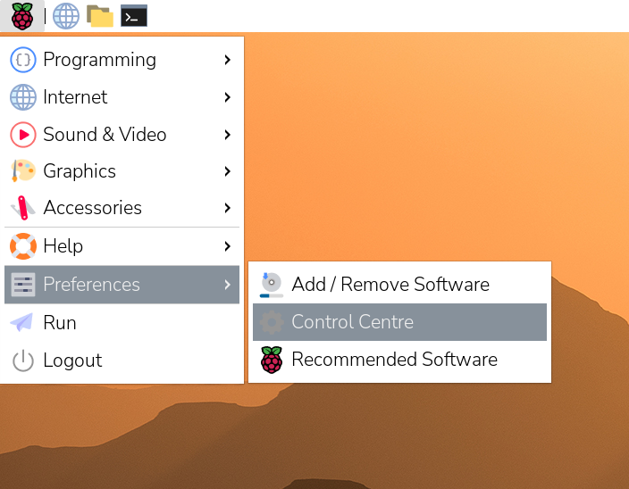
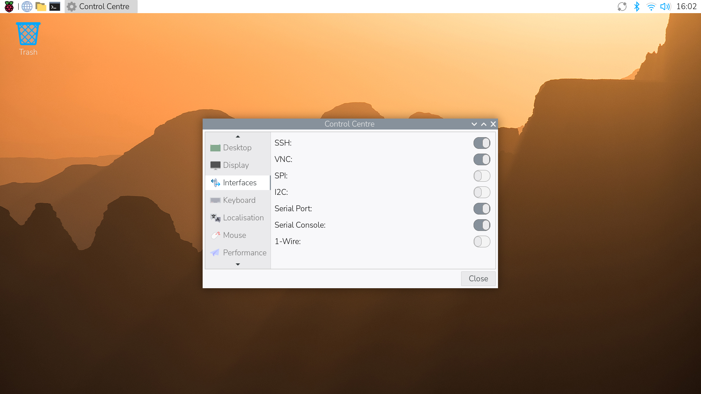
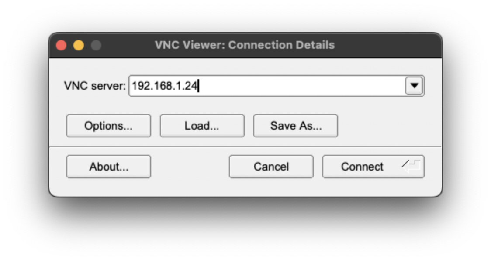
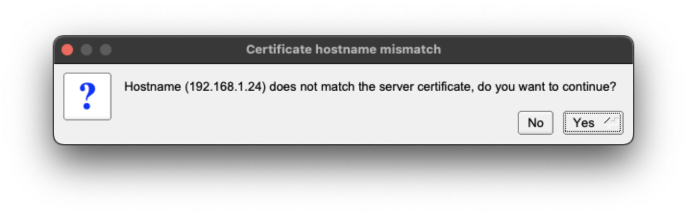
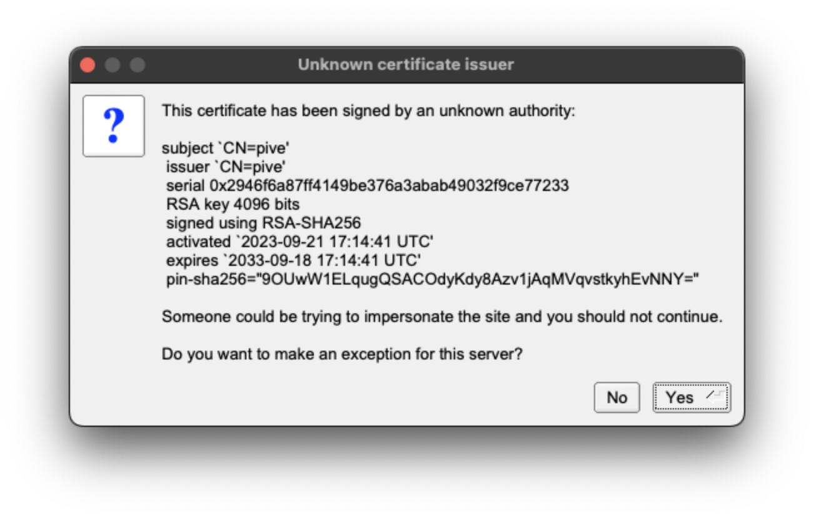
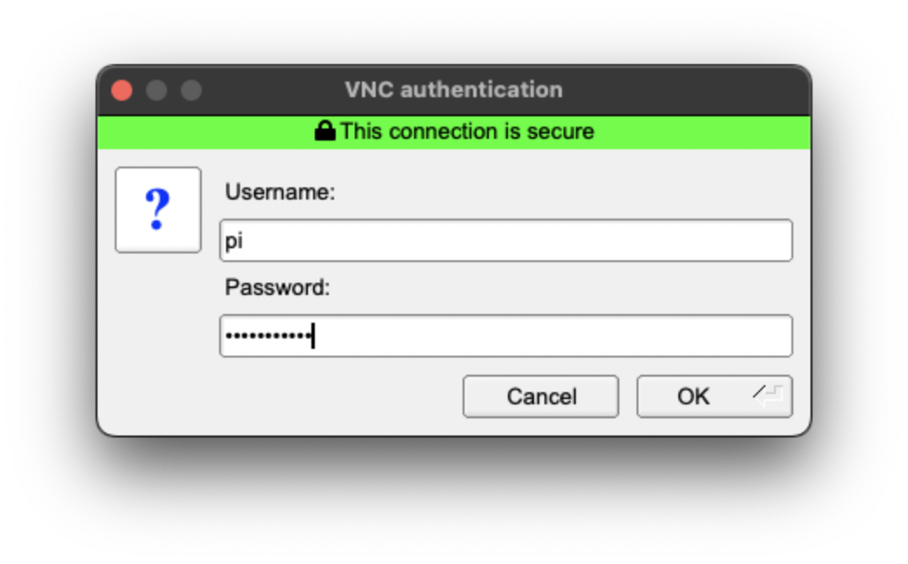
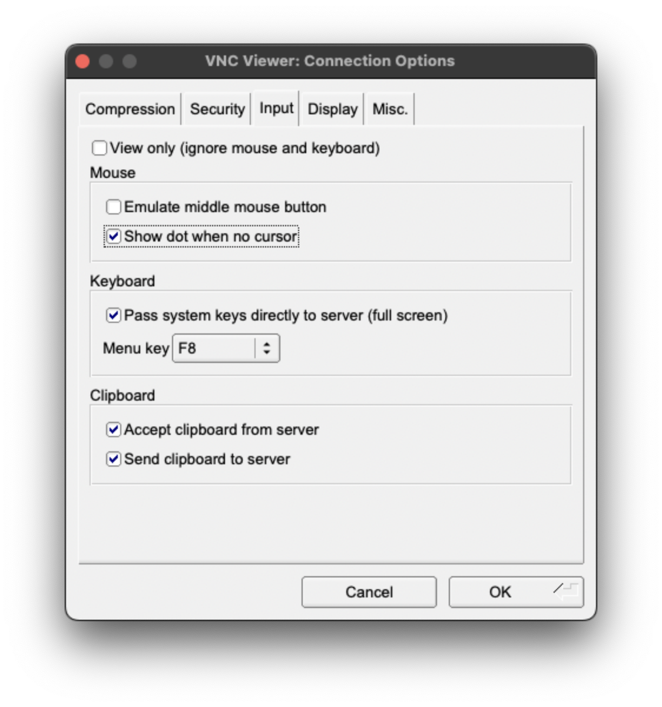

[[vnc]]
== Virtual Network Computing (VNC)

Sometimes it is not convenient to physically work with a device. Virtual Network Computing (VNC) allows you to control the desktop of one device from another.

VNC relies upon a client and a server. The client runs on a device you can physically interact with, such as a personal laptop, desktop, tablet, or phone. The server runs on your Raspberry Pi.
When you use VNC, the client transmits keyboard and mouse events to the server. The server executes those events on your Raspberry Pi, and returns screen updates to the client.

The VNC client displays the desktop of your Raspberry Pi in a window. You can interact with the desktop as though you were working on the Raspberry Pi itself.

Raspberry Pi OS includes https://github.com/any1/wayvnc[wayvnc]. This provides a VNC server that you can enable in your device preferences.

Before you can use VNC on your Raspberry Pi, you must enable the VNC server.

NOTE: Previous versions of Raspberry Pi OS supported client connections from RealVNC. In Raspberry Pi OS _Bookworm_ or later, RealVNC is no longer supported. Instead, you can connect using TigerVNC.

=== Enable the VNC server

Raspberry Pi OS supports enabling the VNC server both graphically and at the command line.

TIP: Once enabled, you can access your WayVNC configuration at `~/.config/wayvnc/`.

==== Enable VNC Server Graphically

1. Boot into the graphical desktop on your Raspberry Pi.
2. Click the Raspberry Pi icon in the system tray of your desktop.
3. Select `Preferences` > `Raspberry Pi Configuration` from the menu.
+
--

--
4. Navigate to the `Interfaces` tab.
5. Click the radio button next to *VNC* into the active position.
+
--

--
6. Click the "OK" button to save your configuration changes.

==== Enable the VNC server on the command line

Use using xref:configuration.adoc#raspi-config[raspi-config] to enable the VNC server on the command line.

1. Open `raspi-config` with the following line:
+
--
[source,console]
----
sudo raspi-config
----
--
2. Navigate to *Interface Options*. Press `Enter` to select.
3. Select `VNC`. Press `Enter` to select.
4. Under "Would you like the VNC Server to be enabled?", highlight `<Yes>` and press `Enter`.
5. Press `Enter` to return to the menu. Press Esc to exit `raspi-config`.

=== Connect to your Raspberry Pi

To connect to your Raspberry Pi, you'll need the following:

* your Raspberry Pi and the device running the VNC client must be connected to the same network (e.g. a home wireless network)
* the IP address of your Raspberry Pi
* a valid username and password combination for an account on your Raspberry Pi

If you don't know the IP address of your device, see xref:remote-access.adoc#ip-address[our instructions on finding your IP address].

1. Download https://tigervnc.org/[TigerVNC]. You can install the latest version from the https://github.com/TigerVNC/tigervnc/releases[Releases page of their GitHub repository]. Click on the link in the latest release, and find the binary for your platform. Windows users should download an `exe`; macOS users should download the `dmg`; Linux users should install the `jar`.
2. On your client device, launch TigerVNC by double-clicking the binary.
3. In the "VNC server" field, enter the IP address of your Raspberry Pi.
+
--

--
4. Click the "Connect" button to initiate a connection with the server.
   * If TigerVNC warns you that the "Hostname does not match the server certificate", click the "Yes" button to continue.
+
--

--
* If TigerVNC warns you that the "certificate has been signed by an unknown authority", click the "Yes" button to grant an exception for your Raspberry Pi.
+
--

--
5. When prompted for a username and password, enter your credentials.
+
--

--
6. Click the "OK" button to authenticate with the VNC server. If your credentials are correct, TigerVNC should open a window containing the desktop corresponding to your account on the Raspberry Pi. You should be able to move your mouse and keyboard to input text and interact with the desktop.
+
--

--

TIP: If you can't see the cursor in your VNC client, enable the "Show dot when no cursor" input option in TigerVNC.
--

--
