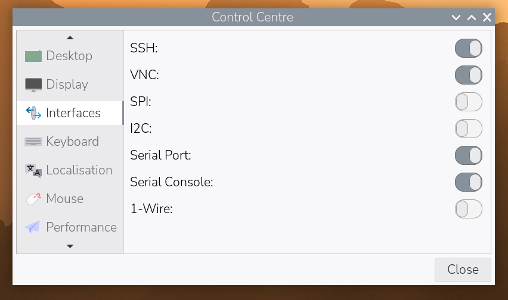

[[vnc]]
== Virtual Network Computing (VNC)

Sometimes it is not convenient to physically work with a device. Virtual Network Computing (VNC) allows you to control the desktop of one device from another.

VNC relies upon a client and a server. The client runs on a device you can physically interact with, such as a personal laptop, desktop, tablet, or phone. The server runs on your Raspberry Pi.
When you use VNC, the client transmits keyboard and mouse events to the server. The server executes those events on your Raspberry Pi, and returns screen updates to the client.

The VNC client displays the desktop of your Raspberry Pi in a window. You can interact with the desktop as though you were working on the Raspberry Pi itself.

Raspberry Pi OS includes https://github.com/any1/wayvnc[wayvnc]. This provides a VNC server that you can enable in your device preferences.

Before you can use VNC on your Raspberry Pi, you must enable the VNC server.

=== Enable the VNC server

Raspberry Pi OS supports enabling the VNC server both graphically and at the command line.

TIP: Once enabled, you can access your WayVNC configuration at `/etc/wayvnc/`.

==== Enable VNC Server Graphically

1. Boot into the graphical desktop on your Raspberry Pi.
2. Click the Raspberry Pi icon in the system tray of your desktop.
3. Select *Preferences* > *Raspberry Pi Configuration* from the menu.
+
--
image::images/raspberry-pi-configuration.png[Select Raspberry Pi Configuration from the Preferences menu in the system tray.]
--
4. Navigate to the *Interfaces* tab.
5. Click the radio button next to *VNC* into the active position.
+
--

--
6. Click the "OK" button to save your configuration changes.

==== Enable the VNC server on the command line

Use using xref:configuration.adoc#raspi-config[raspi-config] to enable the VNC server on the command line.

1. Open `raspi-config` with the following line:
+
--
[source,console]
----
sudo raspi-config
----
--
2. Navigate to *Interface Options*. Press `Enter` to select.
3. Select *VNC*. Press `Enter` to select.
4. Under "Would you like the VNC Server to be enabled?", highlight `<Yes>` and press `Enter`.
5. Press `Enter` to return to the menu. Press `Esc` to exit `raspi-config`.

=== Connect to your Raspberry Pi

To connect to your Raspberry Pi, you'll need the following:

* your Raspberry Pi and the device running the VNC client, connected to the same network (e.g. a home wireless network or VPN)
* the hostname or IP address of your Raspberry Pi
* a valid username and password combination for an account on your Raspberry Pi

If you don't know the IP address of your device, see xref:remote-access.adoc#ip-address[our instructions on finding your IP address].

1. Download https://www.realvnc.com/download/viewer/[VNC Viewer]. You are entitled to use RealVNC's cloud service for free, provided that remote access is for educational or non-commercial purposes only.
2. On your client device, launch VNC Viewer.
3. Read and accept the terms and conditions.
4. Click the *Use RealVNC Viewer without signing in* link to connect only to devices on your local network without RealVNC's cloud service.
5. In the *Enter a VNC Server address or search* field at the top of the window, enter the hostname or IP address of your Raspberry Pi.
+
--
image::images/vnc-client-enter-ip.png[Entering the Raspberry Pi's local IP address into the VNC client.]
--
6. Press the *Enter* key to begin connecting.
7. You may see an *Identity Check* window that warns that RealVNC Viewer has no record of this server. If this is the first connection to this device over VNC, this is expected. Press the *Continue* button to continue connecting.
+
--
image::images/vnc-client-no-record-continue.png[A warning that the VNC client has no record of the server.,400]
--
8. In the *Authentication* window, enter the username and password for the user account on your Raspberry Pi.
+
--
image::images/vnc-client-enter-credentials.png[Entering Raspberry Pi user account credentials into the VNC client.]
--
9. Press the *OK* button to connect to your Raspberry Pi.
10. VNC Viewer will open a window containing the desktop for your account on the Raspberry Pi. You should be able to interact with the desktop using your mouse and keyboard automatically; you may have to enable accessibility access to use specialised keys such as media keys.
+
--
image::images/vnc-client-desktop.png[The desktop of a Raspberry Pi after successfully authenticating.]
--
