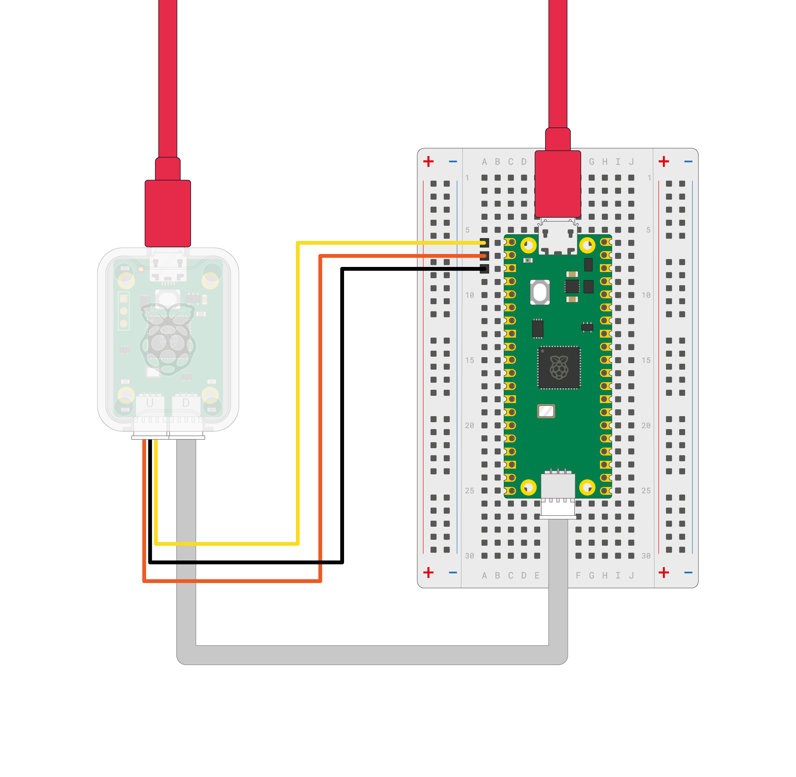

== Getting started

image:images/labelled-wiring.jpg[width="100%"]

Depending on your setup, there are several ways to wire the Debug Probe to a xref:raspberry-pi-pico.adoc[Raspberry Pi Pico]. Below, we connect the Debug Probe to a Raspberry Pi Pico H which has the newer three-pin JST connector for SWD.

video::4RCZBZsfsek[youtube]

Here we have connected:

* The Debug Probe "D" connector to Pico H SWD JST connector
* The Debug Probe "U" connector has the three-pin JST connector to 0.1-inch header (male)
** Debug Probe RX connected to Pico H TX pin
** Debug Probe TX connected to Pico H RX pin
** Debug Probe GND connected to Pico H GND pin

NOTE: If you have an "original" Raspberry Pi Pico, or Pico W, without a JST connector, you can still connect it to a Debug Probe. To do so, solder a male connector to the SWDCLK, SWDIO and GND header pins on the board, and connect them to the Debug Probe "D" connector using the alternate 3-pin JST connector to 0.1-inch header (female) cable included with the Debug Probe.

