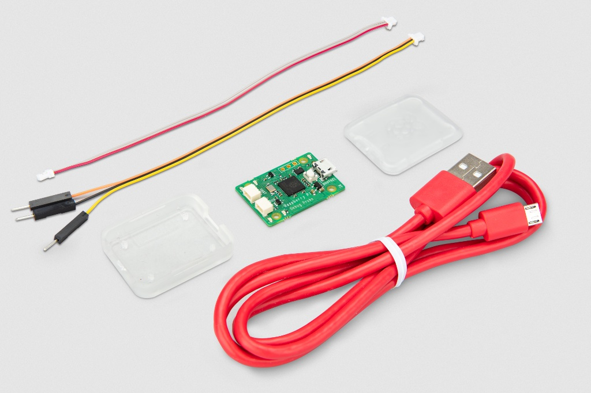
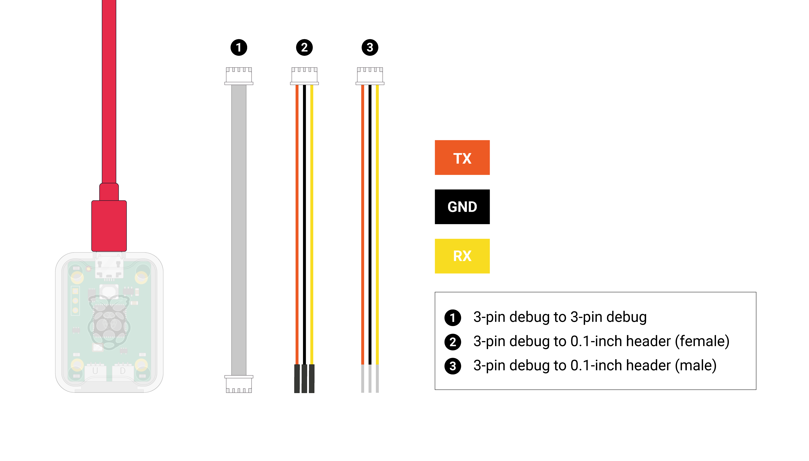
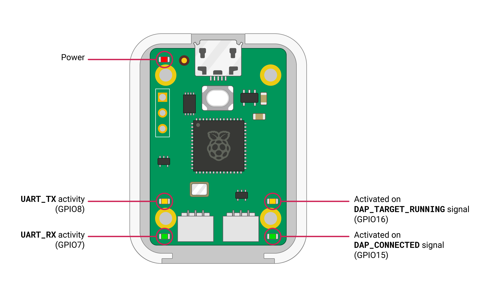

== About the Debug Probe

The Raspberry Pi Debug Probe is a USB device that provides both a UART serial port and a standard Arm Serial Wire Debug (SWD) interface. The probe is designed for easy, solderless, plug-and-play debugging. It has the following features:

* USB to ARM https://developer.arm.com/documentation/ihi0031/a/The-Serial-Wire-Debug-Port\--SW-DP-/Introduction-to-the-ARM-Serial-Wire-Debug\--SWD\--protocol[Serial Wire Debug] (SWD) port
* USB to UART bridge
* Compatible with the https://developer.arm.com/documentation/101451/0100/About-CMSIS-DAP[CMSIS-DAP] standard
* Works with https://openocd.org/[OpenOCD] and other tools supporting CMSIS-DAP
* Open source, easily upgradeable firmware

NOTE: For more information on the Raspberry Pi three-pin debug connector see the https://rptl.io/debug-spec[specification].

This makes it easy to use a Raspberry Pi Pico on non-Raspberry Pi platforms such as Windows, Mac, and “normal” Linux computers, where you don’t have a GPIO header to connect directly to the Pico's serial UART or SWD port.

=== The Debug Probe

The probe operates at 3.3V nominal I/O voltage.

Included with the Debug Probe is a USB power cable and three debug cables:

* 3-pin JST connector to 3-pin JST connector cable
* 3-pin JST connector to 0.1-inch header (female)
* 3-pin JST connector to 0.1-inch header (male)

The two 0.1-inch header cables — intended for breadboard (male) or direct connection to a board with header pins (female) — are coloured as below:

Orange:: TX/SC (Output from Probe)
Black:: GND
Yellow:: RX/SD (Input to Probe or I/O)

While the cable with 3-pin JST connectors is intended to be used with the https://rptl.io/debug-spec[standard 3-pin connector] which newer Raspberry Pi boards use for the SWD debug port and UART connectors.

The Debug Probe has five LEDs, a red LED to indicate power, and four more activity indicator LEDs

NOTE: OpenOCD just switches both DAP LEDs on when the target is connected, and turns them off when it calls `DAP_DISCONNECT`.
