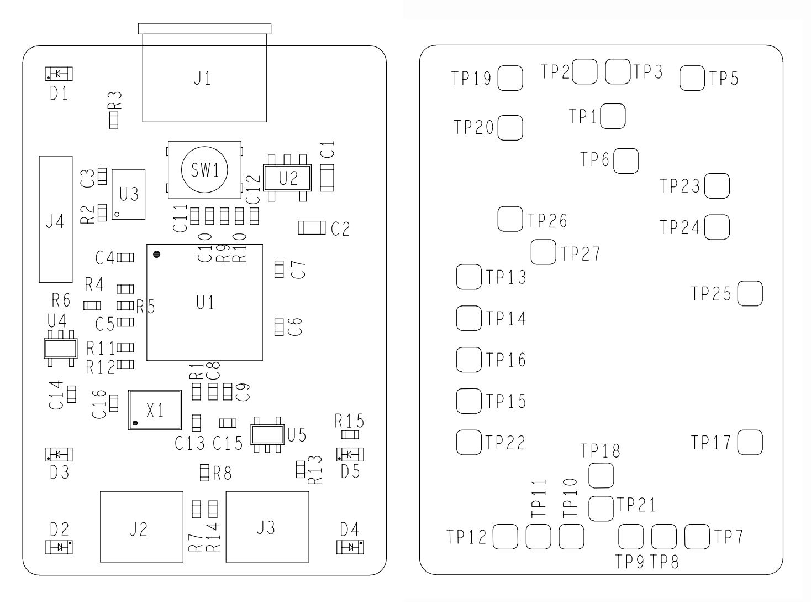

== Schematics

Schematics and mechanical drawing of the Debug Probe are available:

* https://datasheets.raspberrypi.com/debug/raspberry-pi-debug-probe-schematics.pdf[Schematics] (PDF)
* https://datasheets.raspberrypi.com/debug/raspberry-pi-debug-probe-mechanical-drawing.pdf[Mechanical Diagram] (PDF)

The test point (TP) shown on the schematics are located as shown in the diagram below.

