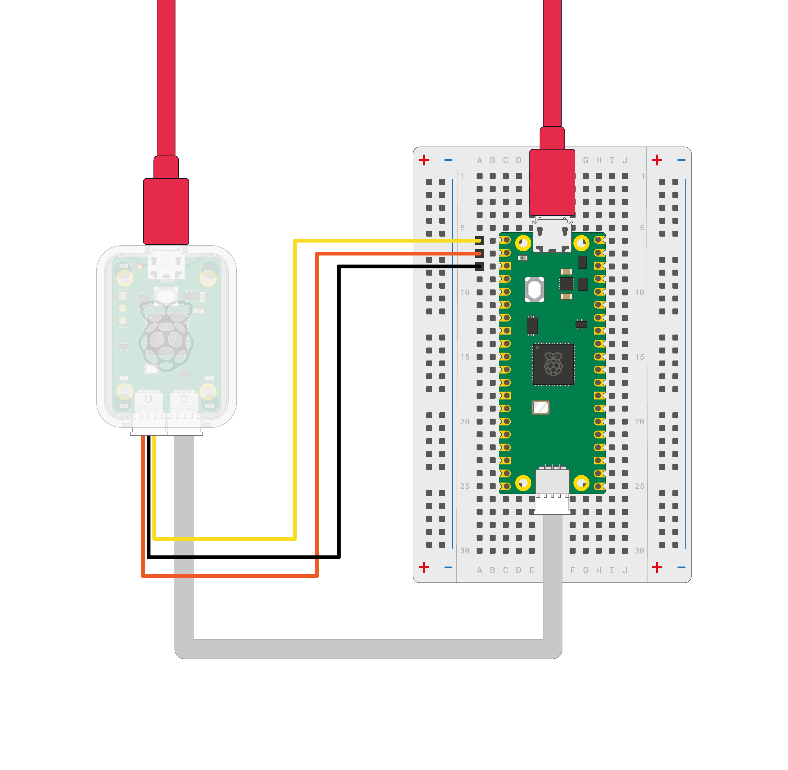
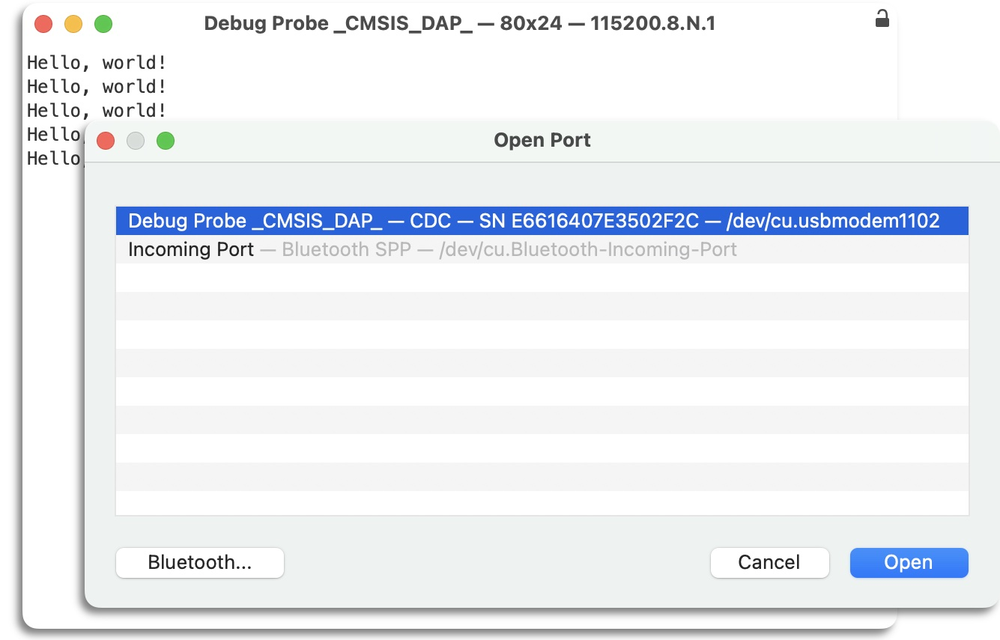

== Serial connections

Ensure that the Debug Probe is connected to the UART pins of your Raspberry Pi Pico.

The default pins for Raspberry Pi Pico UART0 are as follows:

[cols="1,1,1"]
|===
| Default UART0 | Physical Pin | GPIO Pin

| GND | 3 | N/A
| UART0_TX | 1 | GP0
| UART0_RX | 2 | GP1
|===

Once connected, traffic over the Raspberry Pi Pico's UART will be relayed to your computer by the Debug Probe and exposed as a CDC UART. On a Raspberry Pi this will show up as `/dev/ttyACM0`; on other platforms this serial port will show up differently (e.g. on macOS it will appear as `/dev/cu.usbmodemXXXX`).

If you have not already done so you should install minicom:

[source,console]
----
$ sudo apt install minicom
----

and open the serial port:

[source,console]
----
$ minicom -b 115200 -o -D /dev/ttyACM0
----

TIP: To exit `minicom`, use CTRL-A followed by X.

To test serial communication you can build and upload the "Hello World" example application.

Change directory into the `hello_world` directory inside the `pico-examples` tree, and run `make`. Afterwards, you can upload it to your Raspberry Pi Pico using `openocd`. For a full walkthrough of building the `hello_serial` example program, see Chapter 4 of https://pip.raspberrypi.com/documents/RP-008276-DS[Getting started with Raspberry Pi Pico].

[source,console]
----
$ cd pico-examples
$ mkdir build
$ cd build
$ export PICO_SDK_PATH=../../pico-sdk
$ cmake ..
$ cd hello_world/serial
$ make -j4
$ sudo openocd -f interface/cmsis-dap.cfg -f target/rp2040.cfg -c "adapter speed 5000" -c "program hello_serial.elf verify reset exit"
$ minicom -b 115200 -o -D /dev/ttyACM0
----

On opening `minicom` you should see "Hello, world!" printed to the console.

For terminal programs that support it, a description of the USB serial UART is advertised in the USB device description.

The unique serial number in this description means that on Windows your COM port numbering is "sticky" per device, and will allow you to write `udev` rules to associate a named device node with a particular Debug Probe.

== RTT connections

You can also configure your application to send its output directly over the SWD interface without the need for a UART connection. This uses a mechanism called Segger Real-Time Transport (RTT).

To do this, you must enable the RTT stdio driver in your application and connect to RTT with the Debug Probe.

NOTE: You must use a *debug build* of your application to send output over SWD.

=== Enabling the RTT stdio driver

The C/C++ SDK provides a stdio driver for RTT just like the ones for UART and USB. For more information, see xref:../pico-sdk/runtime.adoc#group_pico_stdio_rtt[pico_stdio_rtt].

To enable the driver in your build, include the following line in your *CMakeLists.txt* file (or link with *pico_stdio_rtt* which does the same thing):

[source,console]
----
pico_enable_stdio_rtt(<your_project_name> 1)
----

After calling `stdio_init_all()`, any output that your application sends with `printf()` is sent to RTT. If you want to copy your output to the UART as well, you can enable that too.

=== Connecting to RTT from VSCode

RTT is supported by OpenOCD and the VSCode https://marketplace.visualstudio.com/items?itemName=marus25.cortex-debug[Cortex-Debug] extension; both of these are set up as part of xref:../microcontrollers/debug-probe.adoc#install-tools[installing the tools].

To enable RTT for a debug session add a section to its launch configuration. Open your project's `.vscode` folder and add the following lines to the `launch.json` file, putting them in the appropriate configuration section, such as `"Pico Debug (Cortex-Debug)"`:

[source,json]
----
"rttConfig": {
    "enabled": true,
    "address": "auto",
    "decoders": [
        {
            "label": "",
            "port": 0,
            "type": "console"
        }
    ]
}
----

For more information, see https://github.com/Marus/cortex-debug/blob/master/debug_attributes.md[cortex-debug launch attributes].

If you now launch a debug session on an RTT-enabled application and open the *TERMINAL* tab, you see a list on the right that includes `RTT Ch:0 console`. Select this to see the output that your application sends to the `pico_stdio_rtt` driver.

=== Connecting to RTT in a standalone debug session

If you are using a standalone debug session as described in xref:../microcontrollers/debug-probe.adoc#standalone-debug-session[Starting a Debug Session], you can connect to RTT by completing the following steps:

. Build and upload your RTT-enabled application.
. Connect the Debug Probe and start `openocd` and `gdb` in separate terminals. For more information, see xref:../microcontrollers/debug-probe.adoc#standalone-debug-session[Standalone debug session].

. At the `gdb` prompt enter the following commands:
+
[source,console]
----
(gdb) target remote localhost:3333
(gdb) monitor reset init
(gdb) monitor rtt setup 0x20000000 2048 "SEGGER RTT"
(gdb) monitor rtt start
(gdb) monitor rtt server start 60000 0
(gdb) continue
----+
NOTE: The `gdb` commands prefixed with `monitor` are passed through to `openocd`. For more information about the commands used here, see https://openocd.org/doc/html/General-Commands.html[section 15.6] of the OpenOCD Manual.
+
OpenOCD searches for an RTT control block on the target and then creates a local TCP socket on port 60000.

. Open a third window and connect to the local socket with a tool like `nc` (netcat) or equivalent to see the RTT output from your application:
+
[source,console]
----
$ nc localhost 60000
----