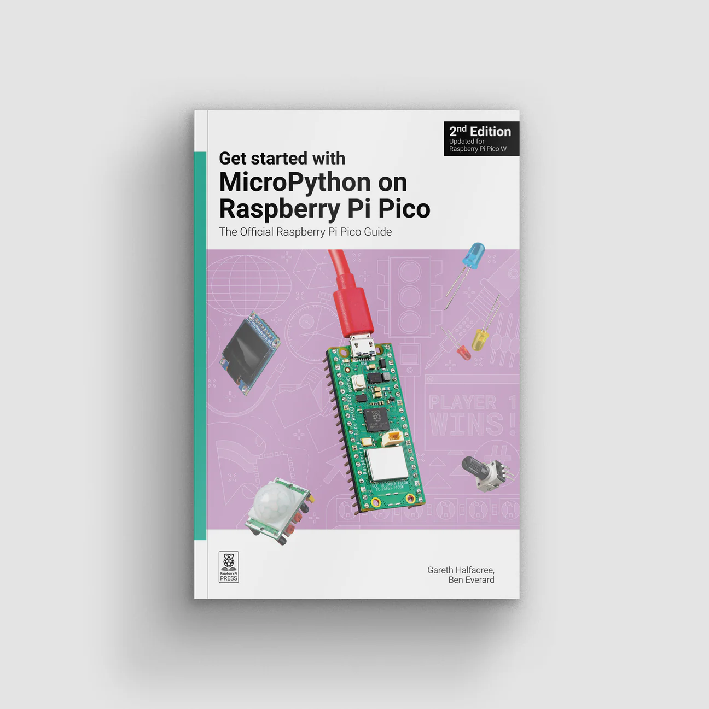

== Where can I find documentation?

You can find information on the MicroPython port to RP2040 at;

https://datasheets.raspberrypi.com/pico/raspberry-pi-pico-python-sdk.pdf[Raspberry Pi Pico Python SDK]:: A MicroPython environment for RP2040 microcontrollers
https://datasheets.raspberrypi.com/picow/connecting-to-the-internet-with-pico-w.pdf[Connecting to the Internet with Raspberry Pi Pico W]:: Getting Raspberry Pi Pico W online with C/{cpp} or MicroPython
https://docs.micropython.org/en/latest/rp2/quickref.html[RP2 Quick Reference]:: The official documentation around the RP2040 port of MicroPython
https://docs.micropython.org/en/latest/library/rp2.html[RP2 Library]:: The official documentation about the `rp2` module in MicroPython

There is also a book by https://store.rpipress.cc/[Raspberry Pi Press] available written by Gareth Halfacree and Ben Everard.

 
In "Get Started with MicroPython on Raspberry Pi Pico", you will learn how to use the beginner-friendly language MicroPython to write programs and connect hardware to make your Raspberry Pi Pico interact with the world around it. Using these skills, you can create your own electro-mechanical projects, whether for fun or to make your life easier. 

* Set up your Raspberry Pi Pico and start using it
* Start writing programs using MicroPython
* Control and sense electronic components
* Discover how to use Pico’s unique Programmable IO
* Make a reaction game, burglar alarm, temperature gauge, and many more

You can https://store.rpipress.cc/products/get-started-with-micropython-on-raspberry-pi-pico[buy the book] on the Raspberry Pi Press site.