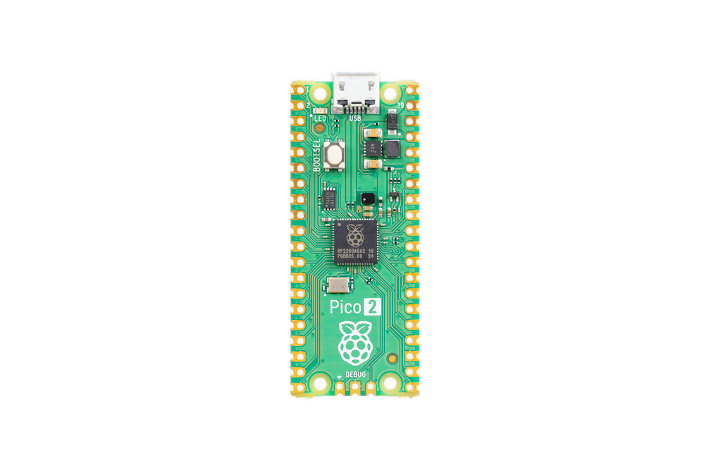
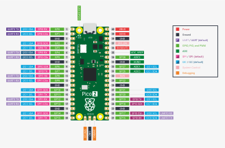
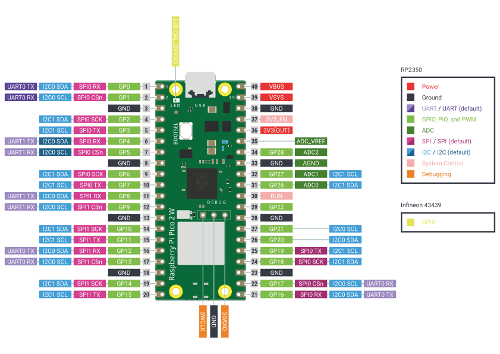
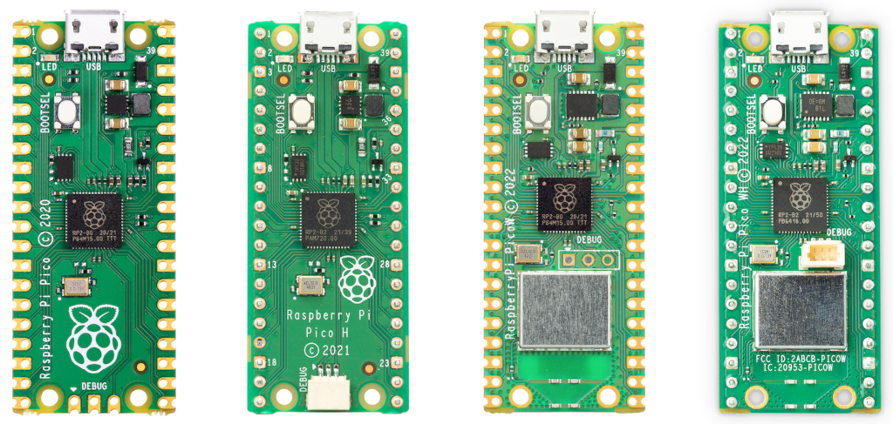

Pico-series devices are organised into **families** based on product generation.

The original Raspberry Pi Pico family, referred to as Pico or Pico 1, comes in the following variants:

* Pico
* Pico H
* Pico W
* Pico WH

The second-generation Raspberry Pi Pico family is referred to as Pico 2. Pico 2 comes in the following variants:

* Pico 2
* Pico 2 W

== Pico 2 family

[[pico-2-technical-specification]]
=== Raspberry Pi Pico 2

Raspberry Pi Pico 2 is a low-cost, high-performance microcontroller board with flexible digital interfaces. Key features include:

* xref:silicon.adoc#rp2350[RP2350] microcontroller chip designed by Raspberry Pi in the United Kingdom
* Dual Cortex-M33 or Hazard3 processors at up to 150 MHz
* 520 kB of SRAM, and 4 MB of on-board flash memory
* USB 1.1 with device and host support
* Low-power sleep and dormant modes
* Drag-and-drop programming using mass storage over USB
* 26× multi-function GPIO pins including 3 that can be used for ADC
* 2× SPI, 2× I2C, 2× UART, 3× 12-bit 500 ksps Analogue to Digital Converter (ADC), 24× controllable PWM channels
* 2× Timer with 4 alarms, 1× AON Timer
* Temperature sensor
* 3 × Programmable IO (PIO) blocks, 12 state machines total for custom peripheral support
** Flexible, user-programmable high-speed IO
** Can emulate interfaces such as SD Card and VGA

The Raspberry Pi Pico 2 comes as a castellated module which allows soldering direct to carrier boards, while the Pico 2 _with headers_ comes with pre-soldered headers.

NOTE: Both boards have a three pin Serial Wire Debug (SWD) header. However, the Pico 2 with headers breaks this out into a small, keyed, https://pip.raspberrypi.com/documents/RP-008189-DS[3-pin connector] while the Pico 2 has three castellated through-hole pins adjacent to the edge of the board.

==== Pinout and design files

* Download the https://pip.raspberrypi.com/documents/RP-008301-DS[Pinout Diagram] (PDF)
* Download the https://pip.raspberrypi.com/documents/RP-008303-DS[STEP File]
* Download the https://pip.raspberrypi.com/documents/RP-008300-DS[Fritzing Part] for Raspberry Pi Pico

NOTE: More information on Fritzing is available on the https://fritzing.org/[fritzing.org] website.

[[pico2w-technical-specification]]
=== Raspberry Pi Pico 2 W

Raspberry Pi Pico 2 W adds on-board single-band 2.4 GHz wireless interfaces (802.11n) using the Infineon CYW43439 to the Pico 2 hardware. The on-board 2.4 GHz wireless interface has the following features:

* Wireless (802.11n), single-band (2.4 GHz)
* WPA3
* Soft access point supporting up to four clients
* Bluetooth 5.2
** Support for Bluetooth LE Central and Peripheral roles
** Support for Bluetooth Classic

The onboard antenna is licensed from ABRACON (formerly ProAnt). The wireless interface is connected via
SPI to the xref:silicon.adoc#rp2350[RP2350] microcontroller.

Due to pin limitations, some of the wireless interface pins are shared. The CLK is shared with VSYS monitor, so only
when there isn't an SPI transaction in progress can VSYS be read via the ADC. The Infineon CYW43439 DIN/DOUT and
IRQ all share one pin on the RP2350. Only when an SPI transaction isn't in progress is it suitable to check for IRQs. The interface typically runs at 33 MHz.

For best wireless performance, position the antenna in free space. For instance, metal underneath or nearby the
antenna can reduce performance both in terms of gain and bandwidth. Adding grounded metal to the sides of the
antenna can improve the antenna's bandwidth.

`libcyw43` is licensed for non-commercial use. However, Pico 2 W users, and anyone else who builds their product around RP2350 and CYW43439, benefit from a free https://github.com/georgerobotics/cyw43-driver/blob/195dfcc10bb6f379e3dea45147590db2203d3c7b/LICENSE.RP[commercial-use license].

In addition to the https://github.com/bluekitchen/btstack/blob/master/LICENSE[standard BTstack licensing] terms, a https://github.com/raspberrypi/pico-sdk/blob/master/src/rp2_common/pico_btstack/LICENSE.RP[supplemental licence] covers commercial use of BTstack with Raspberry Pi Pico 2 W.

==== Pinout and design files

* https://pip.raspberrypi.com/documents/RP-008305-DS[Pinout Diagram] (PDF)
* https://pip.raspberrypi.com/documents/RP-008306-DS[Schematic]
// TODO: add these when available
// * Download https://datasheets.raspberrypi.com/pico2w/RPi-PicoW-PUBLIC-20220607.zip[Design Files] (Cadence Allegro)
// * Download https://datasheets.raspberrypi.com/pico2w/PicoW-step.zip[STEP File]

== Pico 1 family

The Raspberry Pi Pico 1 family consists of four boards; Raspberry Pi Pico (far left), Pico H (middle left), Pico W (middle right), and Pico WH (far right).

[[pico-1-technical-specification]]
=== Raspberry Pi Pico and Pico H

Raspberry Pi Pico is a low-cost, high-performance microcontroller board with flexible digital interfaces. Key features include:

* xref:silicon.adoc#rp2040[RP2040] microcontroller chip designed by Raspberry Pi in the United Kingdom
* Dual-core Arm Cortex M0+ processor, flexible clock running up to 133 MHz
* 264 kB of SRAM, and 2 MB of on-board flash memory
* USB 1.1 with device and host support
* Low-power sleep and dormant modes
* Drag-and-drop programming using mass storage over USB
* 26 × multi-function GPIO pins
* 2 × SPI, 2 × I2C, 2 × UART, 3 × 12-bit ADC, 16 × controllable PWM channels
* Accurate clock and timer on-chip
* Temperature sensor
* Accelerated floating-point libraries on-chip
* 8 × Programmable I/O (PIO) state machines for custom peripheral support

The Raspberry Pi Pico comes as a castellated module which allows soldering direct to carrier boards, while the Pico H comes with pre-soldered headers.

NOTE: Both boards have a three pin Serial Wire Debug (SWD) header. However, the Pico H has this broken out into a small, keyed, https://pip.raspberrypi.com/documents/RP-008189-DS[3-pin connector] while the Pico has three castellated through-hole pins adjacent to the edge of the board.

==== Pinout and design files

image::images/pico-pinout.svg[]

* Download the https://pip.raspberrypi.com/documents/RP-008309-DS[Pinout Diagram] (PDF)
* Download the https://pip.raspberrypi.com/documents/RP-008379-DS[Design Files] (Cadence Allegro)
* Download the https://pip.raspberrypi.com/documents/RP-008311-DS[STEP File]
* Download the https://pip.raspberrypi.com/documents/RP-008310-DS[Fritzing Part] for Raspberry Pi Pico
* Download the https://pip.raspberrypi.com/documents/RP-008314-DS[Fritzing Part] for Raspberry Pi Pico H

NOTE: More information on Fritzing is available on the https://fritzing.org/[fritzing.org] website.

[[picow-technical-specification]]
=== Raspberry Pi Pico W and Pico WH

Raspberry Pi Pico W adds on-board single-band 2.4 GHz wireless interfaces (802.11n) using the Infineon CYW43439 while retaining the Pico form factor. The on-board 2.4 GHz wireless interface has the following features:

* Wireless (802.11n), single-band (2.4 GHz)
* WPA3
* Soft access point supporting up to four clients
* Bluetooth 5.2
** Support for Bluetooth LE Central and Peripheral roles
** Support for Bluetooth Classic

The antenna is an onboard antenna licensed from ABRACON (formerly ProAnt). The CYW43439 wireless chip is connected via
SPI to the xref:silicon.adoc#rp2040[RP2040] microcontroller.

Due to pin limitations, some of the wireless interface pins are shared. The CLK is shared with VSYS monitor, so only
when there isn't an SPI transaction in progress can VSYS be read via the ADC. The Infineon CYW43439 DIN/DOUT and
IRQ all share one pin on the RP2040. Only when an SPI transaction isn't in progress is it suitable to check for IRQs. The
interface typically runs at 33 MHz.

For best wireless performance, the antenna should be in free space. For instance, putting metal under or close by the
antenna can reduce its performance both in terms of gain and bandwidth. Adding grounded metal to the sides of the
antenna can improve the antenna's bandwidth.

`libcyw43` is licensed for non-commercial use. However, Pico W users, and anyone else who builds their product around RP2040 and CYW43439, benefit from a free https://github.com/georgerobotics/cyw43-driver/blob/195dfcc10bb6f379e3dea45147590db2203d3c7b/LICENSE.RP[commercial-use license].

In addition to the https://github.com/bluekitchen/btstack/blob/master/LICENSE[standard BTstack licensing] terms, a https://github.com/raspberrypi/pico-sdk/blob/master/src/rp2_common/pico_btstack/LICENSE.RP[supplemental licence] covers commercial use of BTstack with Raspberry Pi Pico W or Raspberry Pi Pico WH.

==== Pinout and design files

image::images/picow-pinout.svg[]

* Download the https://pip.raspberrypi.com/documents/RP-008315-DS[Pinout Diagram] (PDF)
* Download the https://pip.raspberrypi.com/documents/RP-008380-DS[Design Files] (Cadence Allegro)
* Download the https://pip.raspberrypi.com/documents/RP-008318-DS[STEP File]
* Download the https://pip.raspberrypi.com/documents/RP-008316-DS[Fritzing Part] for Raspberry Pi Pico W
