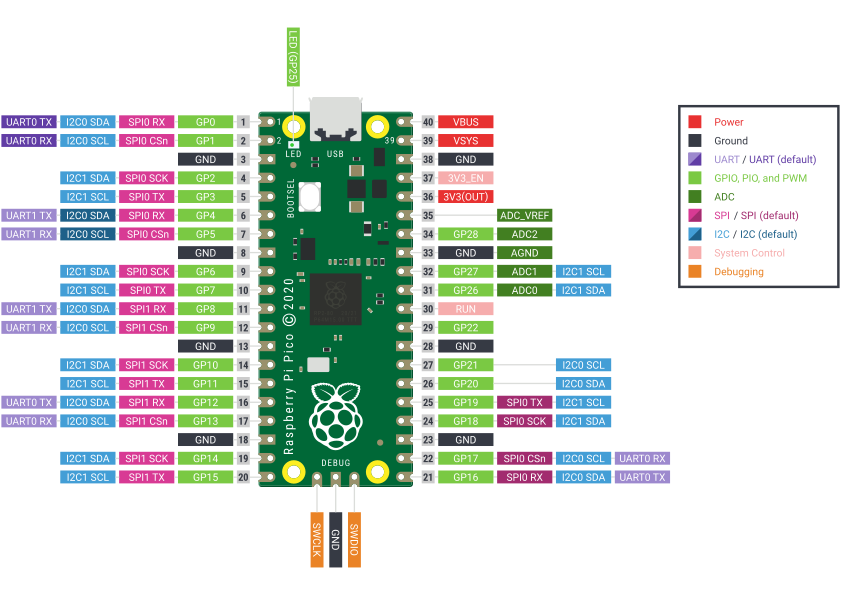

== The family

image::images/four_picos.jpg[width="75%"]

The Raspberry Pi Pico family currently consists of four boards; Raspberry Pi Pico (far left), Pico H (middle left), Pico W (middle right), and Pico WH (far right).

[[technical-specification]]
== Raspberry Pi Pico and Pico H

Raspberry Pi Pico is a low-cost, high-performance microcontroller board with flexible digital interfaces. Key features include:

* xref:rp2040.adoc#welcome-to-rp2040[RP2040] microcontroller chip designed by Raspberry Pi in the United Kingdom
* Dual-core Arm Cortex M0+ processor, flexible clock running up to 133 MHz
* 264kB of SRAM, and 2MB of on-board flash memory
* USB 1.1 with device and host support
* Low-power sleep and dormant modes
* Drag-and-drop programming using mass storage over USB
* 26 × multi-function GPIO pins
* 2 × SPI, 2 × I2C, 2 × UART, 3 × 12-bit ADC, 16 × controllable PWM channels
* Accurate clock and timer on-chip
* Temperature sensor
* Accelerated floating-point libraries on-chip
* 8 × Programmable I/O (PIO) state machines for custom peripheral support

The Raspberry Pi Pico comes as a castellated module allows soldering direct to carrier boards, while the Pico H comes with pre-soldered headers.

NOTE: Both boards have a three pin Serial Wire Debug (SWD) header. However, the Pico H has this broken out into a small, keyed, https://datasheets.raspberrypi.com/debug/debug-connector-specification.pdf[3-pin connector] while the Pico has three castellated through-hole pins adjacent to the edge of the board.

=== Pinout and design files

* Download the https://datasheets.raspberrypi.com/pico/Pico-R3-A4-Pinout.pdf[Pinout Diagram] (PDF)
* Download https://datasheets.raspberrypi.com/pico/RPi-Pico-R3-PUBLIC-20200119.zip[Design Files] (Cadence Allegro)
* Download https://datasheets.raspberrypi.com/pico/Pico-R3-step.zip[STEP File]
* Download https://datasheets.raspberrypi.com/pico/Pico-R3-Fritzing.fzpz[Fritzing Part] for Raspberry Pi Pico
* Download https://datasheets.raspberrypi.com/pico/PicoH-Fritzing.fzpz[Fritzing Part] for Raspberry Pi Pico H

NOTE: More information on Fritzing is available on the https://fritzing.org/[fritzing.org] website.

== Raspberry Pi Pico W and Pico WH

Raspberry Pi Pico W adds on-board single-band 2.4GHz wireless interfaces (802.11n) using the Infineon CYW43439 while retaining the Pico form factor. The on-board 2.4GHz wireless interface has the following features:

* Wireless (802.11n), single-band (2.4 GHz)
* WPA3
* Soft access point supporting up to four clients

The antenna is an onboard antenna licensed from ABRACON (formerly ProAnt). The wireless interface is connected via
SPI to the xref:rp2040.adoc#welcome-to-rp2040[RP2040] microcontroller.

Due to pin limitations, some of the wireless interface pins are shared. The CLK is shared with VSYS monitor, so only
when there isn’t an SPI transaction in progress can VSYS be read via the ADC. The Infineon CYW43439 DIN/DOUT and
IRQ all share one pin on the RP2040. Only when an SPI transaction isn’t in progress is it suitable to check for IRQs. The
interface typically runs at 33MHz.

For best wireless performance, the antenna should be in free space. For instance, putting metal under or close by the
antenna can reduce its performance both in terms of gain and bandwidth. Adding grounded metal to the sides of the
antenna can improve the antenna’s bandwidth.

NOTE: The CYW43439 wireless chip is connected via SPI to the RP2040. While the CYW43439 supports both 802.11 wireless and Bluetooth, initially Pico W does not have Bluetooth support. Support may be added later, and will use the same SPI interface. If support is added existing hardware may require a firmware update to support Bluetooth, but there will be no hardware modifications needed.

=== Pinout and design files

image::images/picow-pinout.svg[]

* Download the https://datasheets.raspberrypi.com/picow/PicoW-A4-Pinout.pdf[Pinout Diagram] (PDF)
* Download https://datasheets.raspberrypi.com/picow/RPi-PicoW-PUBLIC-20220607.zip[Design Files] (Cadence Allegro)
* Download https://datasheets.raspberrypi.com/picow/PicoW-step.zip[STEP File]
* Download https://datasheets.raspberrypi.com/picow/PicoW-Fritzing.fzpz[Fritzing Part] for Rapsberry Pi Pico W
