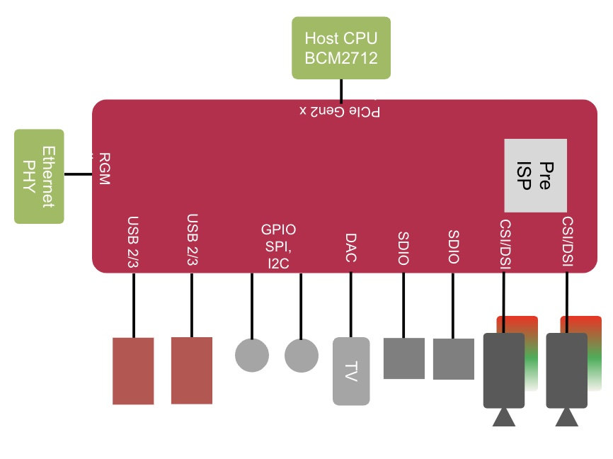

== About RP1

.Architecture 

RP1 is a 12×12mm, 0.65mm-pitch BGA southbridge, which provides the majority of the I/O capabilities for xref:../computers/raspberry-pi-5.adoc[Raspberry Pi 5]. Access to peripherals from BCM2712 is done via the RP1 on Raspberry Pi 5. It provides:

* 4-lane PCIe 2.0 endpoint
* Gigabit Ethernet MAC
** 2× USB 3 host controllers
** Each has 1× USB 3 and 1× USB 2 port
** Each has 1× USB 3 and 1× USB 2 port
* More than 2× usable USB BW vs Raspberry Pi 4
* 2 × SDIO ports/eMMC (not used on Raspberry Pi 5)
* MIPI transceivers (4-lane, supporting DSI and CSI-2)
** Video DAC (3-channel, supporting PAL/NTSC and VGA)
* Only one channel (composite) used on Raspberry Pi 5
* Low-speed peripherals (SPI, UART, I2C, PWM, GPIO, I2S)
* Delta-sigma PWM audio out

More information on RP1 can be found in the https://datasheets.raspberrypi.com/rp1/rp1-peripherals.pdf[RP1 Peripherals] document.
