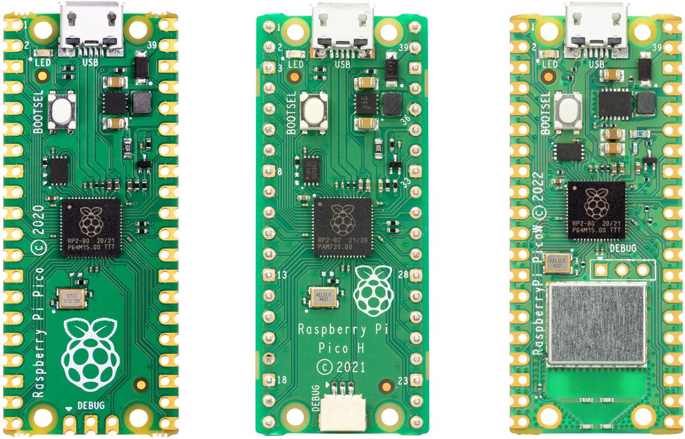

== RP2040-based Boards

Designed by Raspberry Pi as both a development board, and as a reference design, the xref:raspberry-pi-pico.adoc[Raspberry Pi Pico] series is a family of RP2040-based boards. The Pico family currently consists of Raspberry Pi Pico (far left), Pico H (left), Pico W (right), and Pico WH (far right).

The design files for Raspberry Pi Pico and Pico W are available openly, with no limitations. 

* Download https://datasheets.raspberrypi.com/pico/RPi-Pico-R3-PUBLIC-20200119.zip[Design Files] for Raspberry Pi Pico (Cadence Allegro)
* Download https://datasheets.raspberrypi.com/picow/RPi-PicoW-PUBLIC-20220607.zip[Design Files] for Raspberry Pi Pico W (Cadence Allegro)

Permission to use, copy, modify, and/or distribute this design for any purpose with or without fee is hereby granted.

THE DESIGN IS PROVIDED "AS IS" AND THE AUTHOR DISCLAIMS ALL WARRANTIES WITH REGARD TO THIS DESIGN INCLUDING ALL IMPLIED WARRANTIES OF MERCHANTABILITY AND FITNESS. IN NO EVENT SHALL THE AUTHOR BE LIABLE FOR ANY SPECIAL, DIRECT, INDIRECT, OR CONSEQUENTIAL DAMAGES OR ANY DAMAGES WHATSOEVER RESULTING FROM LOSS OF USE, DATA OR PROFITS, WHETHER IN AN ACTION OF CONTRACT, NEGLIGENCE OR OTHER TORTIOUS ACTION, ARISING OUT OF OR IN CONNECTION WITH THE USE OR PERFORMANCE OF THIS DESIGN.

=== Other Boards

Discussions around other third party RP2040-based boards can be found on the https://forums.raspberrypi.com/viewforum.php?f=147[Raspberry Pi forums].
