== RP2040-based Boards

An incomplete list of boards using RP2040.

=== Boards from Raspberry Pi

image::images/pico.jpg[]

https://www.raspberrypi.com/products/raspberry-pi-pico/[Raspberry Pi Pico]:: Designed by Raspberry Pi, RP2040 features a dual-core Arm Cortex-M0+ processor with 264KB internal RAM and support for up to 16MB of off-chip Flash. A wide range of flexible I/O options includes I2C, SPI, and — uniquely — Programmable I/O (PIO). These support endless possible applications for this small and affordable package.

=== Boards from Adafruit

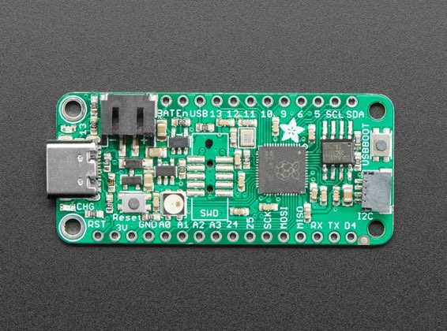

https://www.adafruit.com/product/4884[Feather 2040]:: A new chip means a new Feather, and the Raspberry Pi RP2040 is no exception. When we saw this chip we thought "this chip is going to be awesome when we give it the Feather Treatment" and so we did! This Feather features the RP2040, and all niceties you know and love about Feather.

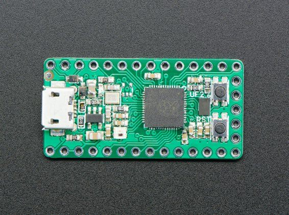

https://www.adafruit.com/product/4888[ItsyBitsy 2040]:: A new chip means a new ItsyBitsy, and the Raspberry Pi RP2040 is no exception. When we saw this chip we thought "this chip is going to be awesome when we give it the ItsyBitsy teensy-weensy Treatment" and so we did! This Itsy' features the RP2040, and all niceties you know and love about the ItsyBitsy family.

=== Boards from Arduino

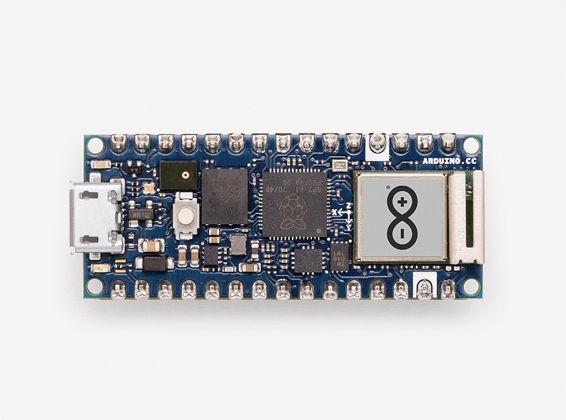

https://store.arduino.cc/nano-rp2040-connect-with-headers[Nano RP2040 Connect]:: Meet the only connected RP2040 board, leveraging essential key features of the other Arduino Nanos — like the versatile u-blox NINA WiFi and Bluetooth module. The new board comes packed with some high-quality MEMS sensors from STM, an efficient power section, and a bunch of other innovations.

=== Boards from Pimoroni

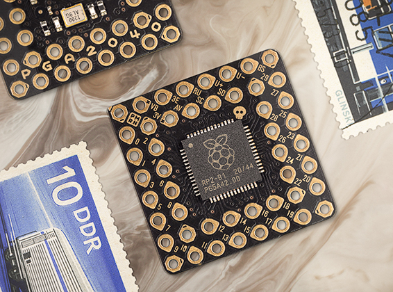

https://shop.pimoroni.com/products/pga2040[PGA2040]:: A minimal RP2040 breakout board wrangled into a Pin Grid Array, with a maximal dash of retraux style. PGA2040 has no USB port, LED or buttons but it does have an embed-friendly 21mm square footprint, 8MB of flash and lots of exposed RP2040 pins to play with.

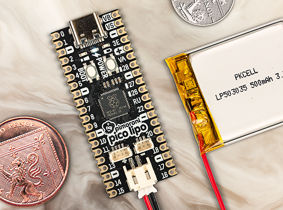

https://shop.pimoroni.com/products/pimoroni-pico-lipo[Pico LiPo]:: A top of the line Pirate-brand RP2040-powered microcontroller with all the extras - lots of flash memory, USB-C, STEMMA QT/Qwiic, debug connectors, and onboard LiPo charging. Pimoroni Pico boards add extra functionality whilst keeping to the Pico footprint, ensuring compatibility with existing Pico addons.

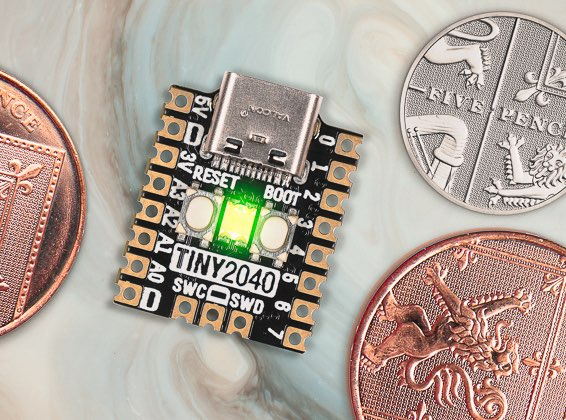

https://shop.pimoroni.com/products/tiny-2040[Tiny 2040]:: A postage stamp sized RP2040 development board with a USB-C connection, perfect for portable projects, wearables, and embedding into devices. Tiny 2040 comes with 8MB of QSPI (XiP) flash on board so it can handle projects small and large with ease.

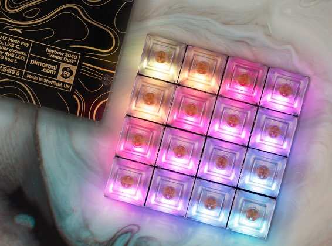

https://shop.pimoroni.com/products/keybow-2040[Keybow 2040]:: A luxe 16 key USB-C keyboard with tactile mechanical switches and fully customisable RGB lighting, ideal for custom macro pads, midi controllers and stream decks. RP2040 gives Keybow 2040 low latency input, zero boot time and a new, compact footprint.

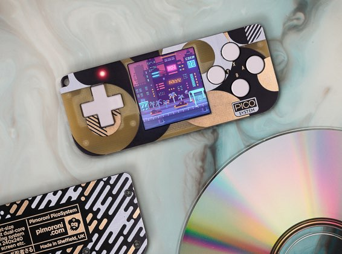

https://shop.pimoroni.com/products/picosystem[PicoSystem]:: An all-in-one pocket sized games console with RP2040 at its heart, ready for filling up with all the most fun pixels! PicoSystem has a nice tactile joypad and buttons, a vibrant 240x240 screen and a lipo battery, neatly wrapped up in some shiny abstract PCB art.

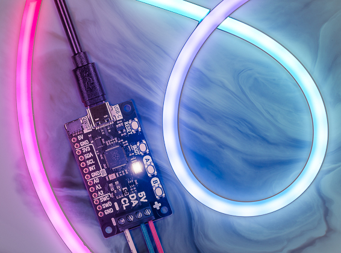

https://shop.pimoroni.com/products/plasma-2040[Plasma 2040]:: Swathe everything in rainbows with this all-in-one, USB-C powered controller for WS2812/Neopixel and APA102/Dotstar addressable LED strips, with RP2040 in the driving seat - just perfect for whipping up some custom mood lighting.

=== Boards from SparkFun

image::images/pro-micro.jpg[]

https://www.sparkfun.com/products/17717[Pro Micro - RP2040]:: The SparkFun Pro Micro RP2040 is a low-cost, high performance board with flexible digital interfaces featuring the RP2040 microcontroller. The board also includes a WS2812B addressable LED, boot button, reset button, USB-C, resettable PTC fuse, castellated pads, and a Qwiic connector to add devices from SparkFun’s quick-connect I2C ecosystem.

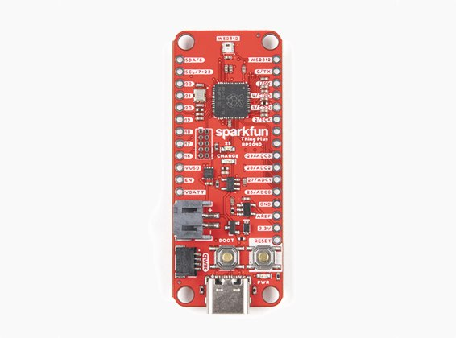

https://www.sparkfun.com/products/17745[Thing Plus - RP2040]:: The SparkFun Thing Plus - RP2040 harnesses the capability of RP2040 on a compact development board. Within the Feather-compatible Thing Plus form factor with 18 GPIO pins, the board offers an SD card slot, 16MB flash memory, a JST single-cell battery connector, an addressable WS2812 RGB LED, JTAG PTH pins, mounting holes, and SparkFun's signature Qwiic connector.

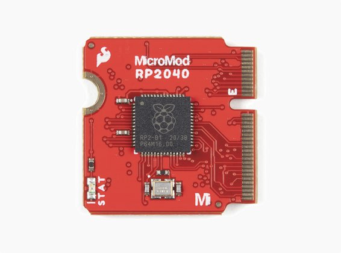

https://www.sparkfun.com/products/17720[MicroMod RP2040 Processor]:: The SparkFun MicroMod Pi RP2040 Processor Board is part of SparkFun’s MicroMod modular interface system. The MicroMod M.2 connector makes it a breeze to connect your MicroMod Pi RP2040 Processor with the MicroMod carrier board that gives you the inputs and outputs you need for your project.

=== Other Boards

Discussions around other RP2040-based boards can be found on the https://forums.raspberrypi.com/viewforum.php?f=147[forums].
