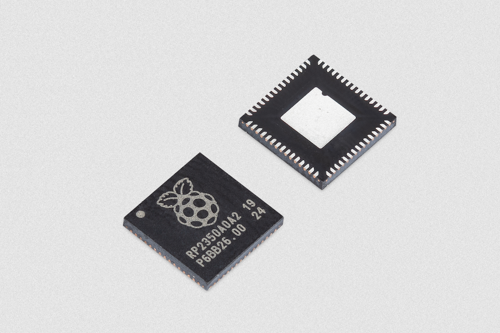
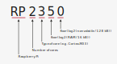

== RP2350

RP2350 is a microcontroller designed by Raspberry Pi.

Whether you have a xref:pico-series.adoc#pico-2-technical-specification[Raspberry Pi Pico 2] or another RP2350-based microcontroller board, everything you need to get started is here. You'll find support for getting started with xref:c_sdk.adoc#sdk-setup[C/{cpp}] or xref:micropython.adoc#what-is-micropython[MicroPython] on Raspberry Pi Pico 2, and links to resources for other boards that use RP2350. There are also links to the technical documentation for both the Raspberry Pi Pico 2 microcontroller board and our RP2350 microcontroller chip.

=== Why is the chip called RP2350?

The post-fix numeral on RP2350 comes from the following,

. Number of processor cores (2)
. Loosely which type of processor (M33)
. floor(log2(RAM / 16 kB))
. floor(log2(nonvolatile / 128 kB)) or 0 if no onboard nonvolatile storage

=== Technical Specification

RP2350 is a high-performance, secure, low-cost, easy-to-use microcontroller from Raspberry Pi.

With a large on-chip memory, symmetric dual-core processor complex, deterministic bus fabric, and rich peripheral set augmented with our unique Programmable I/O (PIO) subsystem, it provides professional users with unrivalled power and flexibility. With detailed documentation, a polished MicroPython port, and a UF2 bootloader in ROM, it has the lowest possible barrier to entry for beginner and hobbyist users.

RP2350 is a stateless device, with support for cached execute-in-place from external QSPI memory. This design decision allows you to choose the appropriate density of non-volatile storage for your application, and to benefit from the low pricing of commodity flash parts.

RP2350 is manufactured on a modern 40nm process node, delivering high performance, low dynamic power consumption, and low leakage, with a variety of low-power modes to support extended-duration operation on battery power.

Key features include:

* Dual Cortex-M33 or Hazard3 processors at up to 150 MHz
* 520 kB multi-bank high performance SRAM
* Support for up to 16 MB of off-chip Flash memory via dedicated QSPI bus
* DMA controller
* Fully-connected AHB crossbar
* On-chip programmable LDO to generate core voltage
* 2 on-chip PLLs to generate USB and core clocks
* 30 GPIO pins, 4 of which can be used as analogue inputs
* Peripherals
** 2 UARTs
** 2 SPI controllers
** 2 I2C controllers
** 24 PWM channels
** USB 1.1 controller and PHY, with host and device support
** 3 Programmable IO (PIO) blocks, 12 state machines total

==== Security

RP2350 has a comprehensive security architecture, built around Arm TrustZone for Cortex-M, including the following features:

* Signed boot support
* 8 kB of on-chip antifuse one-time-programmable (OTP) memory
* SHA-256 acceleration
* A hardware true random number generator (TRNG)

==== Architecture Switching

RP2350 includes a pair of open-hardware Hazard3 RISC-V cores which can be substituted at boot time for the Cortex-M33 cores. Our boot ROM can even auto-detect the architecture for which a second-stage binary has been built and reboot the chip into the appropriate mode. All features of the chip, apart from a handful of security features, and the double-precision floating-point accelerator, are available in RISC-V mode.

=== RP2350-based Boards

Designed by Raspberry Pi as both a development board, and as a reference design, the xref:pico-series.adoc#pico-2-technical-specification[Raspberry Pi Pico 2] is based on the RP2350.

Permission to use, copy, modify, and/or distribute this design for any purpose with or without fee is hereby granted.

THE DESIGN IS PROVIDED "AS IS" AND THE AUTHOR DISCLAIMS ALL WARRANTIES WITH REGARD TO THIS DESIGN INCLUDING ALL IMPLIED WARRANTIES OF MERCHANTABILITY AND FITNESS. IN NO EVENT SHALL THE AUTHOR BE LIABLE FOR ANY SPECIAL, DIRECT, INDIRECT, OR CONSEQUENTIAL DAMAGES OR ANY DAMAGES WHATSOEVER RESULTING FROM LOSS OF USE, DATA OR PROFITS, WHETHER IN AN ACTION OF CONTRACT, NEGLIGENCE OR OTHER TORTIOUS ACTION, ARISING OUT OF OR IN CONNECTION WITH THE USE OR PERFORMANCE OF THIS DESIGN.

==== Other Boards

You can find discussions around third-party RP2350-based boards on the https://forums.raspberrypi.com/viewforum.php?f=147[Raspberry Pi forums].

==== USB PIDs

Many RP2350-based devices use Raspberry Pi's USB Vendor ID and Product ID combination. If you build a third-party board based on RP2350, you may require a unique USB Product ID (PID).

You might need a unique USB PID if you need to provide a custom driver for Windows users.

USB-IF have given Raspberry Pi permission to license USB product ID values for its Vendor ID (`0x2E8A`) for common silicon components used with RP2350.

To reserve a USB PID associated with Raspberry Pi's vendor ID, follow the instructions in the https://github.com/raspberrypi/usb-pid[Raspberry Pi USB PID git repository].

NOTE: If you use the standard RP2350 PID, you can use the `iManufacturer`, `iProduct`, and `iSerial` strings to uniquely identify your device.

