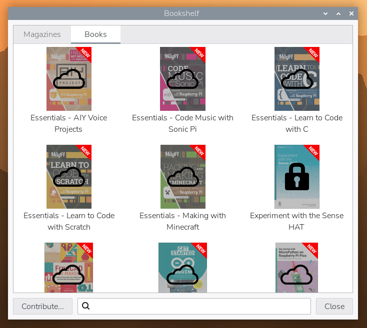

[[bookshelf]]
== Introduction

The Bookshelf application in Raspberry Pi OS provides access to books and magazines published by Raspberry Pi Press. Since Raspberry Pi OS _Trixie_, this also includes contributor-only titles.

* Free titles are indicated by the cloud icon and can be downloaded by anyone.
* Contributor-only titles are indicated by the padlock symbol unless you're signed in with a xref:../services/id.adoc[Raspberry Pi ID] that's associated with a contribution or a subscription to the print magazine. Some contributor-only titles later become available to all.

Bookshelf is included in the Raspberry Pi OS Desktop and Raspberry Pi OS Full images.
