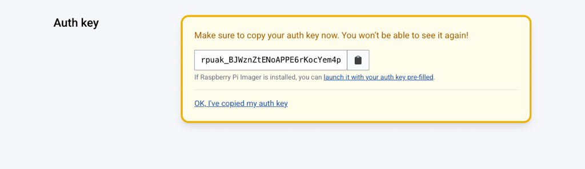
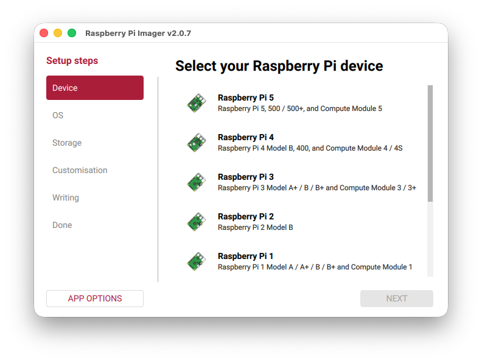
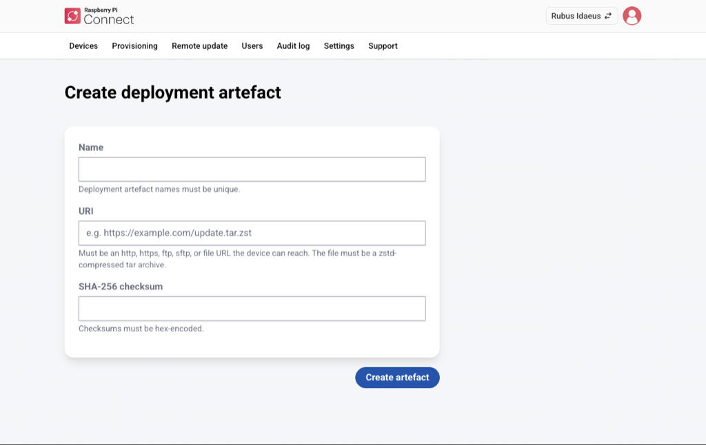
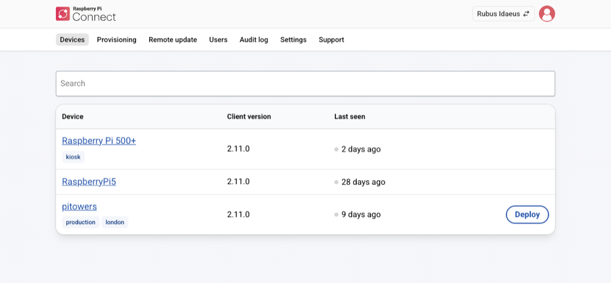
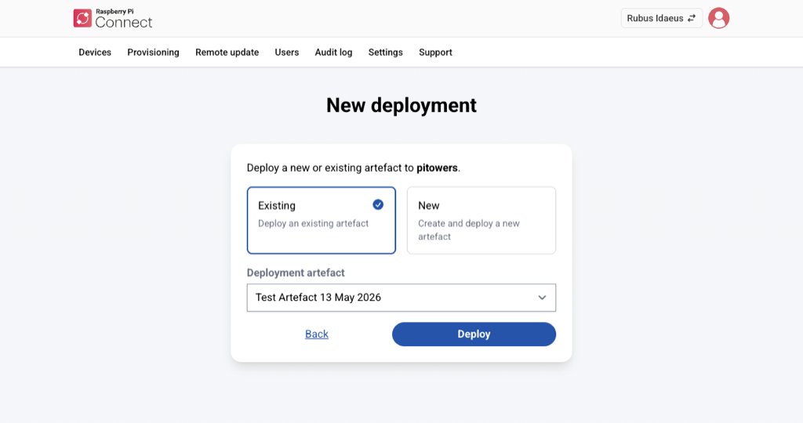

[[remoteupdate-ab]]

=== A/B Boot Update

The A/B boot update prevents a failed or faulty update from causing your device to stop working.

The configuration has two independent slots, each made up of a boot and a system partition. Slot A is used for the existing operating system (OS) and slot B is used for the update. The device boots from slot B, but reverts to booting from the known working partition, slot A, if that fails. This process repeats with each successive update.

Configuring for A/B boot requires being able to physically access the device. This is because you must image the device with the appropriate A/B boot layout. However, once configured, you can then deliver remote updates using Raspberry Pi Connect.

Use https://github.com/raspberrypi/rpi-image-gen[rpi-image-gen] to create both the A/B boot configuration (`.img` file) and the update artefacts (`.tar.zst` files). Use https://www.raspberrypi.com/software/[Raspberry Pi Imager] to configure the `.img` file and write it to the storage device for transfer to the recipient Raspberry Pi.

==== Prerequisites

The following are required to use remote update and the A/B boot configuration:

===== For creation of the A/B boot configuration and creation of the update artefact using rpi-image-gen:

A Raspberry Pi device on which is installed:

* The latest 32-bit or 64-bit version of Raspberry Pi OS (Trixie).
* https://github.com/raspberrypi/rpi-image-gen[rpi-image-gen].
* The latest version of Raspberry Pi Connect or Connect Lite.
* The latest version of https://www.raspberrypi.com/software/[Raspberry Pi Imager].

===== To configure the recipient device for A/B boot:

* A storage device (typically, microSD) to save the A/B boot layout to and a way to connect the storage device to the Raspberry Pi.
+
You must have at least 16 GB of space, but you must decide exactly how much disk space you need based on your expected future requirements for the boot partition (firmware, kernel, device tree files, and possibly initramfs) and the system partition (kernel modules and system-level software such as the standard Linux command-line utilities).

===== To host the artefact for remote deployment to a recipient device:

* A web server accessible from the recipient device.
+
Remote update supports HTTP, HTTPS, FTP, SFTP, and File URI.
+
The location doesn't have to be open to the internet, but it must be accessible from the recipient Raspberry Pi device.

===== For the recipient device receiving the update artefact:

* Raspberry Pi 4 or later that is:
** Connected to the internet.
** Opted in to remote updates.
** Registered with, and signed in to, your Raspberry Pi Connect account.

==== Implement A/B boot and remotely update the first image

Follow the four stages below to implement the A/B configuration and send updates using Raspberry Pi Connect:

. Stage 1: Prepare the recipient Raspberry Pi 4 and later device for remote updates by creating an A/B boot file, then deploy it to the device.
. Stage 2: Create an update artefact file for deployment to the recipient device.
. Stage 3: Host the update artefact and register it on the Raspberry Pi Connect website.
. Stage 4: Use Raspberry Pi Connect's remote update feature to select the recipient device, then deploy the update artefact to that device.

==== Stage 1: Create A/B boot configuration

Standard Raspberry Pi OS installations don't feature an A/B boot configuration. This stage shows you how to create one using https://github.com/raspberrypi/rpi-image-gen[rpi-image-gen] and https://www.raspberrypi.com/software/[Raspberry Pi Imager].

rpi-image-gen outputs an `.img` file containing the A/B boot image.

Raspberry Pi Imager then uses the `.img` file to write the operating system configuration to the storage device. This includes opting the device in to remote updates so that Raspberry Pi Connect can update it.

You must have physical access to the recipient device to update it for the first time, but once you’ve configured it, you can send updates remotely thereafter.

In Step 3, you generate an auth key to allow the recipient device to link to the Raspberry Pi Connect website. This auth key is tied to a single recipient device, so create a new key for each recipient device you want to update.

NOTE: You must be using a Raspberry Pi device running the latest version of Raspberry Pi OS (Trixie) to create the update. The recipient device must be a Raspberry Pi 4 or later.

To update a recipient device with an A/B boot configuration:

===== Step 1: Install rpi-image-gen

. On the Raspberry Pi, from the command line, run the following command to clone the rpi-image-gen repository from GitHub:
+
[source,console]
----
$ git clone https://github.com/raspberrypi/rpi-image-gen.git
----

. Navigate to the cloned directory, then install the dependencies by running the following commands:
+
[source,console]
----
$ cd rpi-image-gen
$ sudo ./install_deps.sh
----

===== Step 2: Prepare and configure the image

TIP: rpi-image-gen contains an example application, with layers and configuration, to build an image compatible with remote updates.

For descriptions of the `.yaml` file metadata, see https://raspberrypi.github.io/rpi-image-gen/layer/index.html#_x_env_metadata[X environment metadata] and https://raspberrypi.github.io/rpi-image-gen/layer/index.html[Layer].

To prepare the image:

. Navigate to the rpi-image-gen installation folder
. Open `examples/ota/layer/ota.yaml`
. Customise the following metadata:
- X-Env-Layer-Name.
- X-Env-Layer-Category.
- X-Env-Layer-Desc.
- X-Env-Layer-Reqs.
. Open `examples/ota/config/ota.yaml`
. Set the following environment variables:
- Version. Used to determine the version boot image. Set a starting version number now and increment it accordingly with each update artefact you create in the future. If you don’t specify a version number, it defaults to 1.0.0.
- Device hostname. Used across all images created for this device. Must be unique. If you don't specify a device hostname, the default value `ota-device-1` is created for each build.
. (Optional) open `examples/ota/config/ota.yaml` and:
- Define additional packages to install at build time. For more information, see https://raspberrypi.github.io/rpi-image-gen/config/index.html#_packages[Packages].
- Add wireless networking credentials. For more information, see https://github.com/raspberrypi/rpi-image-gen/tree/master/examples/ota[Wireless Networking].

===== Step 3: Generate an auth key

In this step, you create the auth key and copy it down for use in Step 4.

When you boot the recipient device after the A/B boot update (Step 6), it exchanges the auth key for an access token that is saved in the user data partition. This key persists across future updates, so you only have to generate it once.

For more information about creating auth keys for an organisation, see xref:../services/connect-for-organisations.adoc#organisation-auth-keys[Create auth keys].

To generate the auth key:

. Log in to Raspberry Pi Connect
. Choose your organisation or *Personal* account from the account switcher at the top right.
. Go to the *Provisioning* tab (for an organisation) or the *Settings* tab (for Personal), then select *New* in the Auth keys section (organisation) or *Create new auth key* (Personal).
. Fill out the form, then select *Create auth key*.
. Copy down the key.

.The Auth key page in Raspberry Pi Connect allows you to copy the key to the clipboard.

===== Step 4: Build the A/B boot configuration image

Now that you’ve set up the application and created an auth key, create the boot configuration image using rpi-image-gen.

This creates a `.img` file that will be written to the storage device with Raspberry Pi Imager in Step 5.

To build the A/B boot configuration image:

. From the command line, change directory to the rpi-image-gen folder.
+
[source,console]
----
$ cd rpi-image-gen
----
. Run the following command, replacing `rpuak_XXX` with the auth key you copied in Step 3 (organisation auth keys start with `rpoak_`).
+
Raspberry Pi 5 and later:
+
[source,console]
----
$ ./rpi-image-gen build -S ./examples/ota/ -c ota.yaml -- IGconf_connect_authkey=rpuak_XXX
----
+
Raspberry Pi 4:
+
[source,console]
----
$ ./rpi-image-gen build -S ./examples/ota/ -c ota.yaml -- IGconf_device_layer=rpi4 IGconf_connect_authkey=rpuak_XXX
----
+
The application generates the file and saves it in the /rpi-image-gen/work/image-x.x.x folder (where x.x.x corresponds to the version environment variable you set in Step 2).

===== Step 5: Write the image

Next, use Raspberry Pi Imager to create the operating system configuration and save it to the storage device.

WARNING: In the example target below, (`/dev/mmcblk0`) is only used if you’re booting from another device, such as an NVMe SSD. Be careful not to overwrite the operating system.

To write the image:

. If Raspberry Pi Imager is not already installed, run the following from the command line:
+
[source,console]
----
$ sudo apt install rpi-imager
----
. Open *Raspberry Pi Imager* from the *Accessories* menu in the graphical interface. Enter your password if prompted to.
. Select the recipient device type: *Raspberry Pi 4* or *Raspberry Pi 5*, then select *Next*.
+
.Raspberry Pi Imager is used to write the image.

+
. On the OS tab, scroll all the way to the bottom and select *Use Custom*.
. Navigate to the `.img` file you created in step 4, select it, then select *Open*.
. Select *Next* and choose the storage device to save the A/B boot configuration to.
. Select *Write*, then follow the on-screen prompts to complete the writing process.
. When Raspberry Pi Imager finishes writing the operating system, select *Finish*.

You can now safely remove the storage device in preparation for Step 6.

[discrete]
===== Step 6: Deploy the `.img` file to the recipient device

. Power off the recipient device.
. Attach the storage device from Step 5.
. Power the recipient device on, then wait for it to boot with the new image.
. Log in to Raspberry Pi Connect, then go to *Devices*.
+
The device appears on the Raspberry Pi Connect dashboard and the *Remote update* label appears beneath the device.

The device is now ready to update remotely using Raspberry Pi Connect.

[discrete]
===== Step 7: Confirm the deployed version

Confirm the version of the deployed image on the device is the same as the one you configured in Step 2.

To confirm the deployed image version:

. Select the device in Raspberry Pi Connect.
. Select *Connect*.
. From the command line, enter:
+
[source,console]
----
$ cat /etc/rpi-issue
----
+
The command line returns something like the following:
+
[source,console]
----
Generated using rpi-image-gen e3828f885c860f15991468883d3b8484b0eaf9d8 on 2025-12-09
Artefact version: 1.0.0
----

==== Stage 2: Create update artefact

Now the device is configured for A/B booting, deliver update artefacts to it using Raspberry Pi Connect.

Update artefacts are created by rpi-image-gen as `.tar.zst` files. These are much smaller than the `.img` file you created in Stage 1, and are deployed in Stage 4 to the recipient device by Raspberry Pi Connect.

For the purposes of illustration, we continue to use the example update from Stage 1 here. Amend these procedures to reflect the path and naming of your own update .yaml file.

To build the update artefact:

===== Step 1: Update the `ota.yaml` configuration

. Increment the Version environment variable in the configuration `ota.yaml` file:
+
[source,console]
----
${EDITOR:-vi} ./examples/ota/config/ota.yaml
----

===== Step 2: Build the update

. From the terminal, build the update by running the following command:
+
[source,console]
----
$ ./rpi-image-gen build -S ./examples/ota/ -c ota.yaml
----

[[host-the-update-artefact]]
==== Stage 3: Host the update artefact

Now that you’ve created an update artefact to deploy using Raspberry Pi Connect, you can host it on an FTP/SFTP server, save it locally using a `file://` URI, put it on a public web server, an S3 bucket, or any other website that the recipient device can download from using HTTP.

Next, you register the URI and SHA-256 checksum with Raspberry Pi Connect. This is so that Connect can tell the device – which you select in Stage 4 – where to find the update file.

The URI you provide is used to find and push the update artefact to the recipient device. This location must therefore be accessible to the recipient device, but it doesn't have to be accessible to the Raspberry Pi Connect servers.

Here is an example URI: http://192.168.0.1:8080/path/to/update.tar.zst

It contains the following required information:

* The host IP: 192.168.0.1
* The port: 8080
* The path: /path/to/update.tar.zst

In the procedures that follow, we show you how to serve an update artefact from a Raspberry Pi host computer that is on the same network as the Raspberry Pi recipient.

To host the update artefact:

===== Step 1: Run an HTTP server on the host device

. Run this command from the terminal to create a server and host the update artefact (change the artefact image directory accordingly):
+
[source,console]
----
$ python -m http.server 8080 --directory ./work/image-myapp-1.1.0
----

===== Step 2: Calculate the SHA-256 checksum of the update file

Next, provide both the artefact's SHA-256 checksum to ensure it hasn’t been corrupted or tampered with, and the host IP address so that it can be sent to the recipient device in Stage 4.

To find the checksum and IP address:

. Run this command from the terminal:
+
[source,console]
----
$ sha256sum ./work/image-myapp-1.1.0/update.tar.zst
----
. Copy down the checksum.

[discrete]
===== Step 3: Find the host computer's IP address on the local network

You must provide a URI for the update artefact, part of which is the host IP address.

To find the IP address:

. Run this command from the terminal:
+
[source,console]
----
$ hostname -I
----
. Copy down the IP address.

===== Step 4: Register the artefact on the Raspberry Pi Connect website

Now that you have hosted the update artefact, and have its IP address and checksum copied down, register the details on the https://connect.raspberrypi.com/[Raspberry Pi Connect website].

To register the update artefact, follow these steps or <<update-remotely,go to Stage 4, Step 1>> if you want to both register it and select the recipient device in one go.

For personal devices:

. Log in to Raspberry Pi Connect.
. Choose your organisation or *Personal* account from the account switcher at the top right.
. Go to the *Remote update* tab, then select *New*.
. Enter a name for the artefact, then paste in the URI and SHA-256 (from Steps 2 and 3).

.The create deployment artefact screen, showing the required fields: Name, URI, and SHA-256 checksum.

[[update-remotely]]
==== Stage 4: Update remotely

Use Raspberry Pi Connect to deploy the update artefact to the recipient Raspberry Pi device.

The Raspberry Pi Connect website is used to choose which device to deploy the update artefact to, so make sure the recipient device is registered to your personal or organisation account before you proceed.

NOTE: You cannot delete an artefact once you have deployed it or attempted to deploy it. This is to provide traceability in the event that your account is compromised.

To deploy the artefact:

===== Step 1: Select the recipient device, then deploy the artefact

. Log in to Raspberry Pi Connect.
. Select the *Personal* or organisations account to which the recipient device is registered, using the account switcher at the top right.
. Go to the *Devices* tab, then select the recipient device.
+
.The device list displays a Deploy button for the devices that have remote update enabled.

+
. Select *Deploy*
. If you have one or more existing update artefacts already registered in your *Remote update* tab, select one of the following, otherwise select *New*:
- *Existing*: select the deployment artefact from the drop-down list, then select *Deploy*.
- *New*: follow the procedures in Stage 3 (above) to create a new update artefact, then select *Create and deploy*.
+
Refresh your browser to see deployment updates. The progression is *Pending*, *In Progress*, and eventually *Succeeded*.
+
If the deployment displays *Failed*, select it to reveal the error message, then see <<ab-troubleshooting, Troubleshooting>>.
+
.After you've selected Deploy, the New deployment screen gives you the choice of selecting an existing deployment, or creating a new one.

+
NOTE: a Pending deployment can be cancelled by selecting the deployment and then selecting *Cancel*. Pending deployments are also automatically cancelled when another deployment is queued up.

===== Step 2: Verify the update

When the deployment shows as *Succeeded*, verify the update.

To verify the update:

. Sign in to Raspberry Pi Connect.
. Choose your organisation or *Personal* account from the account switcher at the top right.
. Select the *Devices* tab.
. Find the recipient device you just updated, then select *Connect*.
. From the command line, enter:

[source,console]
----
$ cat /etc/rpi-issue
----

The command line returns something like the following, indicating that the `Artefact version` number has changed:

[source,console]
----
Generated using rpi-image-gen e3828f885c860f15991468883d3b8484b0eaf9d8 on 2025-12-09
Artefact version: 1.1.0
----