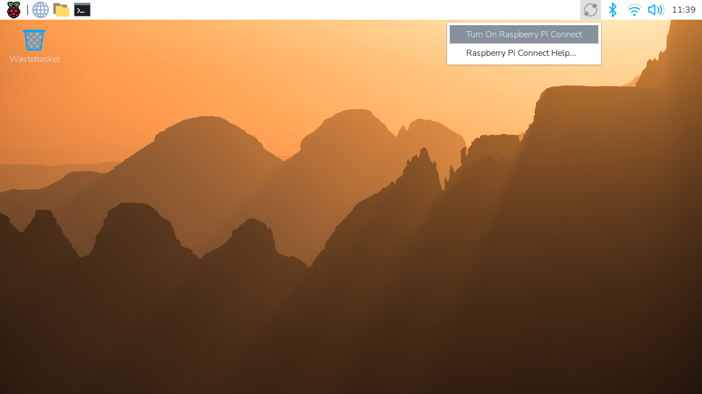

[[install-connect]]
== Install

If Connect isn't already installed in your version of Raspberry Pi OS, open a Terminal window. Run the following command to update your system and packages:

[source,console]
----
$ sudo apt update
$ sudo apt full-upgrade
----

Run the following command on your Raspberry Pi to install Connect:

[source,console]
----
$ sudo apt install rpi-connect
----

You can also install Connect from the Recommended Software application.

After installation, use the `rpi-connect` command line interface to start Connect for your current user:

[source,console]
----
$ rpi-connect on
----

Alternatively, click the Connect icon in the menu bar to open a dropdown menu and select *Turn On Raspberry Pi Connect*:

=== Connect Lite

We distribute an alternate *Lite* variant of Connect that only supports remote shell access, with no ability to screen share.

Run the following command on your Raspberry Pi to install Connect Lite:

[source,console]
----
$ sudo apt install rpi-connect-lite
----

After installation, use the `rpi-connect` command line interface to start Connect for your current user:

[source,console]
----
$ rpi-connect on
----

xref:connect.adoc#enable-remote-shell-at-all-times[Enable user-lingering] to make your device accessible even when your user account isn't logged in.

TIP: Lite commands use the same `rpi-connect` name as the full version of Connect. `rpi-connect-lite` is just a package name.

=== Manually start and stop Connect

To start Connect from the command line, run the following command:

[source,console]
----
$ rpi-connect on
----

To stop Connect, run the following command:

[source,console]
----
$ rpi-connect off
----
