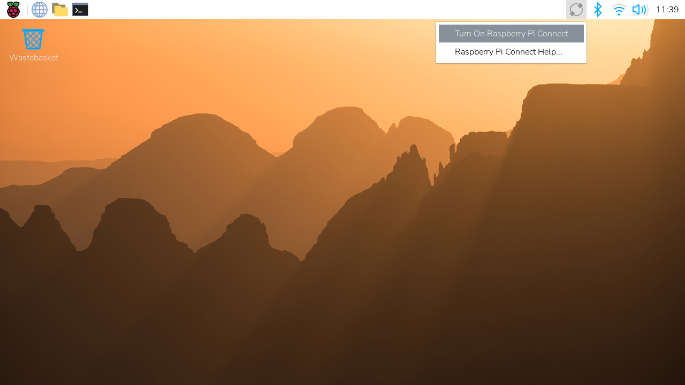
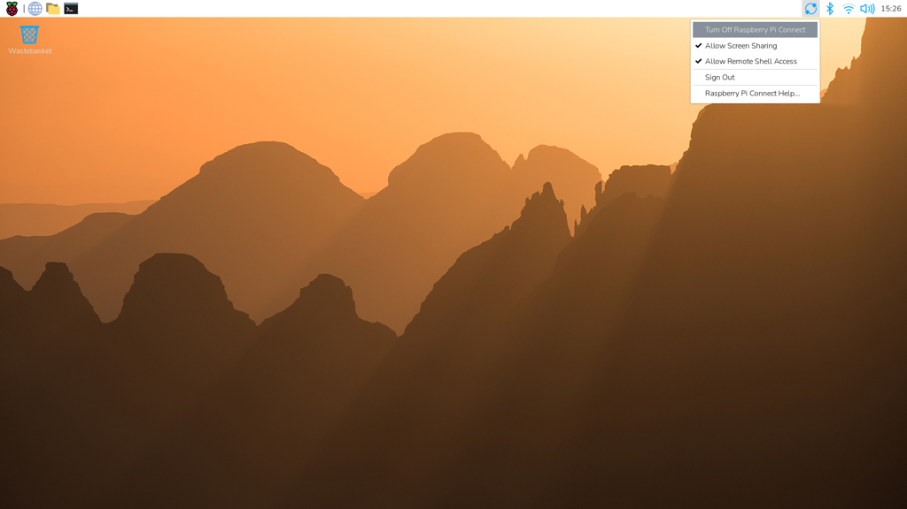

== Manually start and stop Connect

You can turn Connect on and off from either the desktop or the command line:

[tabs]
======
Desktop::
+
To turn on Connect:
+
From the Connect icon in the menu bar, select **Turn On Raspberry Pi Connect**. 
+
If you aren't already signed in with your Raspberry Pi ID, a browser will open and you will be prompted to do so now. Once you've signed in, your Raspberry Pi links to your Connect account.
+

+
To turn off Connect:
+
From the Connect icon in the menu bar, select **Turn Off Raspberry Pi Connect**. 
+
This stops Connect from running.
+

CLI::
+
To turn on Connect, run the following command:
+
[source,console]
----
$ rpi-connect on
----
+
This turns the Connect service on, but doesn't sign you in.
+
To sign in, run the following command:
+
[source,console]
----
$ rpi-connect signin
----
+
To stop Connect, run the following command:
+
[source,console]
----
$ rpi-connect off
----
======