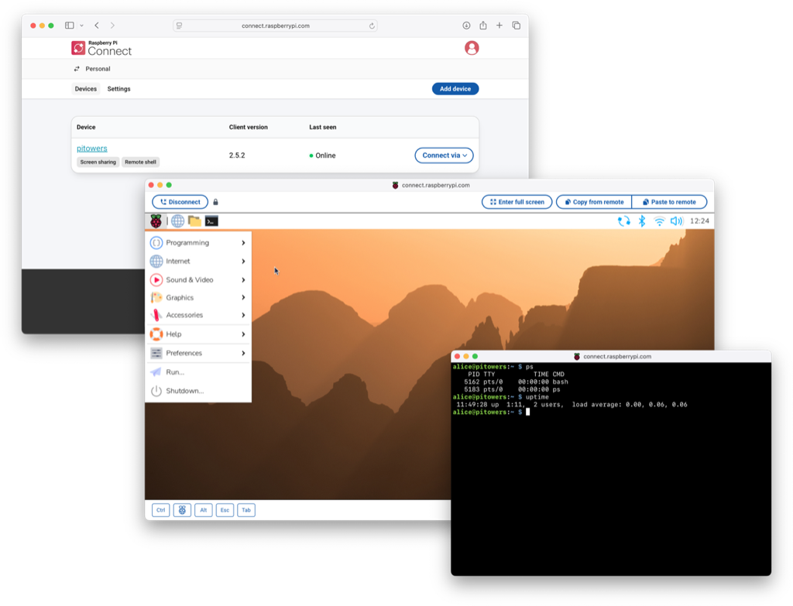

== Introduction

Raspberry Pi Connect provides secure access to your Raspberry Pi from anywhere in the world.

Connect is installed by default in Raspberry Pi OS Desktop and Raspberry Pi OS Full (desktop with recommended software). An alternate *Lite* variant of Connect, that only supports remote shell access with no ability to screen share, is installed by default in Raspberry Pi OS Lite.

To use Connect, xref:connect.adoc#link-connect[link your device with a Connect account]. Visit https://connect.raspberrypi.com[connect.raspberrypi.com] to access the desktop or a shell running on your Raspberry Pi in a browser window.

Connect uses a secure, encrypted connection. By default, Connect communicates directly between your Raspberry Pi and your browser. However, when Connect can't establish a direct connection between your Raspberry Pi and your browser, we use a relay server. In such cases, Raspberry Pi only retains the metadata required to operate Connect.

NOTE: To use Connect, your Raspberry Pi must run https://www.raspberrypi.com/news/bookworm-the-new-version-of-raspberry-pi-os/[Raspberry Pi OS _Bookworm_] or later.
