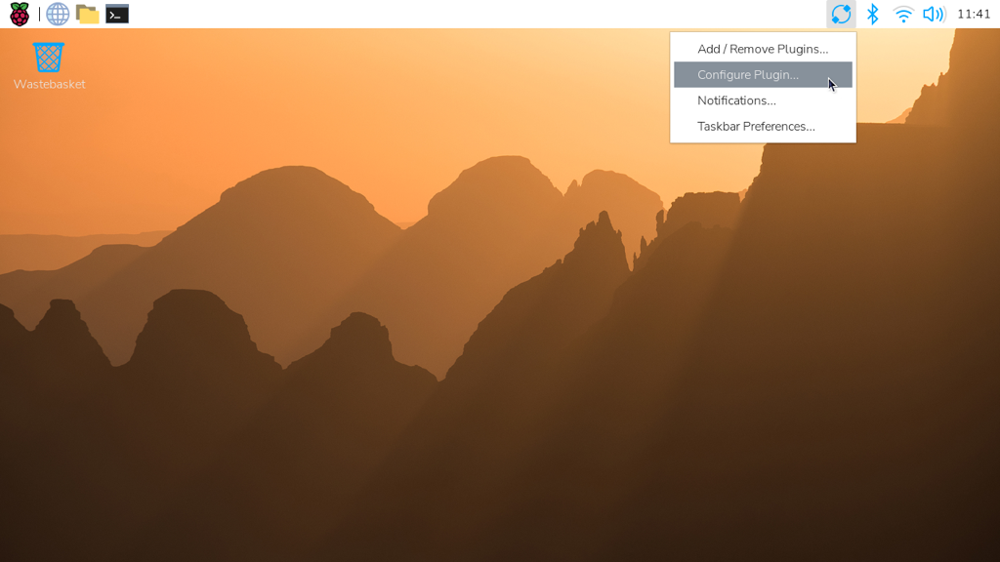
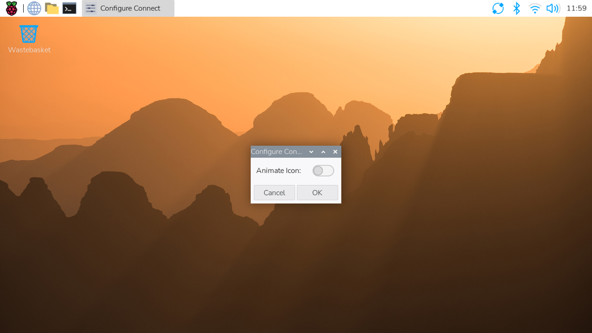
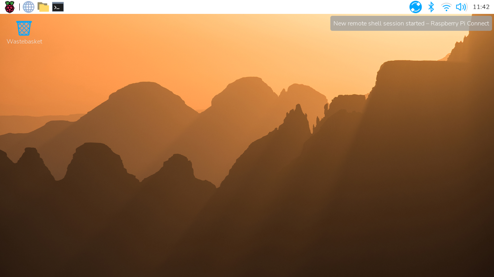
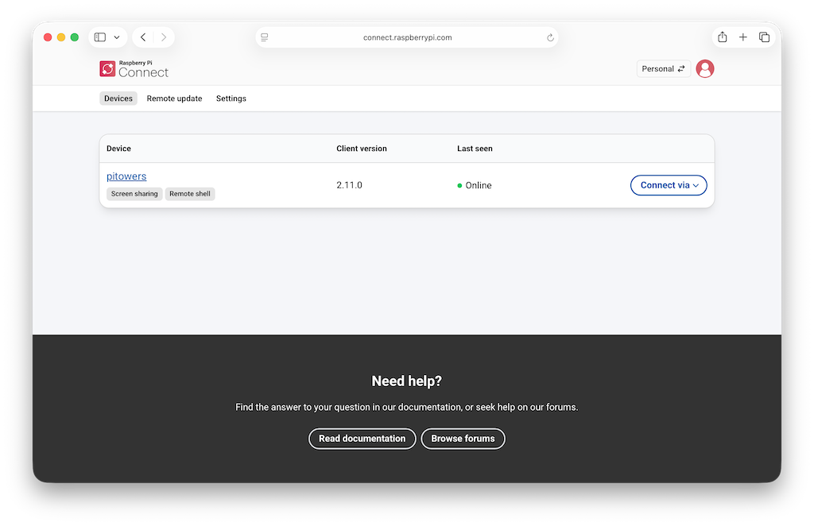
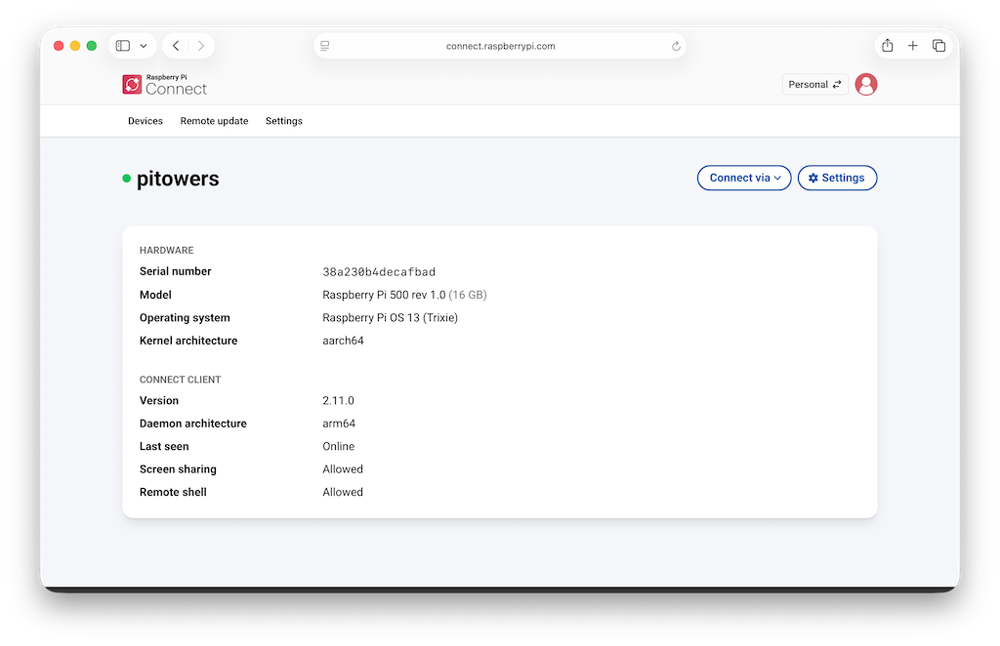

== Enable remote shell at all times

Connect runs as a user-level service, not as root. As a result, Connect only works when your user account is currently logged in on your device. This can make your device unreachable if you reboot with automatic login disabled. To continue running Connect even when you aren't logged into your device, enable **user-lingering**. Run the following command from your user account to enable user-lingering:

[source,console]
----
$ loginctl enable-linger
----

TIP: We recommend enabling user-lingering on all headless Raspberry Pi OS Lite setups to prevent your device from becoming unreachable after a remote reboot.

[[disabling-the-animated-icon]]
== Disable the animated icon

To disable the animated icon when a screen sharing or remote shell session are in progress, right-click the Connect icon in the menu bar and select **Configure Plugin...**.

Select the **Animate Icon** toggle to switch to an alternate icon.

When a screen sharing or remote shell session is in progress, the Connect icon turns blue.

== Manage devices

The Connect dashboard lists all of the devices linked with your Connect account and shows you the various ways you can access them.

Select a device name to open the device details page. This screen provides low-level information about your device.

To rename or delete the device, select **Settings** on the device page.

Deleting a device from Connect automatically signs you out of Connect on the device. The Connect icon in the menu bar turns grey and the menu only provides a **Sign In...** option.

[[update]]
== Update

WARNING: Upgrading Connect disconnects any screen sharing or remote shell sessions in progress. We don't recommended using remote shell to upgrade Connect unless you're running commands in a way that'll survive disconnection, for example, using `screen` or `tmux`.

To update to the latest version of Connect, run the following command:

[source, console]
----
$ sudo apt update
$ sudo apt install --only-upgrade rpi-connect
----

If you installed Connect Lite, replace `rpi-connect` with `rpi-connect-lite` in the above command.

== Disconnect a device from Connect

Run the following command on your device to sign out of your Raspberry Pi ID, which will disable your device on the Connect screen:

[source,console]
----
$ rpi-connect signout
----

Alternatively, select the Connect icon in the menu bar and choose "Sign Out".

TIP: To fully remove a device from your Connect account, xref:connect.adoc#manage-devices[remove it from the Connect dashboard].

== Uninstall

Run the following command to stop and remove Connect from a device:

[source,console]
----
$ sudo apt remove --purge rpi-connect
----

TIP: If you installed Connect Lite, replace `rpi-connect` with `rpi-connect-lite` in the above command.

After uninstalling, the serial number of the device remains linked with your Connect account. The device still appears in the Connect dashboard, but can't be used for remote access. If you install Connect again, even with a different SD card, on the same device, it will reuse the existing device name in the Connect dashboard.

To sever the link between a device and a Connect account, remove the device from the list of devices in the Connect dashboard.
