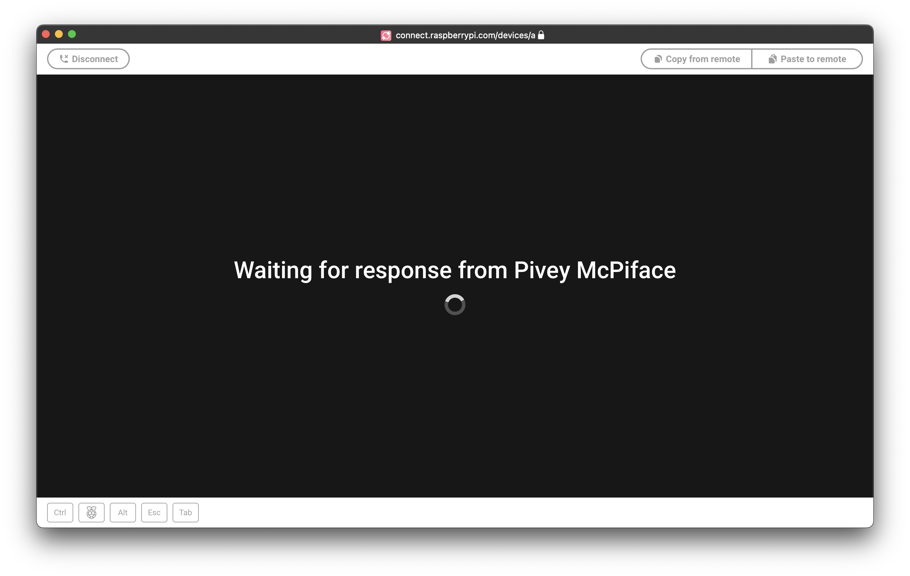
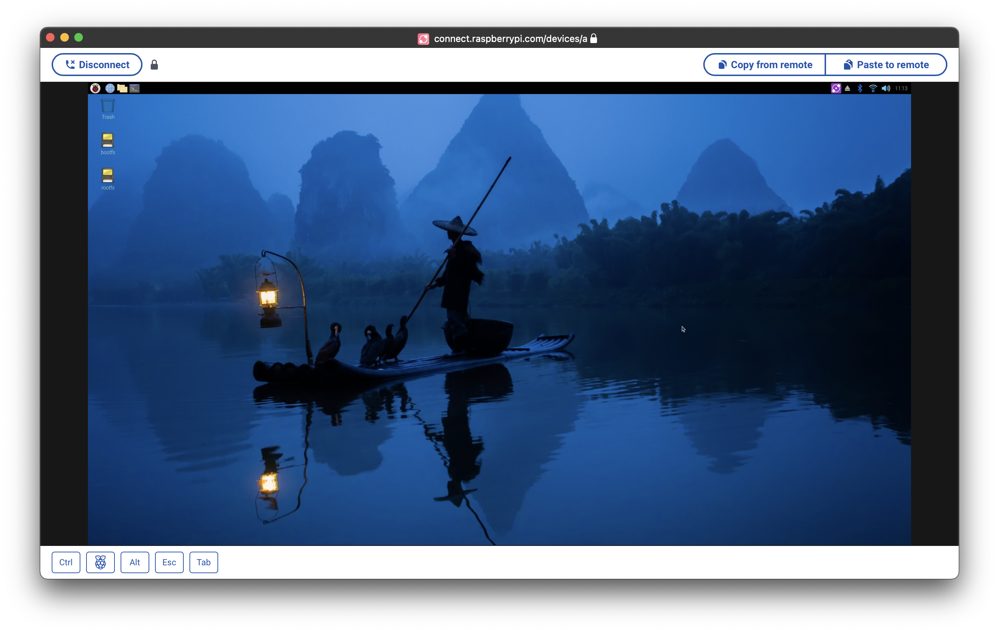
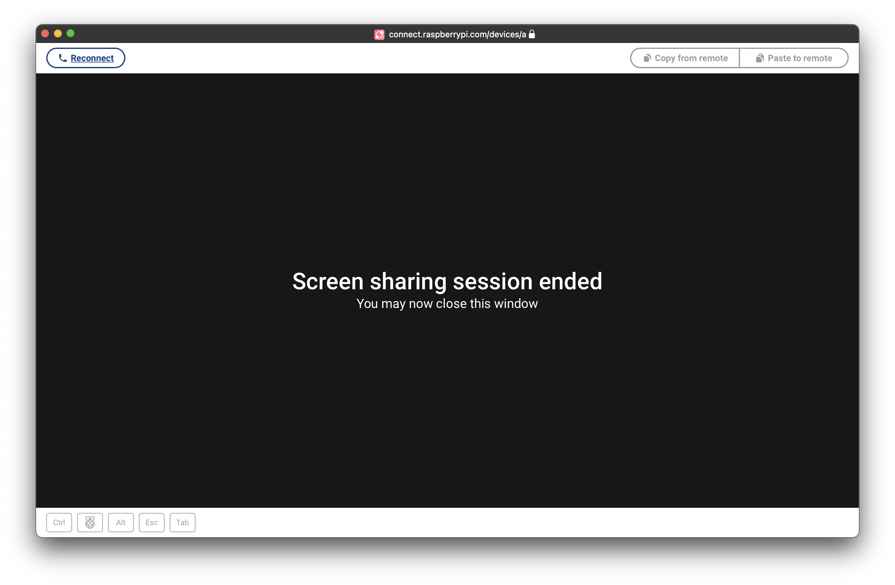
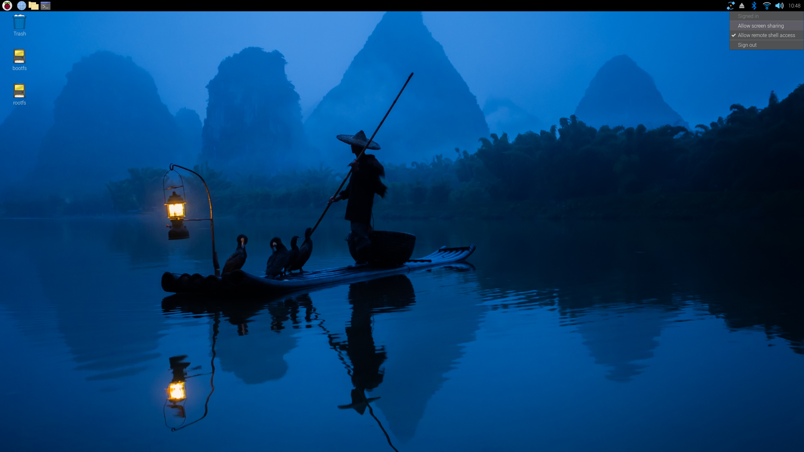
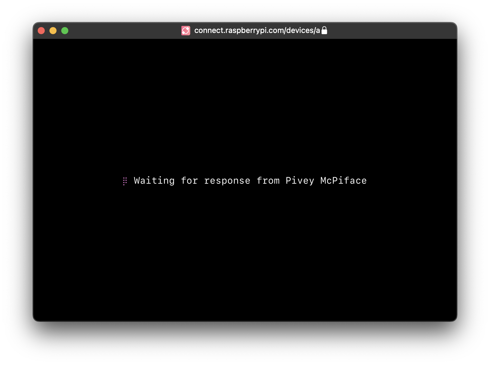
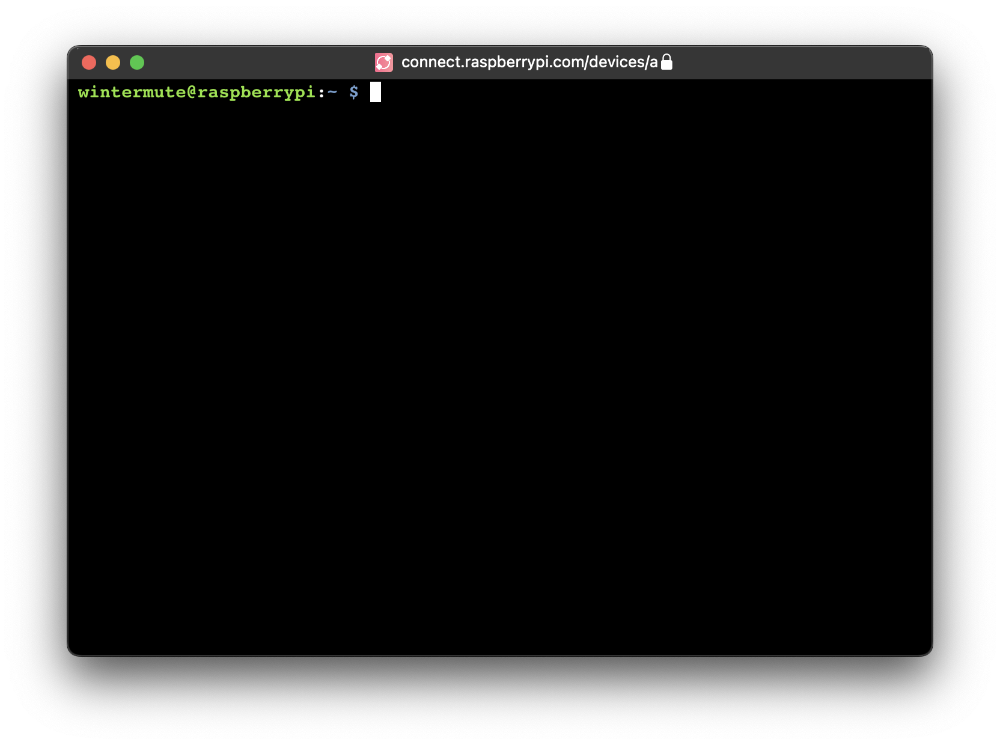
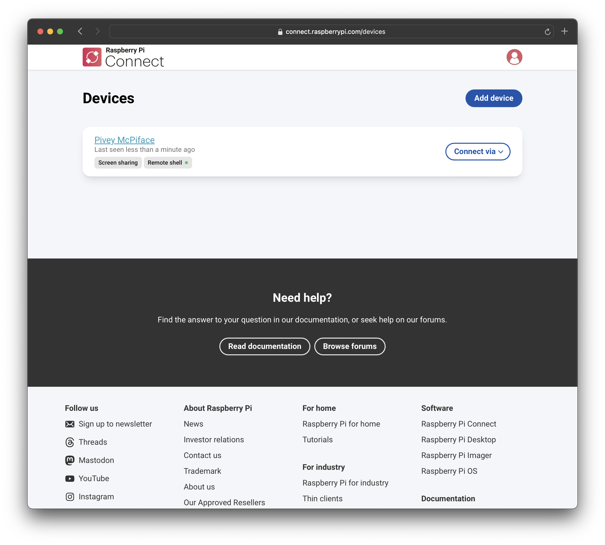
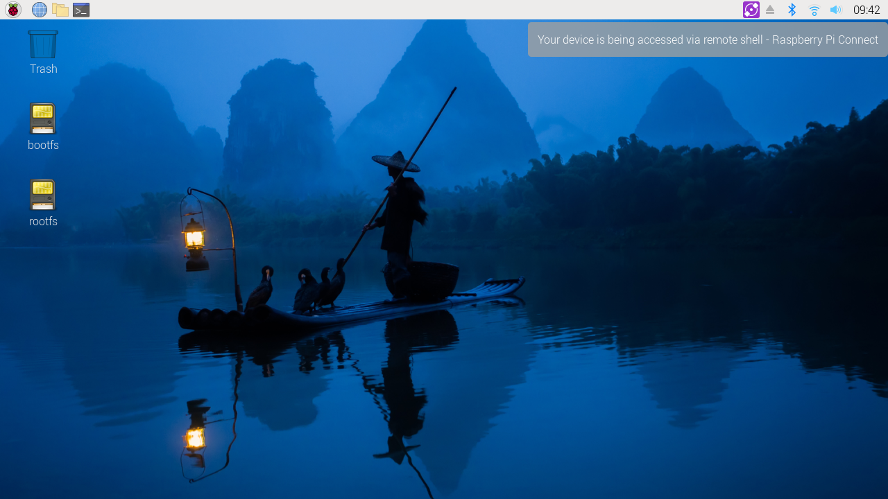
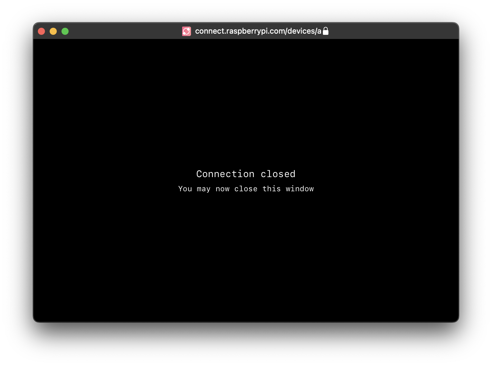
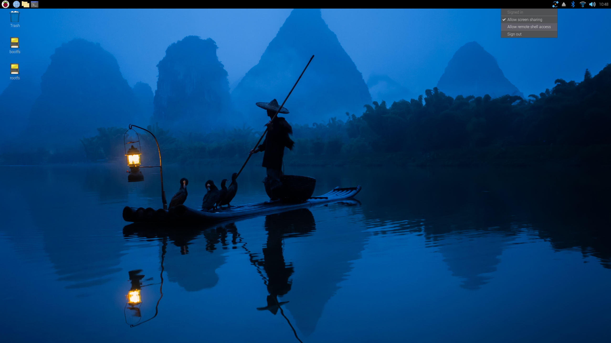

== Link a Raspberry Pi with a Raspberry Pi ID

Now that you've installed Connect on your Raspberry Pi, you must associate your Raspberry Pi with your Raspberry Pi ID to use Connect.

If you do not have a Raspberry Pi ID, xref:id.adoc#create-a-raspberry-pi-id[create one].

To link your Raspberry Pi with your Raspberry Pi ID, use Connect to generate a verification URL. Visit the URL and sign into your Raspberry Pi ID to add your Raspberry Pi to your account.

You can generate the verification URL using the Connect icon on the Raspberry Pi Desktop or with the `rpi-connect` CLI.

=== via the Raspberry Pi Desktop

Once the `rpi-connect` service starts running, the Connect icon appears in the system tray.

image::images/just_installed.png[width="80%"]

Click on the Connect icon and choose "Sign in" from the drop-down menu.

image::images/sign-in.png[width="80%"]

This opens a verification URL you can use to link your Raspberry Pi to your Raspberry Pi ID.

=== via the command line

Use the following command to generate a link that will connect your Raspberry Pi with your Raspberry Pi ID:

[source,console]
----
$ rpi-connect signin
----

This command should output something like the following:

----
Complete sign in by visiting https://connect.raspberrypi.com/verify/XXXX-XXXX
----

Visit the verification URL on any device and sign in to link your Raspberry Pi with your Raspberry Pi ID.

=== Finish linking your Raspberry Pi

Visit the verification URL generated in the previous step.

Sign in to Connect using your xref:id.adoc[Raspberry Pi ID].

image::images/login-with-id.png[width="80%"]

After authenticating, assign a name to your Raspberry Pi. Choose a name that will help you identify your device. Click the **Create device and sign in** button to continue.

image::images/create-device.png[width="80%"]

You can now remotely connect to your Raspberry Pi. The Connect system tray icon will turn blue to indicate that your Raspberry Pi has been linked to the Connect service. You should receive an email notification indicating that a new device has signed into Connect.

image::images/sign-in-email.png[width="70%"]

WARNING: If you receive an email that says a device that you do not recognise has signed into Connect, change your Raspberry Pi ID password immediately. xref:connect.adoc#manage-devices[Remove the device from Connect] to permanently disassociate it from your account. Consider xref:id.adoc#enable-two-factor-authentication[enabling two-factor authentication] to keep your account secure.

Click the Connect system tray icon to open the Connect menu. This menu shows your current sign in status, an option to sign out, and options to enable or disable remote access methods.

TIP: Connect signs communication with your device serial number. Moving your SD card between devices will sign you out of Connect.

== Access your Raspberry Pi

Now that your Raspberry Pi appears on your Connect dashboard, you can access your Raspberry Pi from anywhere using only a browser. Connect provides multiple ways to interact with your Raspberry Pi remotely.

=== Screen sharing

Connect includes the ability to share your Raspberry Pi's screen in a browser. Use the following instructions to share your Raspberry Pi's screen.

NOTE: Screen sharing requires the **Wayland** window server. By default, Raspberry Pi OS only uses Wayland for **64-bit** distributions of Raspberry Pi OS **Bookworm** on Raspberry Pi 5, 4, or 400. Screen sharing is **not** compatible with Raspberry Pi OS Lite or systems that use the X window server.

Visit https://connect.raspberrypi.com[connect.raspberrypi.com] on any computer.

Connect redirects you to the Raspberry Pi ID service to sign in. After signing in, Connect displays a list of linked devices. Devices available for screen sharing show a grey **Screen sharing** badge below the name of the device.

image::images/list-of-devices.png[width="80%"]

Click the **Connect via** button to the right of the device you would like to access. Select the **Screen sharing** option from the menu. This opens a browser window that displays the desktop of your Raspberry Pi.

You can now use your Raspberry Pi as you would locally. For more information about the connection, hover your mouse over the padlock icon immediately to the right of the **Disconnect** button.

TIP: Use the **Copy from remote** and **Paste to remote** buttons above your desktop to transfer text between your local and remote clipboards.

Once connected, a green dot appears next to the **Screen sharing** badge in the Connect dashboard. This indicates an active screen sharing session. Hover to see the current number of screen sharing sessions.

The Connect icon in the system tray turns purple and displays a closed circle when a screen sharing session is in progress.

image::images/screen-sharing-connected.png[width="80%"]

==== Stop screen sharing

To close a screen sharing session, click the **Disconnect** button above your desktop.

==== Disable screen sharing

To turn off screen sharing, click the Connect system tray icon and unselect **Allow screen sharing**.  Your Raspberry Pi remains signed into Connect, but you won't be able to create a screen sharing session from the Connect dashboard.

Alternatively, you can disable screen sharing with the following command:

[source,console]
----
$ rpi-connect vnc off
----

In the Connect dashboard, the **Screen sharing** badge and the **Screen sharing** option in the **Connect via** menu will appear crossed-out.

image::images/screen-sharing-disabled.png[width="80%"]

To re-enable screen sharing, do one of the following:

* click the Connect system tray icon and select **Allow screen sharing**
* run the following command:
+
[source,console]
----
$ rpi-connect vnc on
----

=== Remote shell

Connect includes the ability to access a shell running on your Raspberry Pi from a browser. Use the following instructions to access the remote shell.

Visit https://connect.raspberrypi.com[connect.raspberrypi.com] on any computer.

Connect redirects you to the Raspberry Pi ID service to sign in. After signing in, Connect displays a list of linked devices. Devices available for remote shell access show a grey **Remote shell** badge below the name of the device.

image::images/list-of-devices.png[width="80%"]

Click the **Connect via** button to the right of the device you would like to access. Select the **Remote shell** option from the menu. This opens a shell session on your Raspberry Pi.

You can now use your Raspberry Pi as you would locally.

TIP: On some operating systems, the browser intercepts key combinations like **Ctrl+Shift+C** and **Ctrl+C**. Instead, you can use the right click menu or **Ctrl+Insert** to copy and **Shift+Insert** to paste.

Once connected, a green dot appears next to the **Remote shell** badge in the Connect dashboard. This indicates an active remote shell session. Hover to see the current number of remote shell sessions.

TIP: Every remote shell connection creates a brand new connection, just like SSH. To persist background commands and configuration across multiple sessions, use `screen` or `tmux`.

The Connect icon in the system tray turns purple and displays a closed circle when a remote shell session is in progress.

TIP: The `CONNECT_TTY` environment variable indicates that a session uses a remote shell provided by Connect.

==== End your remote shell session

To close a remote shell session, run the `exit` command or close the window.

==== Disable remote shell access

To turn off remote shell access, click the Connect system tray icon and unselect **Allow remote shell**. Your Raspberry Pi remains signed into Connect, but you won't be able to create a remote shell session from the Connect dashboard.

Alternatively, you can disable remote shell access with the following command:

[source,console]
----
$ rpi-connect shell off
----

In the Connect dashboard, the **Remote shell** badge and the **Remote shell** option in the **Connect via** menu will appear crossed-out.

image::images/remote-shell-disabled.png[width="80%"]

To re-enable screen sharing, do one of the following:

* click the Connect system tray icon and select **Allow remote shell**
* run the following command:
+
[source,console]
----
$ rpi-connect shell on
----

== Manage devices

The Connect dashboard lists all of the Raspberry Pi devices linked with your Raspberry Pi ID and shows you the various ways you can access them.

image::images/list-of-devices.png[width="80%"]

Click on a device name to open the device details page. This screen provides low-level information about your device. You can also edit the device name or remove the device from Connect.

image::images/device-details.png[width="80%"]

Deleting a device from Connect automatically signs you out of Connect on the device. The Connect system tray icon turns grey and the menu only provides a **Sign in** option.

== Enable remote shell at all times

Connect runs as a user-level service, not as root. As a result, Connect only works when your user account is currently logged in on your Raspberry Pi. This can make your Raspberry Pi unreachable if you reboot with automatic login disabled. To continue running Connect even when you aren't logged into your device, enable **user-lingering**. Run the following command from your user account to enable user-lingering:

[source,console]
----
$ loginctl enable-linger
----

TIP: We recommend enabling user-lingering on all headless Raspberry Pi OS Lite setups to prevent your device from becoming unreachable after a remote reboot.

== Update

To update to the latest version of Connect, run the following command:

[source, console]
----
$ sudo apt update
$ sudo apt install --only-upgrade rpi-connect
----

Reboot your device to put your update into effect:

[source, console]
----
$ sudo reboot
----

== Disconnect a device from Connect

Run the following command on your Raspberry Pi to sign out of your Raspberry Pi ID, which will disable your device on the Connect screen:

[source,console]
----
$ rpi-connect signout
----

TIP: To fully remove a Raspberry Pi from your Connect account, xref:connect.adoc#manage-devices[remove it from the Connect dashboard].

== Uninstall

Run the following command to remove Connect software from a Raspberry Pi:

[source,console]
----
$ sudo apt remove --purge rpi-connect
----

TIP: If you installed Connect Lite, replace `rpi-connect` with `rpi-connect-lite` in the above command.

After uninstalling, the serial number of the Raspberry Pi remains linked with your Raspberry Pi ID. The device still appears in the Connect dashboard, but can't be used for remote access. If you install Connect again, even with a different SD card, on the same Raspberry Pi, it will reuse the existing device name in the Connect dashboard.

To sever the link between a Raspberry Pi and a Raspberry Pi ID, remove the Raspberry Pi from the list of devices in the Connect dashboard.
