== Use Connect

Now that you've installed Connect on your Raspberry Pi, you must associate your Raspberry Pi with your Raspberry Pi ID to use Connect.

If you do not have a Raspberry Pi ID, xref:id.adoc#create-a-raspberry-pi-id[create one].

=== Link your Raspberry Pi and Raspberry Pi ID

To link your Raspberry Pi with your Raspberry Pi ID, use Connect to generate a verification URL. Visit the URL and sign into your Raspberry Pi ID to add your Raspberry Pi to your account.

You can generate the verification URL using the Connect icon on the Raspberry Pi Desktop or with the `rpi-connect` CLI.

==== via the Raspberry Pi Desktop

Once the `rpi-connect` service starts running, the Connect icon appears in the system tray.

Click on the Connect icon and choose "Sign in" from the drop-down menu. This opens a verification URL you can use to link your Raspberry Pi to your Raspberry Pi ID.

image::images/sign-in.png[width="80%"]

==== via the command line

Use the following command to generate a link that will connect your Raspberry Pi with your Raspberry Pi ID:

[source,console]
----
$ rpi-connect signin
----

This command should output something like the following:

----
Complete sign in by visiting https://connect.raspberrypi.com/verify/XXXX-XXXX
----

Visit the URL on any device to link your Raspberry Pi with your Raspberry Pi ID.

==== Finish linking your Raspberry Pi in Connect

Visit the verification URL generated in the previous step.

Sign in to Connect using your xref:id.adoc[Raspberry Pi ID].

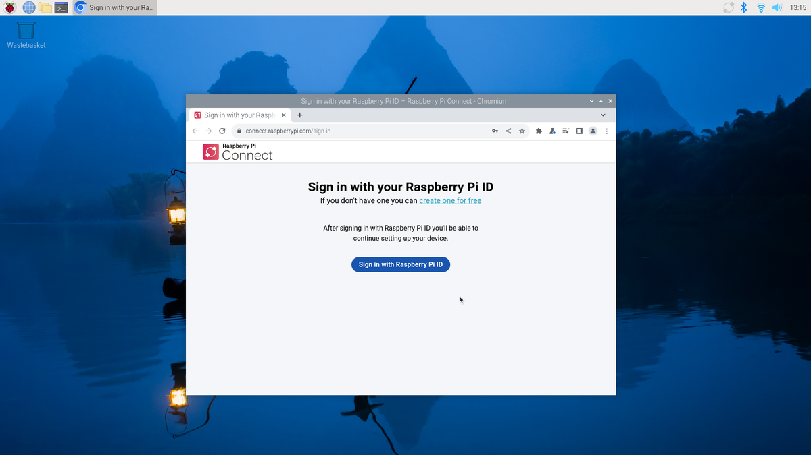

After authenticating, assign a name to your Raspberry Pi. Choose a name that will help you identify your device. Click the **Create device and sign in** button to continue.

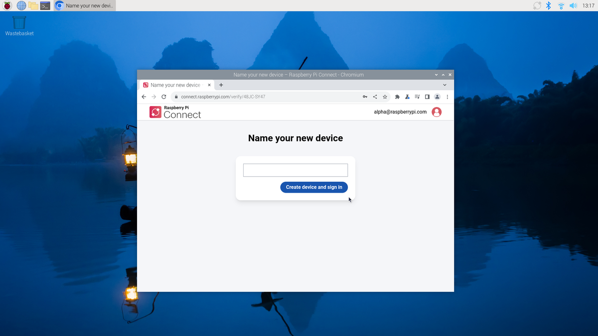

You can now screen share from your Raspberry Pi. The Connect system tray icon will turn blue to indicate that your Raspberry Pi has been linked to the Connect service. You should receive an email notification indicating that a new device has signed into Connect.

image::images/sign-in-email.png[width="70%"]

WARNING: If you receive an email that says a device that you do not recognise has signed into Connect, change your Raspberry Pi ID password immediately. Remove the device from Connect to permanently disassociate it from your account. Consider xref:id.adoc#enable-two-factor-authentication[enabling two-factor authentication] to keep your account secure.

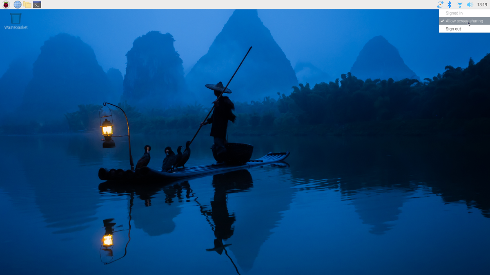

Click the Connect system tray icon to open the Connect menu. This menu shows your current sign in status, an option to sign out, and an option to enable or disable screen sharing.

NOTE: You can also use the terminal command `rpi-connect signout` to remove your Raspberry Pi from Connect.

Connect signs communication with your device serial number. Moving your SD card between devices will sign you out of Connect.

=== Connect to your Raspberry Pi

Now that your Raspberry Pi is listed in the Connect web portal, you can share your Raspberry Pi's screen anywhere using only a browser.

Visit https://connect.raspberrypi.com[connect.raspberrypi.com] on any computer.

Connect redirects you to the Raspberry Pi ID service to sign in. After signing in, Connect displays a list of linked devices. Devices available for screen sharing show a grey **Screen sharing** label below the name of the device.

Click the **Connect** button to the right of the device you would like to screen share. This opens a browser window that displays the desktop of your Raspberry Pi.

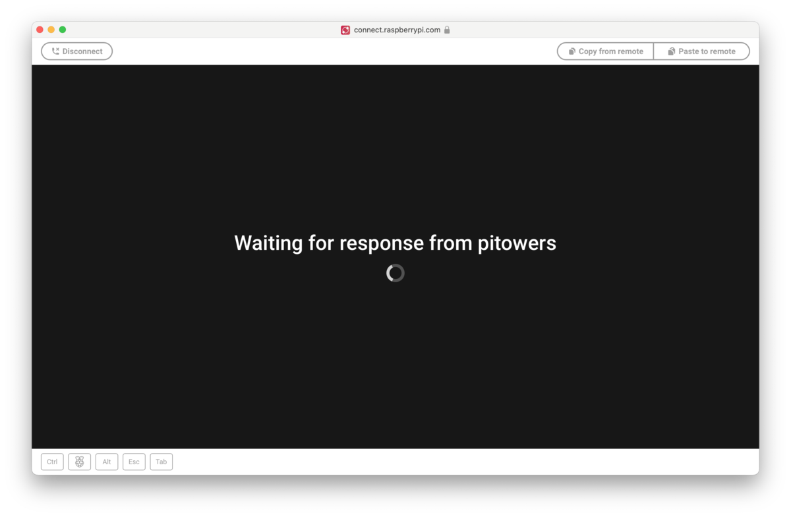

You can now use your Raspberry Pi as you would locally. For more information about the connection, hover your mouse over the padlock icon immediately to the right of the **Disconnect** button.

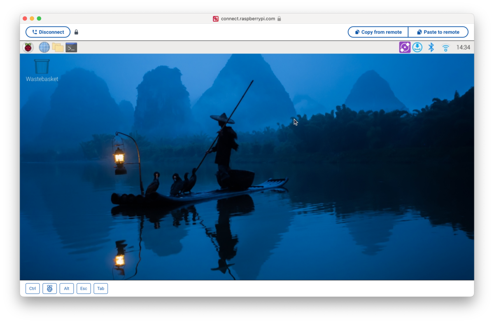

TIP: Use the **Copy from remote** and **Paste to remote** buttons above your desktop to copy between your local and remote clipboards.

Once connected, a green dot appears next to the **Screen sharing** label in the Connect portal. This indicates an active screen sharing session. Hover to see the current number of screen sharing sessions.

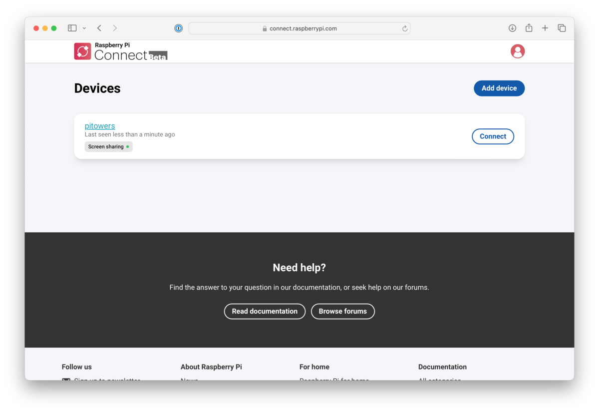

The Connect icon in the system tray turns purple and displays a closed circle when a screen sharing session is in progress.

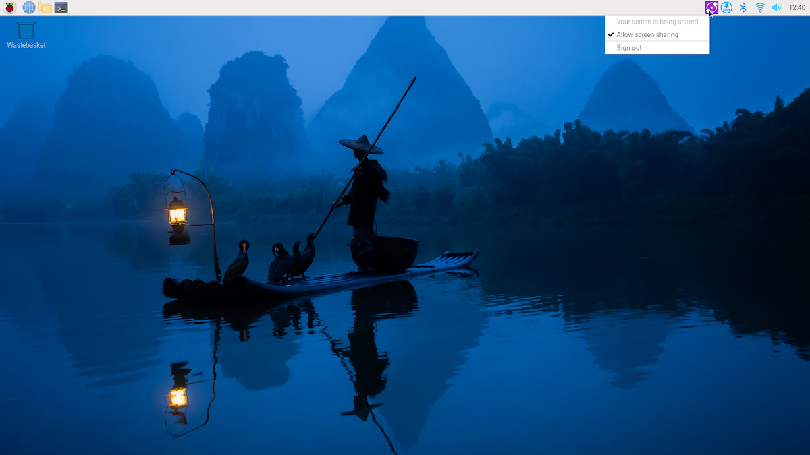

=== Disconnect from your Raspberry Pi

To close a screen sharing session, click the **Disconnect** button above your desktop.

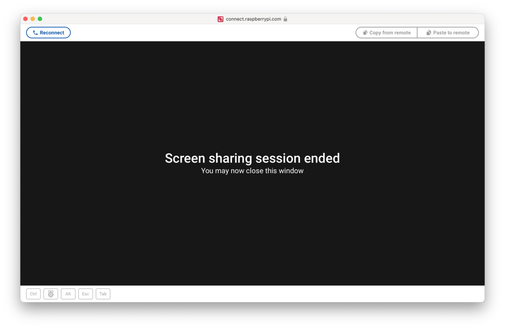

=== Disable screen sharing

To turn off screen sharing, click the Connect system tray icon and unselect **Allow screen sharing**. The lower part of the Connect system tray icon will turn grey. You remain signed into Connect, but your screen cannot be shared.

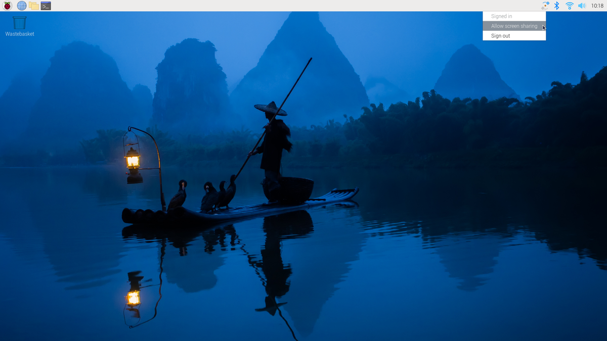

In the Connect portal, the **Connect** button next to that Raspberry Pi will disappear and the **Screen sharing** label will appear crossed-out.

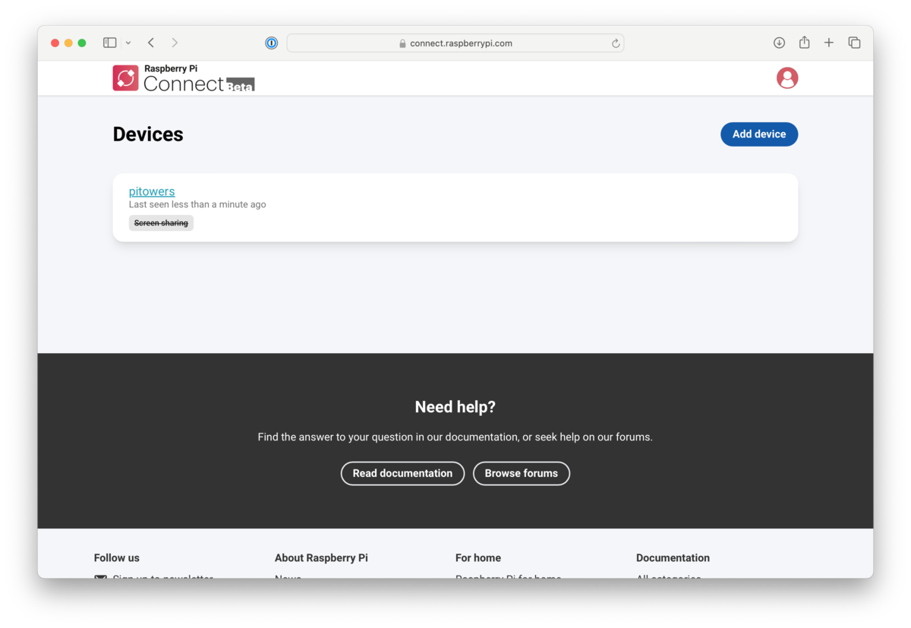 

To re-enable screen sharing, do one of the following:

* click the Connect system tray icon and select **Allow screen sharing**
* run the terminal command `rpi-connect vnc on`

=== Manage your Raspberry Pis

Connect lists all of the Raspberry Pis linked with your Raspberry Pi ID. Each device has a **Connect** button to open a screen sharing session, if screen sharing is enabled on that device. Each device has a list of labels under the device name to indicate available services.

Click on the device name to open the device details page. This screen provides low-level information about your device. You can also edit the device name or remove the device from Connect.

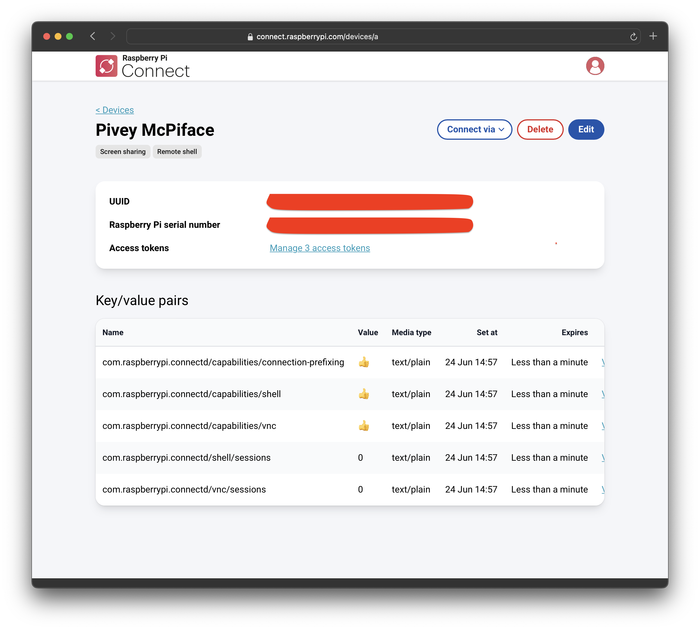

Deleting a device from Connect automatically signs you out of Connect on the device. The Connect system tray icon turns grey and the menu only provides a **Sign in** option.

=== Update Connect

To update to the latest version of Connect, run the following command:

[source, console]
----
$ sudo apt update
$ sudo apt install --only-upgrade rpi-connect
----

Reboot your device to put your update into effect:

[source, console]
----
$ sudo reboot
----

=== Uninstall Connect

Run the following command to remove Connect software from a Raspberry Pi:

[source,console]
----
$ sudo apt remove --purge rpi-connect
----

After uninstalling, the Raspberry Pi's serial number remains linked with your Raspberry Pi ID. The device still appears in the Connect portal, but can't be used for screen sharing. If you install Connect again, even with a different SD card, on the same Raspberry Pi, it will reuse the existing device name in the Connect portal.

To sever the link between a Raspberry Pi and a Raspberry Pi ID, remove the Raspberry Pi from the list of devices in the Connect portal.
