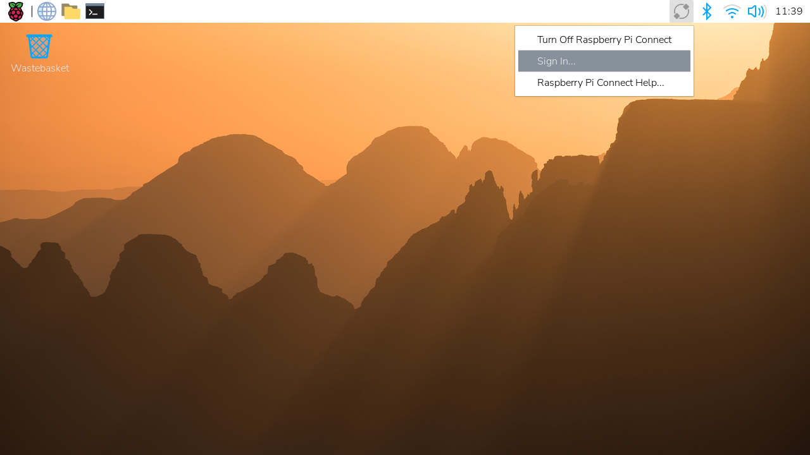
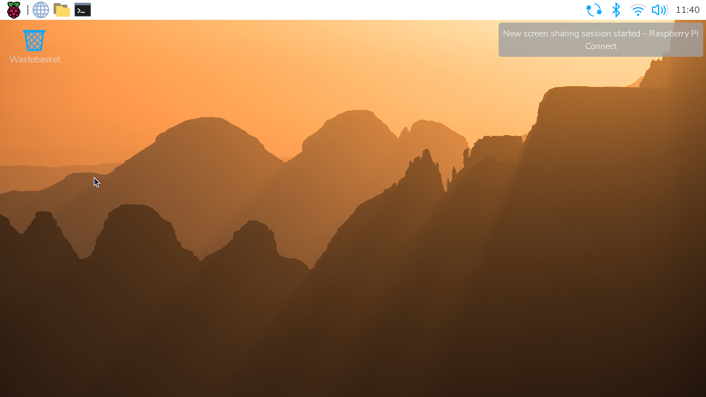
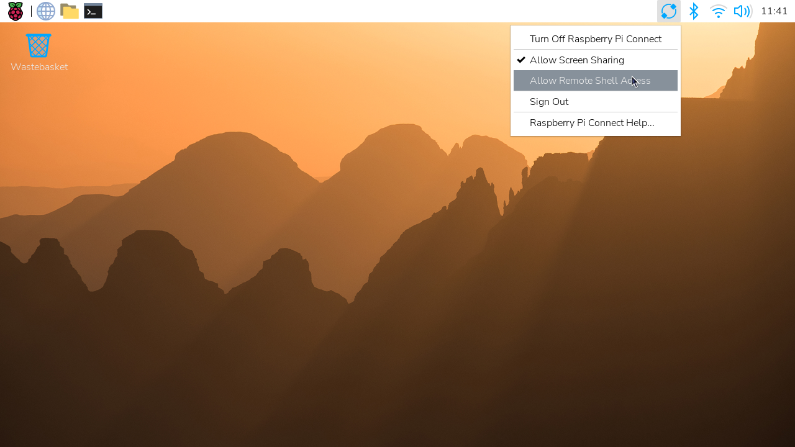

[[link-connect]]
== Link a Raspberry Pi device with a Connect account

After starting Connect on your Raspberry Pi device, you must associate your device with your Connect account.

If you used Raspberry Pi Imager to install Raspberry Pi OS on your device, you might have already linked your device with your Connect account. For more information, see xref:../computers/getting-started.adoc#raspberry-pi-imager[Install using Imager].

[tabs]
======
Desktop::
+
From the Connect icon in the menu bar, select **Turn On Raspberry Pi Connect**. This opens your browser, where you're prompted to sign in with your Raspberry Pi ID:
+

+
If you've already turned on Connect, choose **Sign In...** from the dropdown menu:
+

+
If you don't already have a Raspberry Pi ID, select the *create one for free* link to xref:id.adoc#create-a-raspberry-pi-id[create one].

CLI::
+
Use the following command to generate a link that connects your device with your Connect account:
+
[source,console]
----
$ rpi-connect signin
----
+
This command outputs something like the following:
+
----
Complete sign in by visiting https://connect.raspberrypi.com/verify/XXXX-XXXX
----
+
To link your device with your Connect account, visit the verification URL on any device and sign in with your Raspberry Pi ID.

Using an Auth Key::
+
An auth key is a single-use, temporary token that lets you link a device to a Connect account automatically (without using the web interface).
+
The easiest way of creating and using an auth key is by using the xref:../computers/getting-started.adoc#raspberry-pi-imager[customisation options in Imager]. You can also manually create an auth key from the **Settings** page of a personal or organisation's Connect account, and organisation administrators can create auth keys using the xref:connect.adoc#organisations-management-api[management API].
+
NOTE: Personal accounts can only have one auth key active at a time; organisations can have multiple auth keys active at once. You need a unique auth key for each device.
+
TIP: The Raspberry Pi Connect website displays how long after its creation the auth key expires. To use the auth key, ensure that you boot your Raspberry Pi and connect it to the internet before the expiry time.
+
After creating an auth key, you can provide this to your device using the `rpi-connect signin` command, or by writing the auth key to a file in your home directory.
+
To provide your auth key as a string, run the following command:
+
[source,console]
----
$ rpi-connect signin --auth-key=rpuak_123456
----
+
If you have saved your auth key to a file, you can pass its full path to the command by prefixing it with `+@+`:
+
[source,console]
----
$ rpi-connect signin --auth-key=@/home/alice/auth.key
----
+
If you save your auth key to `+.config/com.raspberrypi.connect/auth.key+` in your home directory, Connect detects it automatically.

======

=== Finish linking your Raspberry Pi

After authenticating, assign a name to your device. Choose a name that uniquely identifies the device.

image::images/new-device.png[width="80%"]

If you're an administrator of an xref:connect.adoc#connect-organisations[organisation], select whether to add this device to your personal account or to a specific organisation.

image::images/new-organisation-device.png[width="80%"]

Select the **Create device and sign in** button to continue.

You can now remotely connect to your device. The Connect icon in your menu bar turns blue to indicate that your device is signed in to the Connect service. You should receive an email notification indicating that a new device is linked to your Connect account.

image::images/sign-in-email.png[width="70%"]

WARNING: If you receive an email that says a device that you don't recognise has signed into Connect, change your Raspberry Pi ID password immediately. Follow the instructions in xref:connect.adoc#manage-devices[Remove the device from Connect] to permanently disassociate it from your account. Consider xref:id.adoc#enable-two-factor-authentication[enabling two-factor authentication] to keep your account secure.

Open the Connect menu by selecting the Connect icon in your menu bar. This menu allows you to turn Connect on and off, sign in and out, and allow or disallow remote access methods.

NOTE: Connect signs communication with your device's serial number. Moving your SD card between devices signs you out of Connect.

== Access your Raspberry Pi device

Now that your device appears on your Connect dashboard, you can access your device from anywhere using only a browser. Connect provides multiple ways to interact with your device remotely.

=== Screen sharing

Connect includes the ability to share your device's screen in a browser. Use the following instructions to share your device's screen.

NOTE: Screen sharing requires the **Wayland** window server. Raspberry Pi OS _Bookworm_ and later use Wayland by default. Screen sharing is **not** compatible with Raspberry Pi OS Lite or systems that use the X window server.

Visit https://connect.raspberrypi.com[connect.raspberrypi.com] on any computer.

Connect redirects you to the Raspberry Pi ID service to sign in. After signing in, Connect displays a list of linked devices. Devices available for screen sharing show a grey **Screen sharing** badge below the name of the device.

image::images/devices.png[width="80%"]

Select the **Connect via** button to the right of the device you want to access. Select the **Screen sharing** option from the menu. This opens a browser window that displays your device's desktop.

image::images/waiting-for-screen-sharing.png[width="80%"]

You can now use your device as you would locally. For more information about the connection, hover your mouse over the padlock icon immediately to the right of the **Disconnect** button.

TIP: Use the **Copy from remote** and **Paste to remote** buttons above your desktop to transfer text between your local and remote clipboards.

Once connected, a green dot appears next to the **Screen sharing** badge in the Connect dashboard. This indicates an active screen sharing session. Hover to see the current number of screen sharing sessions.

image::images/screen-sharing-in-progress.png[width="80%"]

The Connect icon in the system tray rotates when a screen sharing session is in progress. A desktop notification appears whenever a screen sharing session starts.

==== Stop screen sharing

To close a screen sharing session, select the **Disconnect** button above your desktop.

image::images/screen-sharing-ended.png[width="80%"]

==== Disallow screen sharing

To turn off screen sharing, select the Connect icon in the menu bar then deselect **Allow Screen Sharing**.  Your device remains signed in to Connect, but you can't create a screen sharing session from the Connect dashboard.

Alternatively, you can disallow screen sharing with the following command:

[source,console]
----
$ rpi-connect vnc off
----

In the Connect dashboard, the **Screen sharing** badge and the **Screen sharing** option in the **Connect via** menu will appear crossed-out.

image::images/screen-sharing-disabled.png[width="80%"]

To re-enable screen sharing, do one of the following:

* Select the Connect icon in the menu bar and then choose **Allow Screen Sharing**
* Run the following command:
+
[source,console]
----
$ rpi-connect vnc on
----

=== Remote shell

Connect includes the ability to start a shell running on your device from a browser. Use the following instructions to access the remote shell.

Visit https://connect.raspberrypi.com[connect.raspberrypi.com] on any computer.

Connect redirects you to the Raspberry Pi ID service to sign in. After signing in, Connect displays a list of linked devices. Devices available for remote shell access show a grey **Remote shell** badge below the name of the device.

image::images/devices.png[width="80%"]

Select the **Connect via** button to the right of the device you would like to access. Select the **Remote shell** option from the menu. This opens a shell session on your device.

image::images/waiting-for-remote-shell.png[width="80%"]

You can now use your device as you would locally.

image::images/remote-shell.png[width="80%"]

TIP: On some operating systems, the browser intercepts key combinations like **Ctrl+Shift+C** and **Ctrl+C**. Instead, you can use the right click menu or **Ctrl+Insert** to copy and **Shift+Insert** to paste.

Once connected, a green dot appears next to the **Remote shell** badge in the Connect dashboard. This indicates an active remote shell session. Hover to see the current number of remote shell sessions.

image::images/remote-shell-in-progress.png[width="80%"]

TIP: Every remote shell connection creates a brand new connection, just like SSH. To persist background commands and configuration across multiple sessions, use `screen` or `tmux`.

The Connect icon in the menu bar rotates when a remote shell session is in progress. A desktop notification appears whenever a remote shell session starts.

TIP: The `CONNECT_TTY` environment variable indicates that a session uses a remote shell provided by Connect.

==== End your remote shell session

To close a remote shell session, run the `exit` command or close the window.

image::images/remote-shell-ended.png[width="80%"]

==== Disallow remote shell access

To turn off remote shell access, select the Connect icon in the menu bar and then deselect **Allow Remote Shell Access**. Your device remains signed in to Connect, but you can't create a remote shell session from the Connect dashboard.

Alternatively, you can disallow remote shell access with the following command:

[source,console]
----
$ rpi-connect shell off
----

In the Connect dashboard, the **Remote shell** badge and the **Remote shell** option in the **Connect via** menu will appear crossed-out.

image::images/remote-shell-disabled.png[width="80%"]

To re-enable remote shell access, do one of the following:

* Select the Connect system tray icon and choose **Allow Remote Shell Access**
* Run the following command:
+
[source,console]
----
$ rpi-connect shell on
----

== Enable remote shell at all times

Connect runs as a user-level service, not as root. As a result, Connect only works when your user account is currently logged in on your device. This can make your device unreachable if you reboot with automatic login disabled. To continue running Connect even when you aren't logged into your device, enable **user-lingering**. Run the following command from your user account to enable user-lingering:

[source,console]
----
$ loginctl enable-linger
----

TIP: We recommend enabling user-lingering on all headless Raspberry Pi OS Lite setups to prevent your device from becoming unreachable after a remote reboot.

[[disabling-the-animated-icon]]
== Disable the animated icon

To disable the animated icon when a screen sharing or remote shell session are in progress, right-click the Connect icon in the menu bar and select **Configure Plugin...**.

Select the **Animate Icon** toggle to switch to an alternate icon.

When a screen sharing or remote shell session is in progress, the Connect icon turns blue.

== Manage devices

The Connect dashboard lists all of the devices linked with your Connect account and shows you the various ways you can access them.

image::images/devices.png[width="80%"]

Select a device name to open the device details page. This screen provides low-level information about your device. You can also edit the device name or remove the device from Connect.

image::images/device.png[width="80%"]

Deleting a device from Connect automatically signs you out of Connect on the device. The Connect icon in the menu bar turns grey and the menu only provides a **Sign In...** option.

== Update

To update to the latest version of Connect, run the following command:

[source, console]
----
$ sudo apt update
$ sudo apt install --only-upgrade rpi-connect
----

TIP: If you installed Connect Lite, replace `rpi-connect` with `rpi-connect-lite` in the above command.

== Disconnect a device from Connect

Run the following command on your device to sign out of your Raspberry Pi ID, which will disable your device on the Connect screen:

[source,console]
----
$ rpi-connect signout
----

Alternatively, select the Connect icon in the menu bar and choose "Sign Out".

TIP: To fully remove a device from your Connect account, xref:connect.adoc#manage-devices[remove it from the Connect dashboard].

== Uninstall

Run the following command to stop and remove Connect from a device:

[source,console]
----
$ sudo apt remove --purge rpi-connect
----

TIP: If you installed Connect Lite, replace `rpi-connect` with `rpi-connect-lite` in the above command.

After uninstalling, the serial number of the device remains linked with your Connect account. The device still appears in the Connect dashboard, but can't be used for remote access. If you install Connect again, even with a different SD card, on the same device, it will reuse the existing device name in the Connect dashboard.

To sever the link between a device and a Connect account, remove the device from the list of devices in the Connect dashboard.
