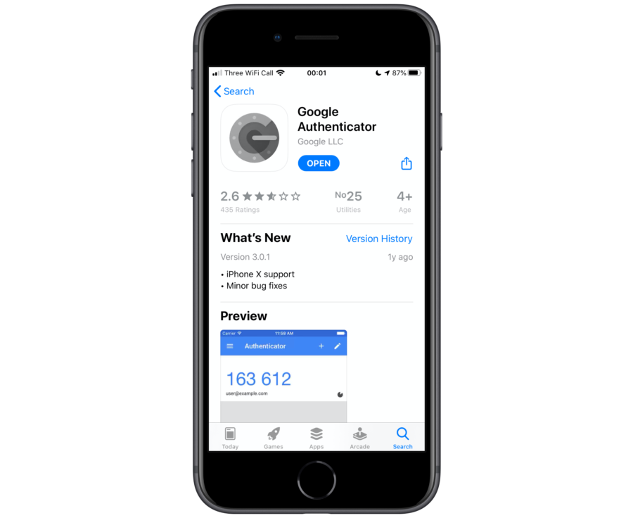
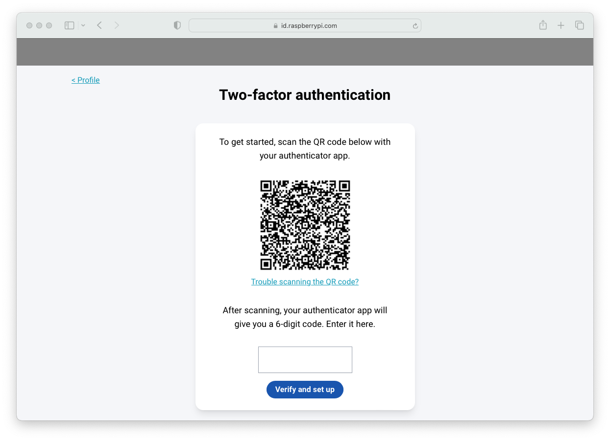
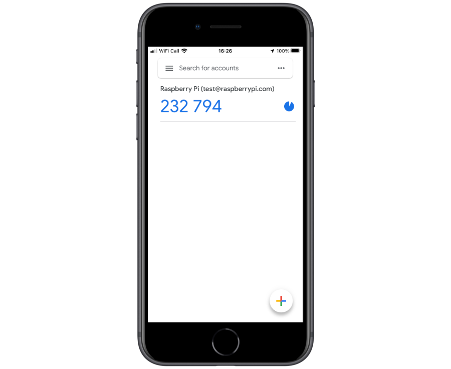
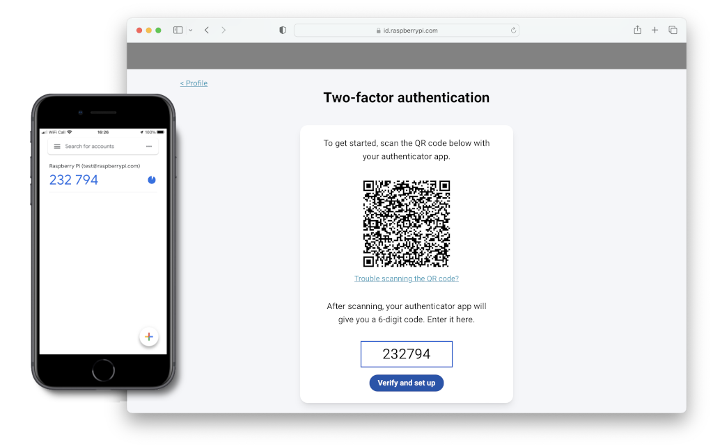
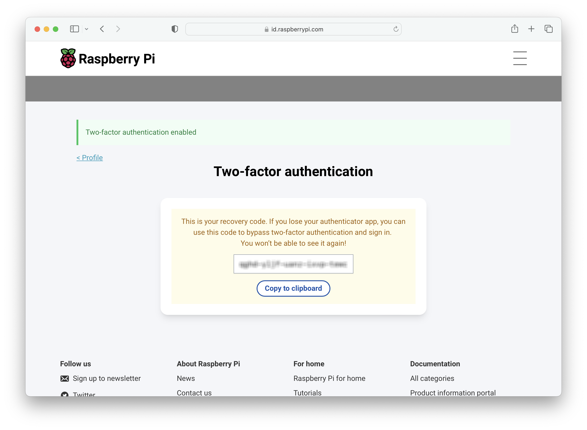

= Two-factor authentication

Like most modern web services, the Raspberry Pi ID service supports two-factor authentication (2FA) using a https://en.wikipedia.org/wiki/Time-based_one-time_password[time-based one-time password] (TOTP).

Two-factor authentication is an extra layer of protection. As well as a password (“something you know”), you’ll need another piece of information to log in. This second factor will be based either on “something you have”, like a smart phone, or on “something you are”, like biometric information.

We’re going to go ahead and set up “something you have”, and use your smart phone as the second factor to protect your Raspberry Pi ID.

=== Installing a two-factor authenticator application

You will need to download an app to your phone that will generate the TOTP. One of the most commonly used is Google Authenticator. It’s available for both https://play.google.com/store/apps/details?id=com.google.android.apps.authenticator2&hl=en_GB[Android] and https://apps.apple.com/us/app/google-authenticator/id388497605[iOS], and there is even an open source version of the app available https://github.com/google/google-authenticator[on GitHub].

So go ahead and install Google Authenticator, or another 2FA app like https://authy.com/[Authy] on your phone before going any further.

=== Enabling two-factor authentication

To enable 2FA, click on the “Two-factor authentication” option when signed in to the https://id.raspberrypi.com[identity service].

Open the Google Authenticator app on your phone and tap the plus sign (+) at the top right, then tap on “Scan barcode”.

Your phone will ask you whether you want to allow the app access to your camera; you should say “Yes”. The camera view will open. Position the QR code squarely in the green box on the screen. As soon as your phone app recognises the code, the authenticator app will add your new account, and will start generating TOTP codes automatically.

NOTE: The Raspberry Pi ID service also support macOS and iOS iCloud Keychain integration, so you can right click (long press) the QR code until you get the "Set up verification code" option on your Mac or iPhone.

Now you should go ahead and enter the six-digit TOTP generated by your authenticator app on your phone into the Raspberry Pi ID service.

If you enter the TOTP correctly, you will see a confirmation screen with a recovery code.

IMPORTANT: You should copy the recovery code down and store it in a safe place. This is the only way to bypass two-factor authentication in the future if you lose, or otherwise don't have access to, your phone and the authenticator app running on it.

You’ll now need your phone, and a TOTP, every time you log in to Raspberry Pi services. But because of that, you’ve just given a huge boost to the security of your devices on the service.

NOTE: If you need to disable two-factor authentication at any point in the future, you can do that by logging back in to the https://id.raspberrypi.com[identity service].

