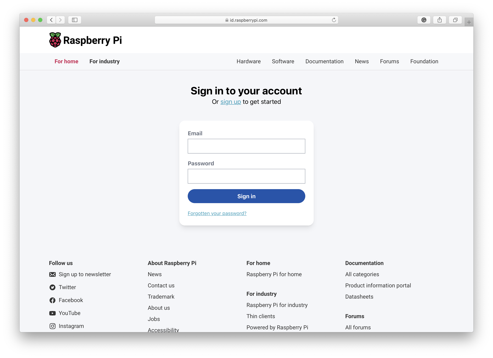
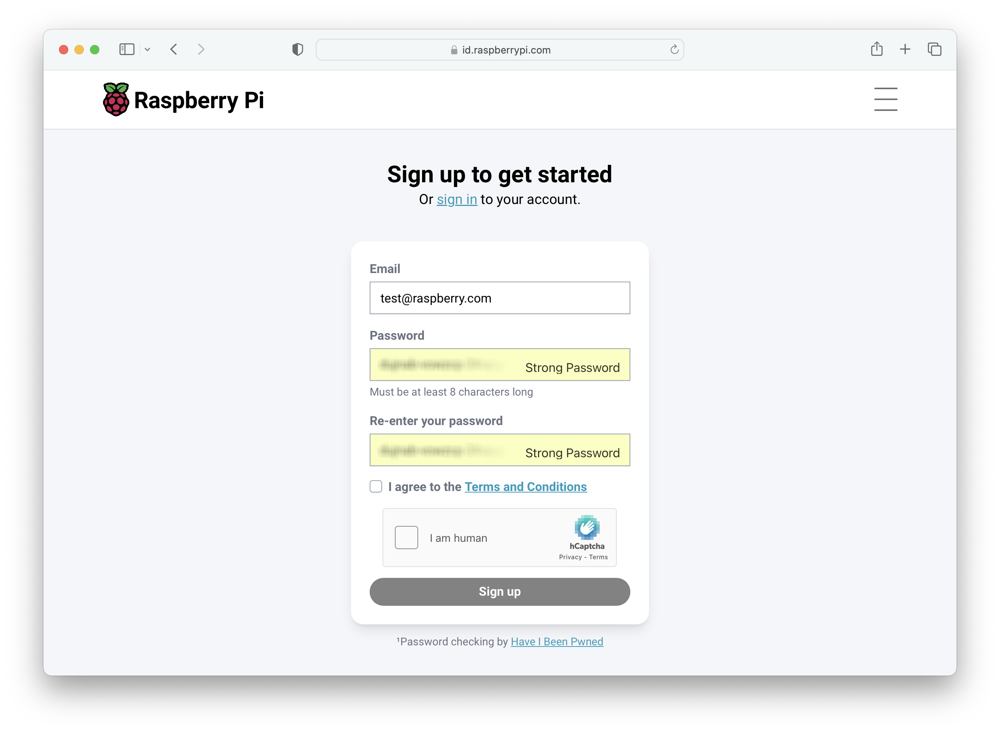
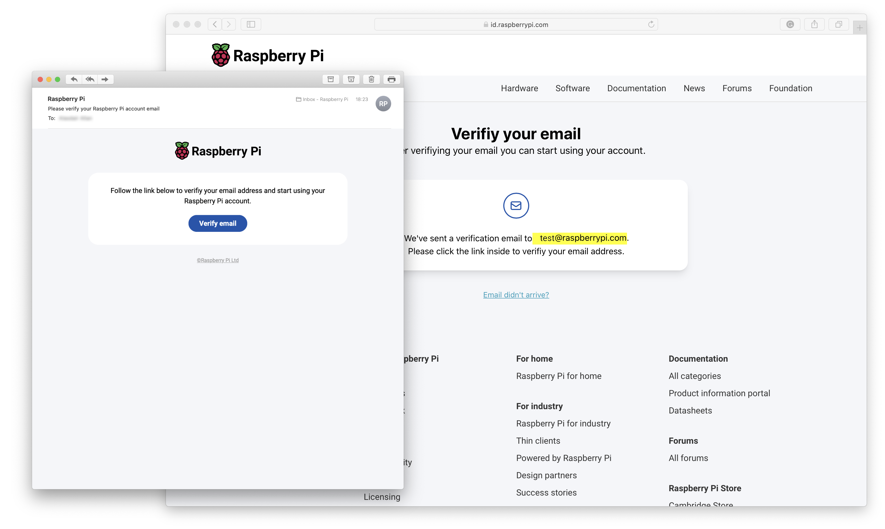
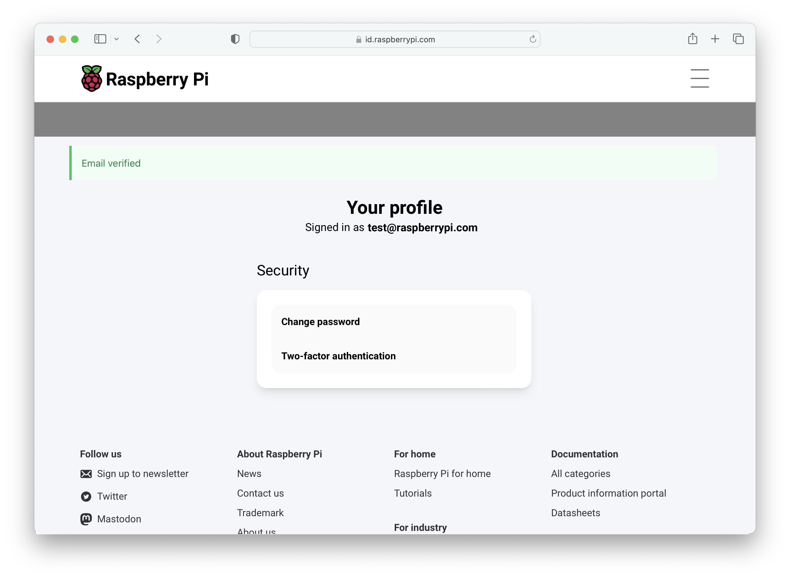

== Signing up to Raspberry Pi ID 

To use Raspberry Pi services, you will first have to create a Raspberry Pi ID account using our https://id.raspberrypi.com[identity service]. This account will be your gateway to the Raspberry Pi website and other services such as the https://events.raspberrypi.com/[Raspberry Pi Events] pages.

=== Creating a Raspberry Pi ID

Go to https://id.raspberrypi.com[id.raspberrypi.com] in your browser and click on "sign up".

This will take you to an account creation page. Enter your email along with a password. You will need to type the password a second time in the password confirmation box.

If your password matches, the service will send an email to the email address you entered. Go to your inbox and open the email, then click on the "Verify email" button in the email.

You will be signed into the identity service.

After creating a Raspberry Pi ID, you can log in to Raspberry Pi services using the "Sign in with Raspberry Pi" button to sign in with your Raspberry Pi ID. 
