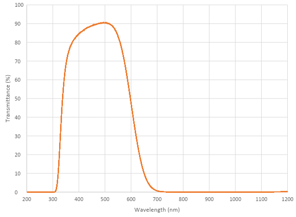

# Camera Module

The Raspberry Pi Camera Modules are official products from the Raspberry Pi Foundation. The original 5-megapixel model was [released](https://www.raspberrypi.org/blog/camera-board-available-for-sale/) in 2013, and an 8-megapixel [Camera Module v2](https://www.raspberrypi.org/products/camera-module-v2/) was [released](https://www.raspberrypi.org/blog/new-8-megapixel-camera-board-sale-25/) in 2016. For both iterations, there are visible light and infrared versions. A 12-megapixel [High Quality Camera](https://www.raspberrypi.org/products/raspberry-pi-high-quality-camera/) was [released](https://www.raspberrypi.org/blog/new-product-raspberry-pi-high-quality-camera-on-sale-now-at-50/) in 2020. There is no infrared version of the HQ Camera, however the [IR Filter can be removed](hqcam_filter_removal.md) if required.

## Hardware specification

| | Camera Module v1 | Camera Module v2 | HQ Camera |
| --- | --- | --- | --- |
| Net price | $25 | $25 | $50 | 
| Size | Around 25 × 24 × 9 mm | | 38 x 38 x 18.4mm (excluding lens) |
| Weight | 3g | 3g | |
| Still resolution | 5 Megapixels | 8 Megapixels | 12.3 Megapixels |
| Video modes | 1080p30, 720p60 and 640 × 480p60/90 | 1080p30, 720p60 and 640 × 480p60/90 | 1080p30, 720p60 and 640 × 480p60/90 |
| Linux integration | V4L2 driver available | V4L2 driver available | V4L2 driver available |
| C programming API | OpenMAX IL and others available | OpenMAX IL and others available | |
| Sensor | OmniVision OV5647 | Sony IMX219 | [Sony IMX477](https://www.sony-semicon.co.jp/products/common/pdf/IMX477-AACK_Flyer.pdf) |
| Sensor resolution | 2592 × 1944 pixels | 3280 × 2464 pixels | 4056 x 3040 pixels|
| Sensor image area | 3.76 × 2.74 mm | 3.68 x 2.76 mm (4.6 mm diagonal) | 6.287mm x 4.712 mm (7.9mm diagonal) |
| Pixel size | 1.4 µm × 1.4 µm | 1.12 µm x 1.12 µm  | 1.55 µm x 1.55 µm |
| Optical size	| 1/4" | 1/4" | |
| Full-frame SLR lens equivalent | 35 mm | | |
| S/N ratio | 36 dB | | |
| Dynamic range | 67 dB @ 8x gain | | |
| Sensitivity | 680 mV/lux-sec | | |
| Dark current | 16 mV/sec @ 60 C | | |
| Well capacity | 4.3 Ke- | | | 
| Fixed focus | 1 m to infinity | | N/A | 
| Focal length | 3.60 mm +/- 0.01 | 3.04 mm | Depends on lens |
| Horizontal field of view | 53.50  +/- 0.13 degrees | 62.2 degrees | Depends on lens|
| Vertical field of view | 41.41 +/- 0.11 degrees | 48.8 degrees | Depends on lens |
| Focal ratio (F-Stop) | 2.9 | 2.0 | Depends on lens |

## Hardware features

| Available | Implemented |
| --- | --- |
| Chief ray angle correction | Yes |
| Global and rolling shutter | Rolling shutter |
| Automatic exposure control (AEC) | No - done by ISP instead |
| Automatic white balance (AWB) | No - done by ISP instead |
| Automatic black level calibration (ABLC) | No - done by ISP instead |
| Automatic 50/60 Hz luminance detection | No - done by ISP instead |
| Frame rate up to 120 fps | Max 90fps. Limitations on frame size for the higher frame rates (VGA only for above 47fps) |
| AEC/AGC 16-zone size/position/weight control | No - done by ISP instead |
| Mirror and flip | Yes |
| Cropping | No - done by ISP instead (except 1080p mode) |
| Lens correction | No - done by ISP instead |
| Defective pixel cancelling | No - done by ISP instead |
| 10-bit RAW RGB data | Yes - format conversions available via GPU |
| Support for LED and flash strobe mode | LED flash |
| Support for internal and external frame synchronisation for frame exposure mode | No |
| Support for 2 × 2 binning for better SNR in low light conditions | Anything output res below 1296 x 976 will use the 2 x 2 binned mode |
| Support for horizontal and vertical sub-sampling | Yes, via binning and skipping |
| On-chip phase lock loop (PLL) | Yes |
| Standard serial SCCB interface | Yes |
| Digital video port (DVP) parallel output interface | No |
| MIPI interface (two lanes) | Yes |
| 32 bytes of embedded one-time programmable (OTP) memory | No |
| Embedded 1.5V regulator for core power | Yes |

## Software features

Full camera software documentation can be found [here](../../raspbian/applications/camera.md).

| | |
| --- | --- |
| Picture formats | JPEG (accelerated), JPEG + RAW, GIF, BMP, PNG, YUV420, RGB888 |
| Video formats | raw h.264 (accelerated) |
| Effects | negative, solarise, posterize, whiteboard, blackboard, sketch, denoise, emboss, oilpaint, hatch, gpen, pastel, watercolour, film, blur, saturation |
| Exposure modes |auto, night, nightpreview, backlight, spotlight, sports, snow, beach, verylong, fixedfps, antishake, fireworks |
| Metering modes | average, spot, backlit, matrix |
| Automatic white balance modes | off, auto, sun, cloud, shade, tungsten, fluorescent, incandescent, flash, horizon |
| Triggers | Keypress, UNIX signal, timeout |
| Extra modes | demo, burst/timelapse, circular buffer, video with motion vectors, segmented video, live preview on 3D models |

## HQ Camera IR Filter transmission information

The HQ Camera uses a Hoya CM500 infrared filter. Its transmission characteristics are as represented in the following graph.

## Mechanical drawing

- Camera Module v2 [PDF](mechanical/rpi_MECH_Camera2_2p1.pdf)
- HQ Camera Module [PDF](mechanical/rpi_MECH_HQcamera_1p0.pdf)
- HQ Camera Module lens mount[PDF](mechanical/rpi_MECH_HQcamera_lensmount_1p0.pdf)
  
## Schematics

- Camera Module v2 [PDF](schematics/rpi_SCH_Camera2_2p1.pdf)
- HQ Camera Module [PDF](schematics/rpi_SCH_HQcamera_1p0.pdf)
