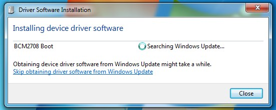
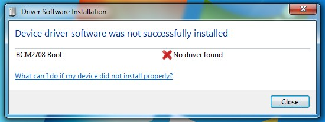
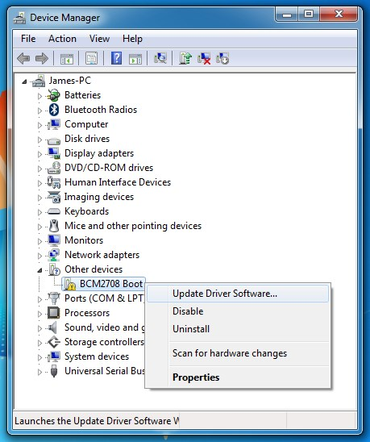
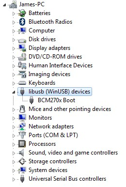

# Flashing the Compute Module eMMC

The Compute module has an on-board eMMC device connected to the primary SD card interface. This guide explains how to write data to the eMMC storage using a Compute Module IO board.

Please also read the section on [Module booting and flashing the eMMC](cm-designguide.md#modulebootingandflashing) in the [Compute Module hardware design guide](cm-designguide.md).

## Steps to flash the eMMC on a Compute Module

To flash the Compute Module eMMC you either need a Linux system (a Raspberry Pi is recommended, or Ubuntu on a PC) or a Windows system (Windows 7 is recommended).  For BCM2837 (CM3) the bug which affected the Mac has been fixed so this will also work.

**Note** There is a bug in the BCM2835 bootloader which returns a slightly incorrect USB packet to the host. Most USB hosts seem to ignore this benign bug and work fine; however we do see some USB ports that don't work due to this bug. We don't quite understand why some ports fail - it doesn't seem to be correlated with whether they are USB2 or USB3 (we have seen both types working), but it's likely to be specific to the host controller and driver.  This bug has been fixed in BCM2837

**For Windows users**

Under Windows an installer is available to automatically install the required drivers and boot tool. Alternatively, a user can compile and run it using Cygwin and/or install the drivers manually.

### Windows installer

For those who just want to enable the Compute Module eMMC as a mass storage device under Windows, the standalone installer is the recommended option. This installer has been tested on Windows 10 32-bit and 64-bit, and Windows XP 32 bit.

Please ensure you are not writing to any USB devices whilst the installer is running.

1. Download and run the [Windows installer](CM-Boot-Installer.exe) to install the drivers and boot tool.
1. Plug your host PC USB into the CMIO USB SLAVE port, making sure J4 is set to the EN position.
1. Apply power to the CMIO board; Windows should now find the hardware and install the driver.
1. Once the driver installation is complete, run the `RPiBoot.exe` tool that was previously installed.
1. After a few seconds, the Compute Module eMMC will pop up under Windows as a disk (USB mass storage device).

### Manual Cygwin install

To use the tool under Cygwin on Windows you'll first need to install [Cygwin](https://www.cygwin.com/). You'll also need to make sure to install the `libusb-1.0` and `libusb-1.0-devel` packages (this was tested using version 1.0.19-1), as well as `gcc` and `make`.

You then need to install the Windows driver which can be downloaded here: [bcm270x-boot-driver.zip](bcm270x-boot-driver.zip). To install the driver, firstly make sure that J4 (USB SLAVE BOOT ENABLE) is set to the 'EN' position, then plug the host machine into the Compute Module IO board USB slave port (J15), and finally apply power to the CMIO board. Windows will see a new USB hardware device called "BCM2708 Boot".



Select "Skip obtaining driver software from Windows Update" (or wait) and the driver will not be found. Close the dialogue box.



Go to Windows Device Manager and you'll see an unknown device with a yellow exclamation mark under Other Devices->BCM2708 Boot:



Right-click on this unknown device and select "Update Driver Software", then select "Browse my computer for driver software". In the next dialogue box, select "Browse", navigate to the directory containing the unzipped `bcm270x-boot-driver.zip` (the directory containing `bcm270x.inf`), and select "Next". Finally, click "Install this driver software anyway" when Windows displays a message saying it cannot verify the publisher.

After a short while, the driver will finish being installed and you should be able to see it in Device Manager:



Finally, follow the remainder of the instructions below in a Cygwin terminal. **Note** When performing the commands below in a Cygwin terminal, **don't** prefix them with `sudo`.

**On your Compute Module IO board:**

Make sure that J4 (USB SLAVE BOOT ENABLE) is set to the 'EN' position.

**On your host system:**

Git may produce an error if the date is not set correctly, so on a Raspberry Pi enter the following:

```bash
sudo date MMDDhhmm
```

where MM is month, DD day and hh mm hours and minutes respectively.

Clone the `usbboot` tool repository:

```bash
git clone --depth=1 https://github.com/raspberrypi/tools
cd tools/usbboot
```

`libusb` must be installed. If you are using Cygwin, please make sure `libusb` is installed as previously described. On the Raspberry Pi or other Debian-based Linux enter the following command:

```bash
sudo apt-get install libusb-1.0-0-dev
```

Now build and install the `usbboot` tool:

```bash
make
sudo make install
```

Run the `usbboot` tool and it will wait for a connection:

```bash
sudo rpiboot
```

Now plug the host machine into the Compute Module IO board USB slave port (J15) and power on the CMIO board. The `rpiboot` tool will discover the Compute Module and send boot code to allow access to the eMMC. 

## Writing to the eMMC - Cygwin

After `rpiboot` completes, a new USB mass storage drive will appear in Windows. We recommend following this [guide](../../installation/installing-images/windows.md) and using Win32DiskImager to write images to the drive, rather than trying to use `/dev/sda` etc. from Cygwin.

Once you have written an OS image, make sure J4 (USB SLAVE BOOT ENABLE) is set to the disabled position and/or nothing is plugged into the USB slave port. Power cycling the IO board should result in the Compute Module booting the OS image from eMMC.

## Writing to the eMMC - Linux

After `rpiboot` completes, you will see a new device appear; this is commonly `/dev/sda` on a Pi but it could be another location such as `/dev/sdb`, so check in `/dev/` before running `rpiboot` so you can see what changes.

You now need to write a raw OS image (such as [Raspbian](http://downloads.raspberrypi.org/raspbian_latest)) to the device. Note the following command may take some time to complete, depending on the size of the image:

```bash
sudo dd if=raw_os_image_of_your_choice.img of=/dev/sda bs=4MiB
```

Once the image has been written, unplug and re-plug the USB; you should see 2 partitions appear (for Raspian) in `/dev`. In total, you should see something similar to this:

```bash
/dev/sda    <- Device
/dev/sda1   <- First partition (FAT)
/dev/sda2   <- Second partition (Linux filesystem)
```

The `/dev/sda1` and `/dev/sda2` partitions can now be mounted normally.

Make sure J4 (USB SLAVE BOOT ENABLE) is set to the disabled position and/or nothing is plugged into the USB slave port. Power cycling the IO board should now result in the Compute Module booting from eMMC.
