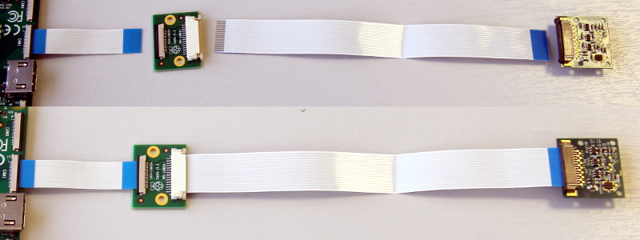
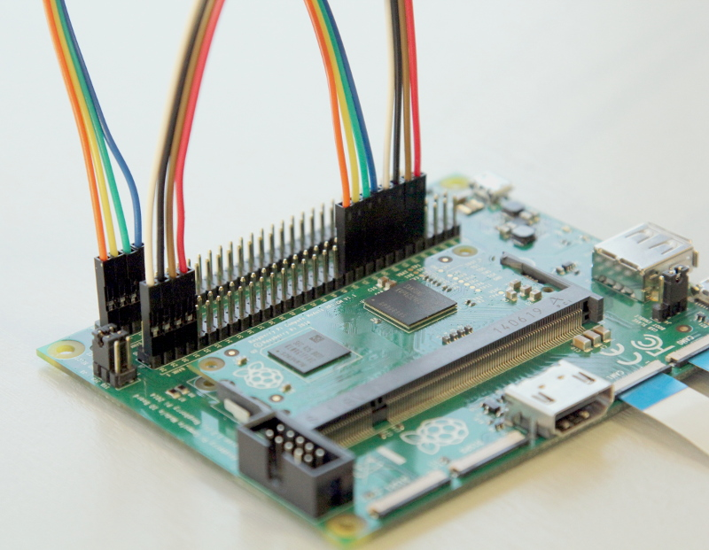

# Attaching a Raspberry Pi Camera to the Compute Module IO Board

*This document is a work in progress and is intended for advanced users.*

*For the camera to work with the compute module, the firmware needs to be July 23rd 2014 or newer (use `vcgencmd version` to check).*

## Quickstart

1. On the compute module, run `sudo raspi-config` and enable the camera.
1. Next, run `sudo wget http://goo.gl/lozvZB -O /boot/dt-blob.bin`
1. Connect adapter board and camera to CAM1 port.

    

1. Connect GPIO pins together as shown below.

    

1. *(Optional)* To add an additional camera, repeat step 3 with CAM0 and connect the GPIO pins for the second camera.

    

1. Finally, reboot for the dt-blob.bin file to be read.

### Software support

Recent raspicam binaries (*raspivid* and *raspistill*) have the -cs (--camselect) option to specify which camera should be used.

From other applications, MMAL can be told which camera to use by setting MMAL_PARAMETER_CAMERA_NUM accordingly.

```
MMAL_PARAMETER_INT32_T camera_num = {{MMAL_PARAMETER_CAMERA_NUM, sizeof(camera_num)}, CAMERA_NUMBER};
status = mmal_port_parameter_set(camera->control, &camera_num.hdr);
```

## Advanced

The 15-way 1mm FFC camera connector on the Raspberry Pi model A and B is attached to the CAM1 interface (though only uses 2 of the 4 available lanes).

The Compute Module IO Board has a 22-way 0.5mm FFC for each camera port, with CAM0 being a 2-lane interface and CAM1 being the full 4-lane interface.

To attach a standard Raspberry Pi Camera to the Compute module IO Board a small adaptor board is available that adapts the 22W FFC to the Pi 15W FFC.

To make the Raspberry Pi Camera work with a standard Raspian OS the GPIOs and I2C interface must be wired to the CAM1 connector. This is done by bridging the correct GPIOs from the J6 GPIO connector to the CD1_SDA/SCL and CAM1_IO0/1 pins on the J5 connector using jumper wires. Additionally, a *dt-blob.bin* file needs to be provided to override default pin states (the dt-blob.bin file is a file that tells the GPU what pins to use when controlling the camera, for more information on this see the relevant section in the guide to attaching peripherals to a Compute Moule [here](cm-peri-sw-guide.md)).

**The pin numbers below are provided only as an example. LED and SHUTDOWN pins can be shared by both cameras, if required.** The SDA and SCL pins must be either GPIO0 and GPIO1 or GPIO28 and 29 and must be individual to each camera.

### Steps to attach a Raspberry Pi Camera (to CAM1)

1. Attach the 0.5mm 22W FFC flexi (included with the adaptor board) to the CAM1 connector (flex contacts face down).
1. Attach the camera adaptor board to the other end of the 0.5mm flex (flex contacts face down).
1. Attach a Raspberry Pi Camera to the other, larger 15W 1mm FFC on the camera adaptor board (**contacts on the Raspberry Pi Camera flex must face up**).
1. Attach CD1_SDA (J6 pin 37) to GPIO0 (J5 pin 1).
1. Attach CD1_SCL (J6 pin 39) to GPIO1 (J5 pin 3).
1. Attach CAM1_IO1 (J6 pin 41) to GPIO2 (J5 pin 5).
1. Attach CAM1_IO0 (J6 pin 43) to GPIO3 (J5 pin 7).

**The numbers in brackets are conventional, physical pin numbers, numbered from left to right, top to bottom. The numbers on the silkscreen correspond to the Broadcom SoC GPIO numbers.**

### Configuring default pin states

The GPIOs used by the camera, default to input mode on the compute module. In order to [override the default pin states](../../configuration/pin-configuration.md) and define the pins used by the camera, we need to create a *dt-blob.bin* file from a source dts file with the relevant information for the GPU, and place this on the root of the first FAT partition.

[Sample device tree source files](#sample-device-tree-source-files) are provided at the bottom of this document.

The **pin_config** section in the `pins_cm { }` (compute module) section of the source dts needs the camera's LED and power enable pins set to outputs:

```
pin@p2  { function = "output"; termination = "no_pulling"; };
pin@p3  { function = "output"; termination = "no_pulling"; };
```

To tell the firmware which pins to use and how many cameras to look for, add the following to the **pin_defines** section:

```
pin_define@CAMERA_0_LED { type = "internal"; number = <2>; };
pin_define@CAMERA_0_SHUTDOWN { type = "internal"; number = <3>; };
pin_define@CAMERA_0_UNICAM_PORT { type = "internal"; number = <1>; };
pin_define@CAMERA_0_I2C_PORT { type = "internal"; number = <0>; };
pin_define@CAMERA_0_SDA_PIN { type = "internal"; number = <0>; };
pin_define@CAMERA_0_SCL_PIN { type = "internal"; number = <1>; };
```

### How to attach two cameras

Attach the second camera to the (CAM0) connector as before.

Connect up the I2C and GPIO lines.

1. Attach CD0_SDA (J6 pin 45) to GPIO28 (J6 pin 1).
1. Attach CD0_SCL (J6 pin 47) to GPIO29 (J6 pin 3).
1. Attach CAM0_IO1 (J6 pin 49) to GPIO30 (J6 pin 5).
1. Attach CAM0_IO0 (J6 pin 51) to GPIO31 (J6 pin 7).

The compute module's **pin_config** secion needs the second camera's LED and power enable pins configured:

```
pin@p30 { function = "output"; termination = "no_pulling"; };
pin@p31 { function = "output"; termination = "no_pulling"; };
```

In the compute module's **pin_defines** section of the dts file, change the *NUM_CAMERAS* parameter to 2 and add the following:

```
pin_define@CAMERA_1_LED { type = "internal"; number = <30>; };
pin_define@CAMERA_1_SHUTDOWN { type = "internal"; number = <31>; };
pin_define@CAMERA_1_UNICAM_PORT { type = "internal"; number = <0>; };
pin_define@CAMERA_1_I2C_PORT { type = "internal"; number = <0>; };
pin_define@CAMERA_1_SDA_PIN { type = "internal"; number = <28>; };
pin_define@CAMERA_1_SCL_PIN { type = "internal"; number = <29>; };
```

<a name="sample-device-tree-source-files"></a>
### Sample device tree source files

[Enable a CAM1 only](dt-blob-cam1.dts)

[Enable both cameras](dt-blob-dualcam.dts)

*As of 2015-04-17 some users are reporting issues with GPIO pin 2 and 3 for camera control. Pin 4 and 5 is reported to work. The issue is being investigated.*
