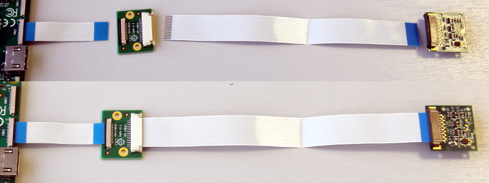
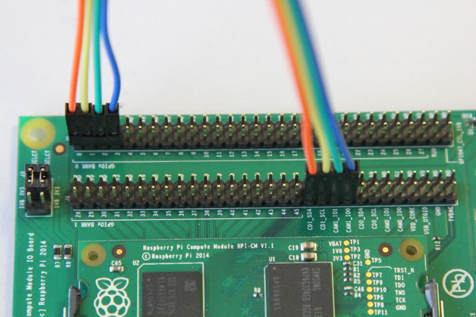

# Attaching a Raspberry Pi Camera Module to the Compute Module IO Board

## Notes before starting

These instructions are intended for advanced users, if anything is unclear please use the [Raspberry Pi Camera forums](https://www.raspberrypi.org/forums/viewforum.php?f=43) for technical help.

Unless explicitly stated otherwise, these instructions will work identically on both the Compute Module and Compute Module 3, attached to a Compute Module IO Board. Compute Module 4 is slightly different, so please refer to the appropriate section.

### Compute Module board capabilities

The Compute Module has two CSI-2 camera interfaces. CAM0 has two CSI-2 data lanes, whilst CAM1 has four data lanes. The Compute Module IO board exposes both of these interfaces. Note that the standard Raspberry Pi devices uses CAM1, but only exposes two lanes.

Please note that the camera modules are **not** designed to be hot pluggable. They should always be connected or disconnected with the power off.

### Updating your system

The camera software is under constant development. Please ensure your system is up to date prior to using these instructions.

```
sudo apt update
sudp apt full-upgrade
```

### Crypto Chip

When using the Compute Module to drive cameras, it is NOT necessary to incorporate the crypto chip used on the Raspberry Pi–designed camera boards when attaching the OM5647, IMX219 or HQ Camera Modules directly to the Compute Module carrier board. The Raspberry Pi firmware will automatically detect the CM and allow communications with the Camera Module to proceed without the crypto chip being present.


## Quickstart

To connect a single camera:
1. Power the CM down.
1. On the compute module, run `sudo raspi-config` and enable the camera.
1. Connect the RPI-CAMERA board and Camera Module to the CAM1 port. As an alternative, the Pi Zero camera cable can be used.

    

1. (CM1 & CM3 only) Connect GPIO pins together as shown below.

    

1. Power the CM up and run `sudo wget http://goo.gl/U4t12b -O /boot/dt-blob.bin`
1. Finally, reboot for the dt-blob.bin file to be read.

To connect two cameras, follow the steps as for a single camera and then also:
1. Whilst powered down, repeat step 3 with CAM0.
1. (CM1 and CM3 only) Connect the GPIO pins for the second camera.
    
1. (CM4 only) Add jumpers to J6.
1. Power up and run `sudo wget https://raw.githubusercontent.com/raspberrypi/documentation/master/hardware/computemodule/dt-blob-dualcam.bin -O /boot/dt-blob.bin`
1. Reboot for the dt-blob.bin file to be read.

Note: The default wiring uses GPIOs 2&3 to control the primary camera. These GPIOs can also be used for I2C, but doing so will result in a conflict, and the camera is unlikely to work.
**Do not enable I2C via `dtparam=i2c_arm=on` if you wish to use the camera with the default wiring**

### Software support

The supplied camera applications `raspivid` and `raspistill` have the -cs (--camselect) option to specify which camera should be used.

If you are writing your own camera application based on the MMAL API you can use the MMAL_PARAMETER_CAMERA_NUM parameter to set the current camera. E.g.

```
MMAL_PARAMETER_INT32_T camera_num = {{MMAL_PARAMETER_CAMERA_NUM, sizeof(camera_num)}, CAMERA_NUMBER};
status = mmal_port_parameter_set(camera->control, &camera_num.hdr);
```

## Advanced

The Compute Module IO board has a 22-way 0.5mm FFC for each camera port, with CAM0 being a two-lane interface and CAM1 being the full four-lane interface. The standard Raspberry Pi uses a 15-way 1mm FFC cable, so you will need either an adapter (part# RPI-CAMERA) or a Pi Zero camera cable.

The CMIO board for Compute Modules 1&3 differ slightly in approach to that for Compute Module 4. They will be considered separately.

### Compute Module 1 & 3

On the Compute Module IO board it is necessary to bridge the GPIOs and I2C interface required by the Raspberry Pi OS to the CAM1 connector. This is done by connecting the GPIOs from the J6 GPIO connector to the CD1_SDA/SCL and CAM1_IO0/1 pins on the J5 connector using jumper wires.

*The pin numbers below are provided only as an example. LED and SHUTDOWN pins can be shared by both cameras, if required.*

The SDA and SCL pins must be either GPIOs 0 and 1, GPIOs 28 and 29, or GPIOs 44 and 45, and must be individual to each camera.

#### Steps to attach a Raspberry Pi Camera (to CAM1)

1. Attach the 0.5mm 22W FFC flexi (included with the RPI-CAMERA board) to the CAM1 connector (flex contacts face down). As an alternative, the Pi Zero camera cable can be used.
1. Attach the RPI-CAMERA adaptor board to the other end of the 0.5mm flex (flex contacts face down).
1. Attach a Raspberry Pi Camera to the other, larger 15W 1mm FFC on the RPI-CAMERA adaptor board (**contacts on the Raspberry Pi Camera flex must face up**).
1. Attach CD1_SDA (J6 pin 37) to GPIO0 (J5 pin 1).
1. Attach CD1_SCL (J6 pin 39) to GPIO1 (J5 pin 3).
1. Attach CAM1_IO1 (J6 pin 41) to GPIO2 (J5 pin 5).
1. Attach CAM1_IO0 (J6 pin 43) to GPIO3 (J5 pin 7).

Note, the numbers in brackets are conventional, physical pin numbers, numbered from left to right, top to bottom. The numbers on the silkscreen correspond to the Broadcom SoC GPIO numbers.

#### Steps to attach a second Raspberry Pi Camera (to CAM0)

Attach the second camera to the (CAM0) connector as before.

Connect up the I2C and GPIO lines.

1. Attach CD0_SDA (J6 pin 45) to GPIO28 (J6 pin 1).
1. Attach CD0_SCL (J6 pin 47) to GPIO29 (J6 pin 3).
1. Attach CAM0_IO1 (J6 pin 49) to GPIO30 (J6 pin 5).
1. Attach CAM0_IO0 (J6 pin 51) to GPIO31 (J6 pin 7).

### Compute Module 4

On the Compute Module 4 IO board the CAM1 connector is already wired to the I2C on GPIOs 44 & 45, and the shutdown line is connected to GPIO 5 on the GPIO expander. There is no LED signal wired through. No hardware changes are required to use CAM1 other than connecting the 22pin FFC to the CAM1 connector (flex contacts face down).

To connect a second Raspberry Pi camera (to CAM0), two jumpers must be added to J6 in a vertical orienation. The CAM0 connector shares the shutdown line with CAM1.

### Configuring default pin states (all CM variants)

The GPIOs that we are using for the camera default to input mode on the Compute Module. To [override these default settings](../../configuration/pin-configuration.md) and also tell the system that these are the pins to be used by the camera, we need to create a `dt-blob.bin` that is loaded by the firmware when the system boots up. This file is built from a source dts file that contains the requried settings, and placed on the boot partition.

[Sample device tree source files](#sample-device-tree-source-files) are provided at the bottom of this document. These use the default wiring as described in this page. 

The `pin_config` section in the `pins_cm { }` (compute module), `pins_cm3 { }` (compute module3), or `pins_cm4 { }` (compute module 4) section of the source dts needs the camera's LED and power enable pins set to outputs:

```
pin@p2  { function = "output"; termination = "no_pulling"; };
pin@p3  { function = "output"; termination = "no_pulling"; };
```

To tell the firmware which pins to use and how many cameras to look for, add the following to the `pin_defines` section:

```
pin_define@CAMERA_0_LED { type = "internal"; number = <2>; };
pin_define@CAMERA_0_SHUTDOWN { type = "internal"; number = <3>; };
pin_define@CAMERA_0_UNICAM_PORT { type = "internal"; number = <1>; };
pin_define@CAMERA_0_I2C_PORT { type = "internal"; number = <0>; };
pin_define@CAMERA_0_SDA_PIN { type = "internal"; number = <0>; };
pin_define@CAMERA_0_SCL_PIN { type = "internal"; number = <1>; };
```
Indentation and line breaks are not critical, so the example files expand these blocks out for readability.

The Compute Module's **pin_config** section needs the second camera's LED and power enable pins configured:

```
pin@p30 { function = "output"; termination = "no_pulling"; };
pin@p31 { function = "output"; termination = "no_pulling"; };
```

In the Compute Module's **pin_defines** section of the dts file, change the **NUM_CAMERAS** parameter to 2 and add the following:

```
pin_define@CAMERA_1_LED { type = "internal"; number = <30>; };
pin_define@CAMERA_1_SHUTDOWN { type = "internal"; number = <31>; };
pin_define@CAMERA_1_UNICAM_PORT { type = "internal"; number = <0>; };
pin_define@CAMERA_1_I2C_PORT { type = "internal"; number = <0>; };
pin_define@CAMERA_1_SDA_PIN { type = "internal"; number = <28>; };
pin_define@CAMERA_1_SCL_PIN { type = "internal"; number = <29>; };
```

<a name="sample-device-tree-source-files"></a>
### Sample device tree source files

[Enable CAM1 only](dt-blob-cam1.dts)

[Enable CAM1 and CAM0](dt-blob-dualcam.dts)

### Compiling a DTS file to a device tree blob

Once all the required changes have been made to the `dts` file, it needs to be compiled and placed on the boot partition of the device. 

Instructions for doing this can be found on the [Pin Configuration](../../configuration/pin-configuration.md) page.
