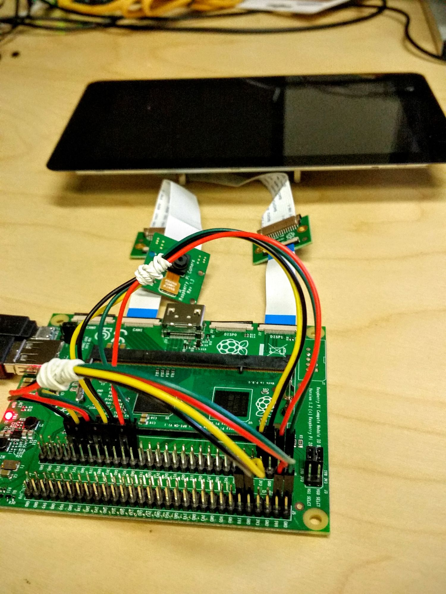
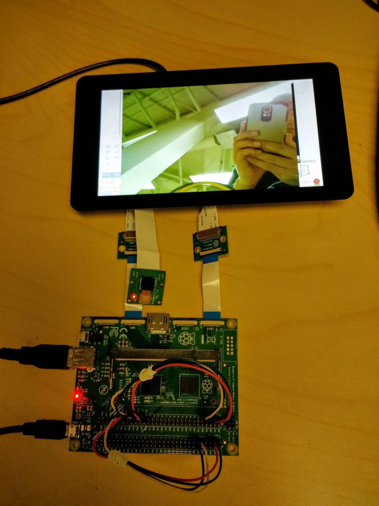

# Attaching Raspberry Pi Official 7" Display to the Compute Module IO Board

These instructions are intended for advanced users, if anything is unclear please use the [Raspberry Pi Compute Module forums](https://www.raspberrypi.org/forums/viewforum.php?f=98) for technical help.

Please ensure your system software is updated before starting.

Largely speaking the approach taken for Compute Modules 1, 3, and 4 is the same, but there are minor differences in physical setup required. It will be indicated where a step applies only to a specific platform.

**Note:** The Raspberry Pi Zero camera cable cannot be used as an alternative to the RPI-DISPLAY adaptor, because its wiring is different. 

Please note that the display is **not** designed to be hot pluggable. It (and camera modules) should always be connected or disconnected with the power off.

## Quickstart — display only

1. Connect the display to the DISP1 port on the Compute Module IO board through the 22W to 15W display adaptor.
1. (CM1 and 3 only) Connect these pins together with jumper wires:

	```
	GPIO0 - CD1_SDA
	GPIO1 - CD1_SCL
	```

1. Power up the Compute Module and run:

	```sudo wget https://goo.gl/iiVxuA -O /boot/dt-blob.bin```

1. Reboot for the `dt-blob.bin` file to be read.

## Quickstart — display and camera(s)

**To enable the display and one camera:**

1. Connect the display to the DISP1 port on the Compute Module IO board through the 22W to 15W display adaptor, called RPI-DISPLAY.
1. Connect the Camera Module to the CAM1 port on the Compute Module IO board through the 22W to 15W adaptor called RPI-CAMERA. Alternatively, the Raspberry Pi Zero camera cable can be used.
1. (CM 1 and 3 only) Connect these pins together with jumper wires:

	```
	GPIO0 - CD1_SDA
	GPIO1 - CD1_SCL
	GPIO2 - CAM1_IO1
	GPIO3 - CAM1_IO0
	```
	
	(Please note this image needs to be updated to have the extra jumper leads removed and use the standard wiring (2&3 not 4&5))

1. Power up the Compute Module and run:

	```sudo wget https://goo.gl/gaqNrO -O /boot/dt-blob.bin```

1. Reboot for the `dt-blob.bin` file to be read.


**To enable the display and both cameras:**

1. Follow the steps for connecting the display and one camera above.
1. Connect the Camera Module to the CAM0 port on the Compute Module IO board through the 22W to 15W adaptor called RPI-CAMERA. Alternatively, the Raspberry Pi Zero camera cable can be used.
1. (CM1 & 3 only) Add links:

	```
	GPIO28 - CD0_SDA
	GPIO29 - CD0_SCL
	GPIO30 - CAM0_IO1
	GPIO31 - CAM0_IO0
	```

1. (CM4 only) Add jumpers to J6.

1. Power up the Compute Module and run:

	```sudo wget https://goo.gl/htHv7m -O /boot/dt-blob.bin```

1. Reboot for the `dt-blob.bin` file to be read.

	
	(Please note this image needs to be updated to show two Camera Modules and the standard wiring)

### Software support

There is no additional configuration required to enable the touchscreen. The touch interface should work out of the box once the screen is successfully detected.

If you wish to disable the touchscreen element and only use the display side, you can add the command ```disable_touchscreen=1``` to /boot/config.txt to do so.

To make the firmware to ignore the display even if connected, then add ```ignore_lcd=1``` to /boot/config.txt.

### Firmware configuration

The firmware looks at the dt-blob.bin file for the relevant configuration to use
for the screen. It looks at the pin_number@ defines for
```
DISPLAY_I2C_PORT
DISPLAY_SDA
DISPLAY_SCL
DISPLAY_DSI_PORT
```
The I2C port, SDA and SCL pin numbers are self explanatory. DISPLAY_DSI_PORT
selects between DSI1 (the default) and DSI0.

### Sources
- [dt-blob-disp1-only.dts](dt-blob-disp1-only.dts)
- [dt-blob-disp1-cam1.dts](dt-blob-disp1-cam1.dts)
- [dt-blob-disp1-cam2.dts](dt-blob-disp1-cam2.dts)
- [dt-blob-disp0-only.dts](dt-blob-disp0-only.dts - uses wiring as for CAM0)
