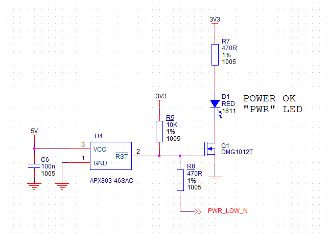

# Compute Module and related schematics

Note that schematics are not available for the Compute Module 4, but are available for the IO board.

* [Compute Module 4 IO Board datasheet including schematics](https://datasheets.raspberrypi.org/cm4io/cm4io-datasheet.pdf)

There is also a KiCAD PCB design set available:

 * [Compute Module 4 IO Board KiCAD files](https://datasheets.raspberrypi.org/cm4io/CM4IO-KiCAD.zip)

Schematics for the Compute Module camera/display adapter board (CMCDA):

* [CMCDA Rev 1.1](https://datasheets.raspberrypi.org/cmcda/cmcda-schematics.pdf)

Schematic for an under-voltage detection circuit, as used in most models of Raspberry Pi:

## Schematics for older models

* [CM Rev 1.1](https://datasheets.raspberrypi.org/cm/cm1-schematics.pdf)
* [CM3 and CM3L Rev 1.0](https://datasheets.raspberrypi.org/cm/cm3-schematics.pdf)

Schematics for the Compute Module IO board (CMIO):

* [CMIO Rev 3.0 (Supports CM1, CM3, CM3L, CM3+ and CM3+L)](https://datasheets.raspberrypi.org/cmio/cmio-schematics.pdf)
