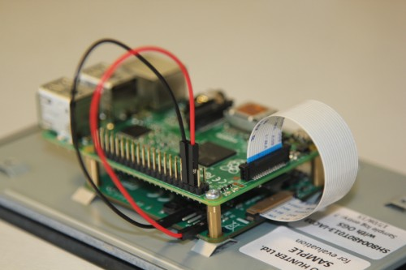

# Raspberry Pi Touch Display

## Introduction

The Raspberry Pi Touch Display is an LCD display which connects to the Raspberry Pi through the DSI connector. In some situations, it allows for the use of both the HDMI and LCD displays at the same time (this requires software support).

## Board support

The DSI display is designed to work with all models of Raspberry Pi, however early models that do not have mounting holes (the Raspberry Pi 1 model A and B) will require additional mounting hardware to fit the HAT-dimensioned stand-offs on the display PCB.

## Physical Installation 

The following image shows how to attach the Raspberry Pi to the back of the Touch Display (if required), and how to connect both the data (ribbon cable) and power (red/black wires) from the Raspberry Pi to the display. If you are not attaching the Raspberry Pi to the back of the display, take extra care when attaching the ribbon cable to ensure it is the correct way round. The black and red power wires should be attached to the GND and 5v pins respectively.



[Legacy support for Raspberry Pi 1 Model A/B](legacy.md)


## Screen orientation

LCD displays have an optimum viewing angle, and depending on how the screen is mounted it may be necessary to change the orientation of the display to give the best results. By default, the Raspberry Pi Touch Display and Raspberry Pi are set up to work best when viewed from slightly above, for example on a desktop. If viewing from below, you can physically rotate the display, and then tell the system software to compensate by running the screen upside down.

### FKMS Mode

FKMS mode is used by default on the Raspberry Pi 4B. FKMS uses the DRM/MESA libraries to provide graphics and 3D acceleration. 

To set screen orientation when running the graphical desktop, select the `Screen Configuration` option from the `Preferences` menu. Right click on the DSI display rectangle in the layout editor, select Orientation then the required option.

To set screen orientation when in console mode, you will need to edit the kernel command line to pass the required orientation to the system. 
```bash
sudo nano /boot/cmdline.txt
```
To rotate by 90 degrees clockwise, add the following to the cmdline, making sure everything is on the same line, do not add any carriage returns. Possible rotation values are 0, 90, 180 and 270.
```
video=DSI-1:800x480@60,rotate=90
```
NOTE:  In console mode it is not possible to rotate the DSI display separately to the HDMI display, so if you have both attached they must both be set to the same value.

### Legacy Graphics Mode

Legacy graphics mode is used by default on all Raspberry Pi models prior to the Raspberry Pi 4B, and can also be used on the Raspberry Pi 4B if required, by disabling FKMS mode by commenting out the FKMS line in `config.txt`. Note: legacy mode on the Raspberry Pi 4B has no 3D acceleration so it should only be used if you have a specific reason for needing it.

To flip the display, add the following line to the file `/boot/config.txt`:

`lcd_rotate=2`

This will vertically flip the LCD and the touch screen, compensating for the physical orientation of the display.

You can also rotate the display by adding the following to the `config.txt` file.

- `display_lcd_rotate=x`, where `x` can be one of the folllowing:

| display_lcd_rotate | result |
| --- | --- |
| 0 | no rotation |
| 1 | rotate 90 degrees clockwise |
| 2 | rotate 180 degrees clockwise |
| 3 | rotate 270 degrees clockwise |
| 0x10000 | horizontal flip |
| 0x20000 | vertical flip |

Note that the 90 and 270 degree rotation options require additional memory on the GPU, so these will not work with the 16MB GPU split.

## Touchscreen orientation

Additionally, you have the option to change the rotation of the touchscreen independently of the display itself by adding a `dtoverlay` instruction in `config.txt`, for example:

`dtoverlay=rpi-ft5406,touchscreen-swapped-x-y=1,touchscreen-inverted-x=1`

The options for the touchscreen are: 

| DT parameter          | Action                          |
|-----------------------|---------------------------------|                          
|touchscreen-size-x     | Sets X resolution (default 800) |
|touchscreen-size-y     | Sets Y resolution (default 600) |
|touchscreen-inverted-x | Invert X coordinates            |
|touchscreen-inverted-y | Invert Y coordinates            |
|touchscreen-swapped-x-y| Swap X and Y cordinates         |

## Troubleshooting

Read our troubleshooting steps, tips, and tricks here: [Raspberry Pi Touch Display troubleshooting](troubleshooting.md).

## Specifications

- 800×480 RGB LCD display
- 24-bit colour
- Industrial quality: 140-degree viewing angle horizontal, 130-degree viewing angle vertical
- 10-point multi-touch touchscreen
- PWM backlight control and power control over I2C interface
- Metal-framed back with mounting points for Raspberry Pi display conversion board and Raspberry Pi
- Backlight lifetime: 20000 hours
- Operating temperature: -20 to +70 degrees centigrade
- Storage temperature: -30 to +80 degrees centigrade
- Contrast ratio: 500
* Average brightness: 250 cd/m<sup>2</sup>
* Viewing angle (degrees):
  * Top - 50
  * Bottom - 70
  * Left - 70
  * Right - 70

## Module mechanical specification

* Outer dimensions: 192.96 × 110.76mm
* Viewable area: 154.08 × 85.92mm
* [Download mechanical drawing (PDF, 592kb)](7InchDisplayDrawing-14092015.pdf)
* [Additional drawing including radius and thickness of glass](radius.png)
