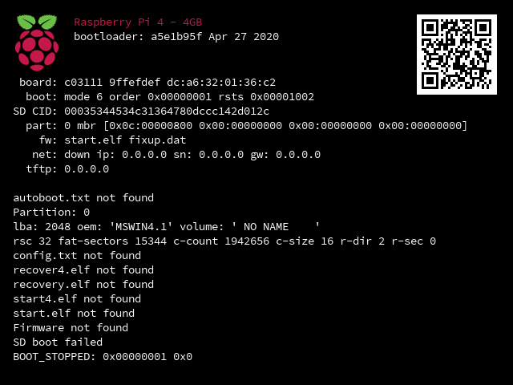

## Boot Diagnostics on the Raspberry Pi 4

Starting with version 2020-04-16 of the Raspberry Pi 4 bootloader, diagnostic information can be displayed at boot time on an HDMI display. To see this diagnostic information, power down the Raspberry Pi 4, remove the SD card, then power back up. A diagnostic display similar to below should appear on the attached display.

This diagnostics page will also appear if the bootloader is unable to boot from an inserted SD card, or is unable to network boot; for example, if there is no bootable image on the card, or it is defective, or the network boot parameters are incorrect.

Once the diagnostics page is displayed, a reboot is only possible by power cycling the device (i.e. unplug then re-plug the power supply).

The top line describes the model of Pi and its memory capacity. The QR code is a link to the [Downloads Page](https://raspberrypi.org/downloads).

The diagnostic information is as follows:

| Line: | Information |
| ---- | ----------- |
| bootloader | Bootloader version - build date |
| board      | Board revision - Serial Number - Ethernet MAC address | 
| boot       | mode: (ROM boot mode - 6 SPI), order: EEPROM config [BOOT_ORDER](https://www.raspberrypi.org/documentation/hardware/raspberrypi/bcm2711_bootloader_config.md), RSTS: PM_RSTS register |
| SD CID	   | SD Card Identifier defined by SD-CARD manufacturer |
| part	     | Master Boot Record primary partitions type:LBA |
| fw	       | Filename for start.elf and fixup.dat if present (e.g. start4x.elf, fixup4x.dat) |
| net	       | Network boot: - Link status (up/down) client IP address (ip), Subnet (sn), Default gateway (gw) |
| tftp       | Network boot: TFTP server IP address|

This display can be disabled using the DISABLE_HDMI option, see [Pi4 Bootloader Configuration](./bcm2711_bootloader_config.md).

N.B. This is purely for diagnosing boot failures; it is not an interactive bootloader. If you require an interactive bootloader, consider using a tool such as NOOBS or U-Boot.
