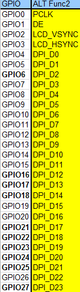
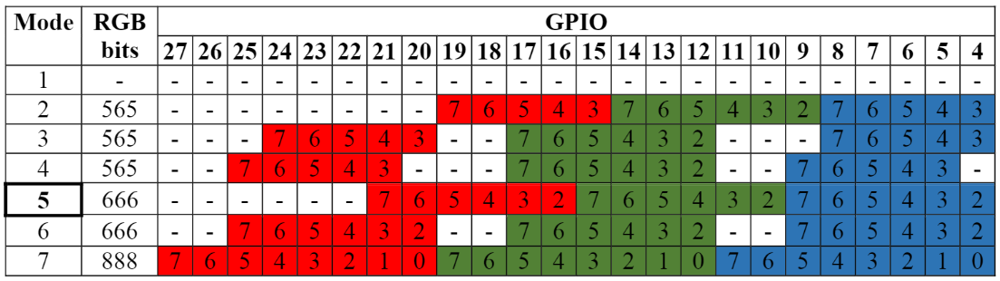

# DPI (Parallel Display Interface)

An up-to-24-bit parallel RGB interface is available on all Raspberry Pi boards with the 40 way header (A+, B+, Pi2, Pi3, Zero) and Compute Module. This interface allows parallel RGB displays to be attached to the Raspberry Pi GPIO either in RGB24 (8 bits for red, green and blue) or RGB666 (6 bits per colour) or RGB565 (5 bits red, 6 green, and 5 blue).

This interface is controlled by the GPU firmware and can be programmed by a user via special config.txt parameters and by enabling the correct Linux Device Tree overlay.

## GPIO Pins

One of the alternate functions selectable on bank 0 of the Raspberry Pi GPIO is DPI (Display Parallel Interface) which is a simple clocked parallel interface (up to 8 bits of R, G and B; clock, enable, hsync, and vsync). This interface is available as alternate function 2 (ALT2) on GPIO bank 0:



Note that there are various ways that the colour values can be presented on the DPI output pins in either 565, 666, or 24-bit modes (see the following table and the `otutput_format` part of the `dpi_output_format` parameter below):



## Disable other GPIO peripherals

Note that all other peripheral overlays that use conflicting GPIO pins must be disabled. In config.txt, take care to comment out or invert any dtparams that enable I2C or SPI:

```
dtparam=i2c_arm=off
dtparam=spi=off
```

## Controlling Output Format

The output format (clock, colour format, sync polarity, enable) can be controlled with a magic number (unsigned integer or hex value prefixed with 0x) passed to the `dpi_output_format` parameter in config.txt created from the following fields:

```
output_format          = (dpi_output_format >>  0) & 0xf;
rgb_order              = (dpi_output_format >>  4) & 0xf;

output_enable_mode     = (dpi_output_format >>  8) & 0x1;
invert_pixel_clock     = (dpi_output_format >>  9) & 0x1;

hsync_disable          = (dpi_output_format >> 12) & 0x1;
vsync_disable          = (dpi_output_format >> 13) & 0x1;
output_enable_disable  = (dpi_output_format >> 14) & 0x1;

hsync_polarity         = (dpi_output_format >> 16) & 0x1;
vsync_polarity         = (dpi_output_format >> 17) & 0x1;
output_enable_polarity = (dpi_output_format >> 18) & 0x1;

hsync_phase            = (dpi_output_format >> 20) & 0x1;
vsync_phase            = (dpi_output_format >> 21) & 0x1;
output_enable_phase    = (dpi_output_format >> 22) & 0x1;

output_format:
   1: DPI_OUTPUT_FORMAT_9BIT_666
   2: DPI_OUTPUT_FORMAT_16BIT_565_CFG1
   3: DPI_OUTPUT_FORMAT_16BIT_565_CFG2
   4: DPI_OUTPUT_FORMAT_16BIT_565_CFG3
   5: DPI_OUTPUT_FORMAT_18BIT_666_CFG1
   6: DPI_OUTPUT_FORMAT_18BIT_666_CFG2
   7: DPI_OUTPUT_FORMAT_24BIT_888

rgb_order:
   1: DPI_RGB_ORDER_RGB
   2: DPI_RGB_ORDER_BGR
   3: DPI_RGB_ORDER_GRB
   4: DPI_RGB_ORDER_BRG

output_enable_mode:
   0: DPI_OUTPUT_ENABLE_MODE_DATA_VALID
   1: DPI_OUTPUT_ENABLE_MODE_COMBINED_SYNCS

invert_pixel_clock:
   0: RGB Data changes on rising edge and is stable at falling edge
   1: RGB Data changes on falling edge and is stable at rising edge.

hsync/vsync/output_enable_polarity:
   0: default for HDMI mode
   1: inverted

hsync/vsync/oe phases:
   0: DPI_PHASE_POSEDGE
   1: DPI_PHASE_NEGEDGE
```

NB the single bit fields all act as an "invert default behaviour".

## Controlling Timings / Resolutions

The `dpi_group` and `dpi_mode` config.txt parameters are used to set either predetermined modes (DMT or CEA modes as used by HDMI) or a user can generate custom modes.

To generate a custom HDMI mode start [here](https://www.raspberrypi.org/forums/viewtopic.php?f=29&t=24679).

If you set up a custom HDMI mode, then in config.txt use:
```
dpi_group=2
dpi_mode=87
```

This will use the custom HDMI timings for DPI.

The other option is to use the hdmi_timings config.txt parameter to set the HDMI (DPI) timings directly. You still need the `dpi_group=2` and `dpi_mode=87` parameters in config.txt 

The hdmi_timings parameters are specified as a space-delimited set of parameters:

```
hdmi_timings=<h_active_pixels> <h_sync_polarity> <h_front_porch> <h_sync_pulse> <h_back_porch> <v_active_lines> <v_sync_polarity> <v_front_porch> <v_sync_pulse> <v_back_porch> <v_sync_offset_a> <v_sync_offset_b> <pixel_rep> <frame_rate> <interlaced> <pixel_freq> <aspect_ratio>

<h_active_pixels> = horizontal pixels (width)
<h_sync_polarity> = invert hsync polarity
<h_front_porch>   = horizontal forward padding from DE acitve edge
<h_sync_pulse>    = hsync pulse width in pixel clocks
<h_back_porch>    = vertical back padding from DE active edge
<v_active_lines>  = vertical pixels height (lines)
<v_sync_polarity> = invert vsync polarity
<v_front_porch>   = vertical forward padding from DE active edge
<v_sync_pulse>    = vsync pulse width in pixel clocks
<v_back_porch>    = vertical back padding from DE active edge
<v_sync_offset_a> = leave at zero
<v_sync_offset_b> = leave at zero
<pixel_rep>       = leave at zero
<frame_rate>      = screen refresh rate in Hz
<interlaced>      = leave at zero
<pixel_freq>      = clock frequency (width*height*framerate)
<aspect_ratio>    = *

* The aspect ratio can be set to one of 8 values (choose closest for your screen):

HDMI_ASPECT_4_3 = 1
HDMI_ASPECT_14_9 = 2
HDMI_ASPECT_16_9 = 3
HDMI_ASPECT_5_4 = 4
HDMI_ASPECT_16_10 = 5
HDMI_ASPECT_15_9 = 6
HDMI_ASPECT_21_9 = 7
HDMI_ASPECT_64_27 = 8
```

## Overlays

A Linux Device Tree overlay is used to switch the GPIO pins into the correct mode (alt function 2). As previously mentioned, the GPU is responsible for driving the DPI display. Hence there is no Linux driver; the overlay simply sets the GPIO alt functions correctly.

A 'full fat' DPI overlay (dpi24.dtb) is provided which sets all 28 GPIOs to ALT2 mode, providing the full 24 bits of colour bus as well as the h and v-sync, enable and pixel clock. Note this uses **all** of the bank 0 GPIO pins.

A second overlay (vga666.dtb) is provided for driving VGA monitor signals in 666 mode which don't need the clock and DE pins (GPIO 0 and 1) and only require GPIOs 4-21 for colour (using mode 5).

These overlays are fairly trivial and a user can edit them to create a custom overlay to enable just the pins required for their specific use case. For example, if one was using a DPI display using vsync, hsync, pclk, and de but in RGB565 mode (mode 2), then the dpi24.dtb overlay could be edited so that GPIOs 20-27 were not switched to DPI mode and hence could be used for other purposes.

## Example config.txt settings

### Gert VGA666 adaptor

This setup is for the [Gert VGA adaptor](https://github.com/fenlogic/vga666)

Note that the instructions provided in the documentation in the above GitHub link are somewhat out of date, please use the settings below.

```
dtoverlay=vga666
enable_dpi_lcd=1
display_default_lcd=1
dpi_group=2
dpi_mode=82
```

### 800x480 LCD panel

Note: this was tested with [Adafruit's DPI add-on board and 800x480 LCD panel](https://www.adafruit.com/products/2453)

```
dtoverlay=dpi24
overscan_left=0
overscan_right=0
overscan_top=0
overscan_bottom=0
framebuffer_width=800
framebuffer_height=480
enable_dpi_lcd=1
display_default_lcd=1
dpi_group=2
dpi_mode=87
dpi_output_format=0x6f005
hdmi_timings=800 0 40 48 88 480 0 13 3 32 0 0 0 60 0 32000000 6
```

