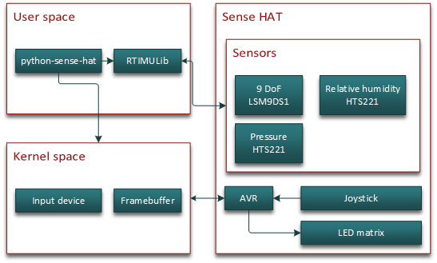

# Sense HAT

## Installation

In order to work correctly, the Sense HAT requires an up to date kernel, I2C enabled and a few libraries to get started.

1. Ensure your apt package list is up to date:

    ```bash
    sudo apt-get update
    ```

1. Next, install the sense-hat package, which will ensure the kernel is up to date, enable I2C and install the necessary libraries and programs:

    ```bash
    sudo apt-get install sense-hat
    ```

1. The python-sense-hat library requires pillow to be installed in order to work under Python 3:

    ```bash
    sudo pip-3.2 install pillow
    ```

1. Finally, a reboot may be required if I2C was disabled or the kernel was not up to date prior to the install:

    ```bash
    sudo reboot
    ```

## Software overview

After installation, example code can be found under `/usr/src/sense-hat/examples`.

These can be copied to the user's home directory by running `cp /usr/src/sense-hat/examples ~/ -a`.

The C/C++ examples can be compiled by running `make` in the appropriate directory.

The RTIMULibDrive11 example comes pre-compiled to help ensure everything works as intended. It can be launched by running `RTIMULibDrive11` and closed by pressing <kbd>Ctrl</kbd>+<kbd>c</kbd>.



### python-sense-hat

sense-hat is the officially supported library for the Sense HAT and provides access to all of the on-board sensors and the LED matrix.

Complete documentation can be found at [pythonhosted.org/sense-hat](https://pythonhosted.org/sense-hat/).

### RTIMULib

[RTIMULib](https://github.com/RPi-Distro/RTIMULib) is a C++ and Python library that makes it easy to use 9-dof and 10-dof IMUs with embedded Linux systems. A pre-calibrated settings file is provided in /etc/RTIMULib.ini, which is also copied and used by python-sense-hat. The included examples look for RTIMULib.ini in the current working directory, so you may wish to copy the file there to get more accurate data.

### Other

#### LED matrix

The LED matrix is an RGB565 [framebuffer](https://www.kernel.org/doc/Documentation/fb/framebuffer.txt) with the id "RPi-Sense FB". The appropriate device node can be written to as a standard file or mmaped. The included 'snake' example shows how to access the framebuffer.

#### Joystick

The joystick comes up as an input event device named "Raspberry Pi Sense HAT Joystick", mapped to the arrow keys and enter. It should be supported by any library which is capable of handling inputs or directly through the [evdev interface](https://www.kernel.org/doc/Documentation/input/input.txt). Suitable libraries include SDL, [pygame](http://www.pygame.org/docs/) and [python-evdev](https://python-evdev.readthedocs.org/en/latest/). The included 'snake' example shows how to access the joystick directly.

## Calibration

...

## Updating the AVR firmware

...

## Updating the EEPROM data

...
