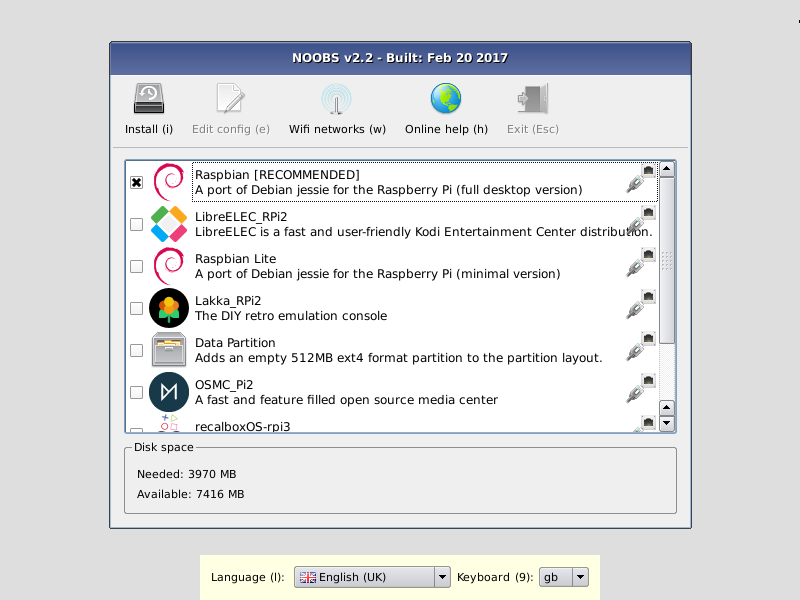

# NOOBS

**New Out Of Box Software (NOOBS)** is an easy operating system installation manager for the Raspberry Pi.

## How to get NOOBS

### Buy a pre-installed SD card

SD cards with NOOBS preinstalled are available from many of our distributors and independent retailers, including [Pimoroni](https://shop.pimoroni.com/products/noobs-8gb-sd-card), [Adafruit](https://www.adafruit.com/products/1583), and [Pi Hut](http://thepihut.com/collections/raspberry-pi-sd-cards-and-adapters/products/noobs-preinstalled-sd-card).

### Download

Alternatively, NOOBS is available for download on the Raspberry Pi website: [raspberrypi.org/downloads](https://www.raspberrypi.org/downloads/)

#### How to install NOOBS on an SD card

Once you've downloaded the NOOBS zip file, you'll need to copy the contents to a formatted SD card on your computer.

To set up a blank SD card with NOOBS:

- Format an SD card as FAT. See the instructions given below.
  - Your SD card will need to be at least 16GB for Full Raspberry Pi OS, or at least 8GB for all other installs. 
- Download and extract the files from the NOOBS zip file.
- Copy the extracted files onto the SD card that you just formatted, so that these files are at the root directory of the SD card. Please note that in some cases it may extract the files into a folder; if this is the case, then please copy across the files from inside the folder rather than the folder itself.
- On first boot, the "RECOVERY" FAT partition will be automatically resized to a minimum, and a list of OSes that are available to install will be displayed.

#### How to format an SD card as FAT

**Note:** If you're formatting an SD (or micro SD) card that has a capacity over 32GB (i.e. 64GB and above), then see the separate [SDXC formatting](sdxc_formatting.md) instructions.

##### Windows

If you are a Windows user, we recommend formatting your SD card using the SD Association's Formatting Tool, which can be downloaded from [sdcard.org](https://www.sdcard.org/downloads/formatter_4/). Instructions for using the tool are available on the same site.

##### Mac OS

The [SD Association's Formatting Tool](https://www.sdcard.org/downloads/formatter_4/) is also available for Mac users, although the default OS X Disk Utility is also capable of formatting the entire disk. To do this, select the SD card volume and choose `Erase` with `MS-DOS` format.

##### Linux

For Linux users we recommend `gparted` (or the command line version `parted`). Norman Dunbar has written up [instructions](http://qdosmsq.dunbar-it.co.uk/blog/2013/06/noobs-for-raspberry-pi/) for Linux users.

## What's included in NOOBS

The following operating systems are currently included in NOOBS:

- [Raspberry Pi OS](https://www.raspberrypi.org)
- [LibreELEC](https://libreelec.tv/)
- [OSMC](https://osmc.tv/)
- [Recalbox](https://www.recalbox.com/)
- [Lakka](http://www.lakka.tv/)
- [RISC OS](https://www.riscosopen.org/wiki/documentation/show/Welcome%20to%20RISC%20OS%20Pi)
- [Screenly OSE](https://www.screenly.io/ose/)
- [Windows 10 IoT Core](https://developer.microsoft.com/en-us/windows/iot)
- [TLXOS](https://thinlinx.com/)

As of NOOBS v1.3.10 (September 2014), only Raspberry Pi OS is installed by default in NOOBS. The others can be installed with a network connection.

## NOOBS and NOOBS Lite

NOOBS is available in two forms: offline and network install, or network install only.

The full version has Raspberry Pi OS included, so it can be installed from the SD card while offline, whereas using NOOBS Lite or installing any other operating system requires an internet connection.

Note that the operating system image on the full version can be outdated if a new version of the OS is released, but if connected to the internet you will be shown the option of downloading the latest version if there is a newer one available.

## NOOBS development

### Latest NOOBS release

The latest NOOBS release is **v3.5.0**, released on **15th September 2020**.

(From NOOBS v1.4.0 onwards, NOOBS Lite only shares the first two digits of the version number, i.e. v1.4)

### NOOBS documentation

More comprehensive documentation, including more advanced configuration of NOOBS, is available on [GitHub](https://github.com/raspberrypi/noobs/blob/master/README.md).

### NOOBS source code

See the NOOBS source code on [GitHub](https://github.com/raspberrypi/noobs).
