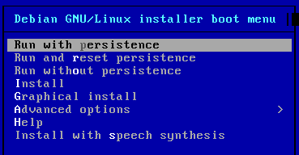

# Raspberry Pi Desktop boot options

When booting the Raspberry Pi Desktop image, you will be presented with a
selection screen offering a number of options for how you would like to run
or install it:

## Options

- Run with persistence
    - Live boot the OS with persistence of files and programs - any changes made
    will remain after reboot
- Run and reset persistence
    - Reset any changes made, and live boot the OS with persistence of files
    thereafter
- Run without persistence
    - Run the OS with no persistence of changes
- Install
    - Install the OS fully using a command-line installer
- Graphical install
    - Install the OS fully using a graphical installer
- Advanced options
    - Expert install
    - Rescue mode
    - Automated install
    - Graphical expert install
    - Graphical rescue mode
    - Graphical automated install
- Help
    - View the help index
- Install with speech synthesis
    - Install the OS fully, with speech synthesis enabled
