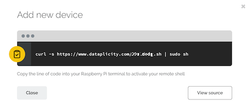

# Access your Raspberry Pi over the internet

You can connect to your Raspberry Pi over the internet from another computer or a mobile device. There are a number of ways to do this, which we cover below. 

## Port Forwarding

One method is to set port forwarding up on your router. To set port forwarding up, you must change the configuration of your router to forward all inbound traffic from the internet on a specific port to the local IP address of your Raspberry Pi. Most routers have this feature available. However, every router is different so you will need to consult your router's user manual for instructions. The settings can be tricky if your Pi is behind a firewall or if there is more than one router. One disadvantage of port forwarding is that it exposes a network port on your private LAN to the public internet. This is a known security vulnerability and must be managed carefully.

## Alternatives

Alternative online services are available.

### remot3.it ("remote it" by Weaved, Inc.)

One secure alternative to port forwarding is the [remot3.it](https://www.remot3.it) service from Weaved. remot3.it is software you install on your Raspberry Pi to access a single Pi, or manage a fleet of 100s or 1000s of Pi, from anywhere over the Internet. Use remot3.it to access your Pi's SSH, VNC, HTTP(S), and RDP services, or any other TCP port on your Pi.   Without port forwarding.

From the command line on your Pi update your Raspbian package lists:

```bash
sudo apt-get update
```

Install the remot3.it package:

```bash
sudo apt-get install weavedconnectd
```

Next, run the remot3.it installer with the command below.

```bash
sudo weavedinstaller
```

The remot3.it installer will ask you to create a remot3.it user account by entering an email address and a password.  Follow the on-screen menus to give your Pi a device name and choose what TCP ports/services to enable for remote access.

Sign In to your account at www.remot3.it   Your remot3.it account is now a private Internet VPN connection service to your Pi without port forwarding.  

For more detailed instructions and examples see [Getting Started with remot3.it for Pi](http://forum.weaved.com/t/how-to-get-started-with-remot3-it-for-pi/1029).  For further assistance email support@remot3.it

### Dataplicity

[Dataplicity](https://dataplicity.com) allows you to connect and control your Pi's shell remotely from a web browser and its mobile apps. You can use Dataplicity's Wormhole feature to host a website or API directly from your Pi and automatically enable HTTPS/SSL with no configuration or certificates.

[It uses WebSockets over HTTPS](https://docs.dataplicity.com/docs/how-it-works) to provide an opportunistic connection and requires a single line install.

Dataplicity provides free support by e-mail/in-app messenger. 

[](https://dataplicity.com)
