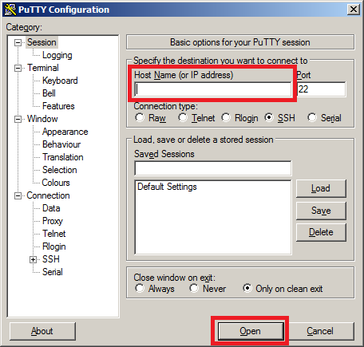
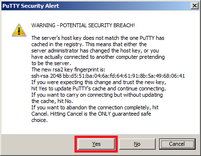
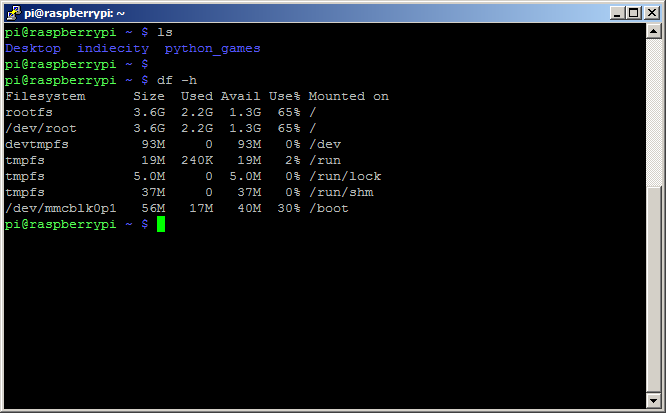
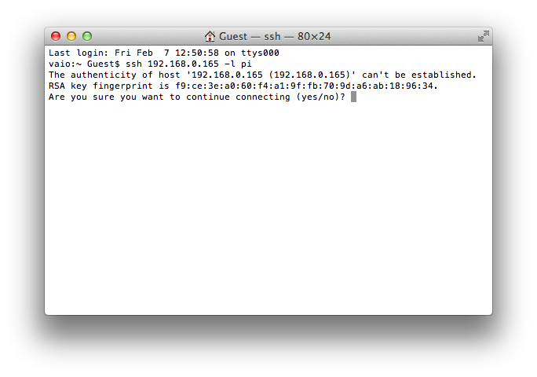
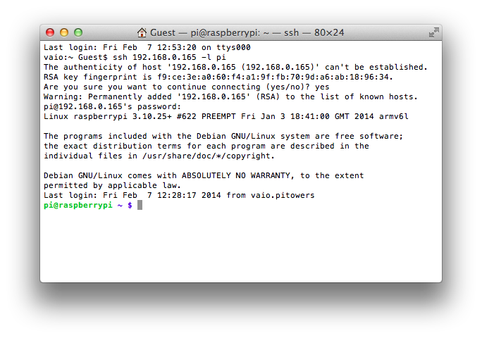
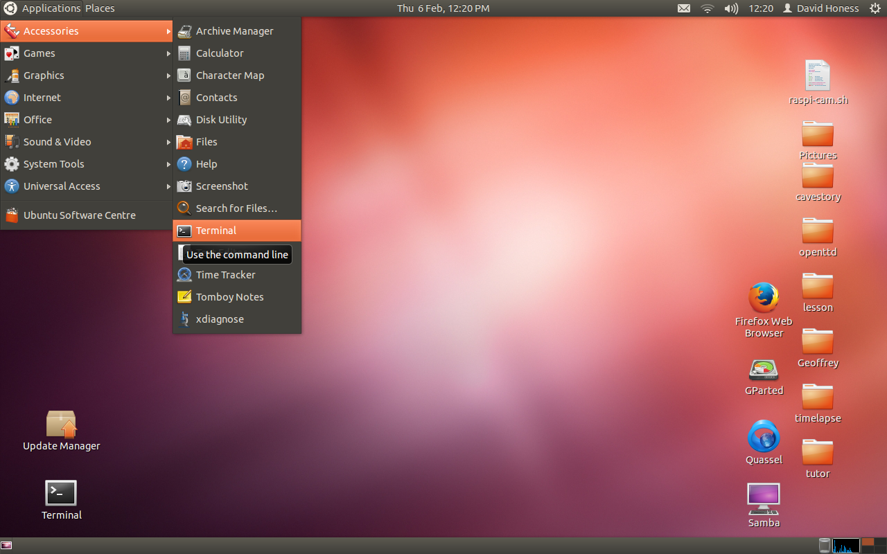
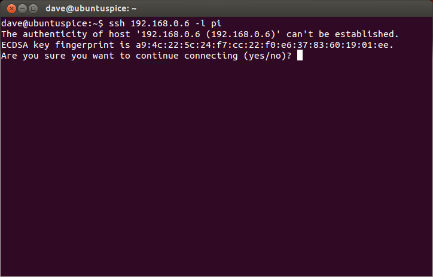
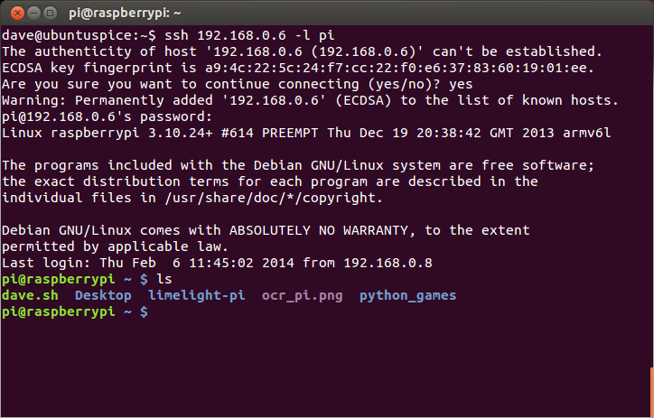

#SSH, Secure Shell Server

##Introduction

SSH is a host program that allows you to log into your Raspberry Pi over the network and execute commands remotely.  For example from a Windows, OSX or Linux PC/Laptop.  Ideal if you want to operate the Raspberry Pi without having a screen attached.

You can have the Raspberry Pi command prompt inside a window on another computer.  The Raspbian OS (amongst others) comes with a built in SSH server which makes this possible.

Don’t confuse this with a full remote desktop though, it just gives you the command prompt – no desktop (see [VNC](./vnc.md) if you need remote desktop).  If you were to type `startx` on the PC it wouldn’t work.  It only supports text based output and therefore is very fast.  However you can do things like install programs, move files around, write code, reboot the Pi etc.  Basically everything you would normally be able to do if you were using the command prompt on the Pi itself.

##Why should you use it?

If you’re following online resources you will, time and again, come across commands that need to be entered at the prompt.  You can either carefully type them out using the keyboard attached to the Pi or you can just copy and paste them into an SSH window on the same PC you’re working/reading on.

That then causes the command to be executed by the Raspberry Pi remotely.  In the long run it saves bags of time!

##Time
* 15 minutes

##Requirements
* A Local Area Network (LAN, Ethernet or Wireless)
* Raspberry Pi connected to the LAN
* SD card (with latest Raspbian installed)
* PC/Laptop connected to the LAN (Windows, OSX or Linux)
* Note: Using SSH works slightly differently depending upon the OS of the PC/Laptop

Below are separate instructions for Windows, OSX and Linux.

##Microsoft Windows (XP, Visa, 7 and 8)
On Windows you will need to download an SSH client program.  The most commonly used one is called PuTTY and can be downloaded from here: http://www.chiark.greenend.org.uk/~sgtatham/putty/download.html

Look for **putty.exe** under the heading **For Windows on Intel x86**.
It doesn’t have an installer package, it’s just a standalone exe file.  When you run it you’ll see the configuration screen below.

Type the IP address of the Pi into the **Host Name** field and click the Open button.  If nothing happens for a while when you click the Open button and eventually see a message saying **Network error: Connection timed out** it’s likely that you’ve entered the wrong IP address for the Pi.

If you don’t know the IP address just type `ifconfig` at the Raspberry Pi command prompt and the address is on the second line just after `inet addr`.  You can also look at the device list on your router if you’re running the Pi headless (without a screen).

When the connection works you’ll see this security warning (below), you can safely ignore it and click the Yes button.  You’ll only see this warning the first time when PuTTY connects to a Pi that it has never seen before.

You’ll now have the usual login prompt, login with the same username and password as you would use on the Pi itself.  The default login for Raspbian is `pi` with the password `raspberry`.

You should now have the Raspberry Pi prompt which will be identical to the one found on the Raspberry Pi itself.

`pi@raspberrypi ~ $ _`

A paste in PuTTY is done with a right click of the mouse, so try this now by copying and pasting the command below.  This will just tell you the CPU temperature of the Raspberry Pi.

`/opt/vc/bin/vcgencmd measure_temp`

You can type exit to close the PuTTY window.

The next time you use PuTTY look for the **Saved Sessions** section on the bottom half of the configuration screen.  If you use this I recommend switching to the *Connection* page in the left hand tree and setting the *Seconds between keepalives* value to 30.  Then switch back to the *Session* page in the tree before you click *Save*.  Using this setting allows you to leave a PuTTY window open for long periods of time with no activity and the Pi will not time out and disconnect you.

For further PuTTY documentation please visit this page: http://www.chiark.greenend.org.uk/~sgtatham/putty/docs.html

##Apple OS X (all versions)

Under OS X SSH is done using the terminal program.  To locate it first open the finder, then select *Applications* on the left and type in *terminal* in the search box on the right.  Perhaps create a shortcut to it in your Dock for future use.

Once you have the terminal open you need to run the `ssh` command specifying the IP address and login for the Raspberry Pi.

If you don’t know the IP address just type `ifconfig` at the Raspberry Pi command prompt and the address is on the second line just after `inet addr`.  You can also look at the device list on your router if you’re running the Pi headless (without a screen).

Copy and paste the following command into the terminal window but replace `<IP>` with the IP address of the Raspberry Pi.

*Command – V* to paste in the terminal.

`ssh <IP> -l pi`

The `-l` part means use the following login username, which we’re specifying as `pi`.

If you receive an `operation timed out` error it’s likely that you’ve entered the wrong IP address for the Raspberry Pi.

When the connection works you’ll see the security/authenticity warning below.

You will have to type *yes* to continue.  You’ll only see this warning the first time you connect to a Pi that it has never been seen by your Mac before.

Next you’ll be prompted for the password for the `pi` login, by default on Raspbian the password is `raspberry`.  You should now have the Raspberry Pi prompt which will be identical to the one found on the Raspberry Pi itself.

`pi@raspberrypi ~ $ _`

Try copying and pasting the command below.  This will just tell you the CPU temperature of the Raspberry Pi.  *Command – V* to paste.

`/opt/vc/bin/vcgencmd measure_temp`

You can type exit to close the connection to the Raspberry Pi and exit again to close the terminal window itself.  For further documentation on the ssh command just enter `man ssh` into the terminal.

##Ubuntu/Linux

Under Linux SSH is done using the terminal, either a terminal program from the desktop or from the pure command line itself.  Under the desktop interface a terminal program can be started from the Applications / Accessories menu (see below).

If you’re using Unity on Ubuntu you can also open the finder and just type in `term` and it will show at least one Terminal program that you can use.

Once you have the terminal open you need to run the `ssh` command specifying the IP address and login for the Raspberry Pi.

If you don’t know the IP address just type `ifconfig` at the Raspberry Pi command prompt and the address is on the second line just after `inet addr`.  You can also look at the device list on your router if you’re running the Pi headless (without a screen).

Copy and paste the following command into the terminal window but replace `<IP>` with the IP address of the Raspberry Pi.  *Ctrl – Shift – V* to paste in the terminal.

`ssh <IP> -l pi`

The `-l` part means use the following login username, which we’re specifying as pi.

If you receive a `command not found` error when you do this then it’s probably because there is no SSH client package installed.  You will need to install it before continuing.  On most Linux distributions the package name is `openssh-client` or `ssh-client`.

If you receive a `connection timed out` error it’s likely that you’ve entered the wrong IP address for the Raspberry Pi.

When the connection works you’ll see the security/authenticity warning below.

You will have to type *yes* to continue.  You’ll only see this warning the first time you connect to a Pi that it has never been seen by your PC/Laptop before.

Next you’ll be prompted for the password for the `pi` login, by default on Raspbian the password is `raspberry`.  You should now have the Raspberry Pi prompt which will be identical to the one found on the Raspberry Pi itself.

`pi@raspberrypi ~ $ _`

Try copying and pasting the command below.  This will just tell you the CPU temperature of the Raspberry Pi.  *Ctrl – Shift – V* to paste.

`/opt/vc/bin/vcgencmd measure_temp`

You can type exit to close the connection to the Raspberry Pi and exit again to close the terminal window itself.  For further documentation on the ssh command just enter `man ssh` into the terminal.
