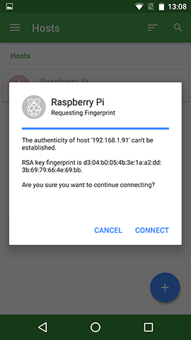

# SSH using Android

To use SSH on your mobile device you need to download a client. There are several different good quality clients available, such as [Termius](http://www.termius.com), [JuiceSSH](https://juicessh.com/), and [Connectbot](https://connectbot.org/). For this tutorial we will use Termius, because it is a popular cross-platform SSH client. The process will be similar for other clients. 


## 1. Add your Raspberry Pi as a host

Download Termius from [Google Play](https://play.google.com/store/apps/details?id=com.server.auditor.ssh.client), if you haven't installed it already. Click to open the app.

The app should open showing ‘No Hosts’. To get started, you should tap the blue `+` button in the lower left corner. Then tap ‘New Host’. 


Enter an `alias`, such as Raspberry Pi. Then enter the IP address under `hostname`. Fill in the `username` and `password` and hit the tick `✓` in the top right corner. 

If you do not know the IP address, type `hostname -I` in the command line on the Raspberry Pi. See [here](../ip-address.md) for more ways to find your IP address. The default login for Raspberry Pi OS is `pi` with the password `raspberry`.


## 2. Connect

When you have saved the new host, you will be sent back to the ‘Hosts’ screen. There, you will find the new entry. Make sure your mobile device has wireless connectivity turned on, and that it is connected to the same network as your Raspberry Pi.

Tap the new entry once. When the connection works, you will see a security warning. Don’t worry: everything is fine. Click ‘Connect’. You will only see this warning the first time Termius connects to a Pi that it hasn’t seen before.



You should now see the Raspberry Pi prompt, which will be identical to the one found on the Raspberry Pi itself.

```
pi@raspberrypi ~ $
```

You can type `exit` to close the terminal window.


If a dialogue saying `Connection failed Connecting to 192.xxx.xxx.xxx port 22` appears, it is likely that you have entered an incorrect IP address. If the IP address is correct, wireless connectivity on your mobile device might be turned off; the Raspberry Pi might be turned off; or the Raspberry Pi and your mobile device may be connected to different networks.


## 3. Modify an entry, troubleshooting, and more

A connection might be unsuccessful for various reasons. The most likely reasons are that your device or Raspberry Pi are [not connected properly](../../configuration/wireless/wireless-cli.md); [SSH is disabled](../../configuration/raspi-config.md); there is a typo in your code, or the IP address or credentials have changed. In the latter cases, you will need to update the host.

To do this, go to the Hosts screen, and tap and hold the relevant entry. In the top right corner, new functions will pop up. Tap the pencil icon. A new screen titled 'Edit Host' will appear.
