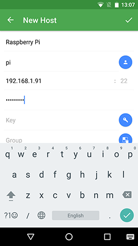
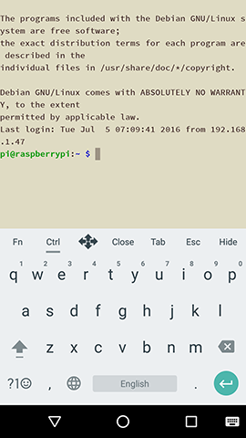

# SSH USING ANDROID

To use SSH on your mobile device you need to download a client. There are several different good quality clients available, such as [Serverauditor](http://www.serverauditor.com), [JuiceSSH](https://juicessh.com/), and [Connectbot](https://connectbot.org/). For the sake of this tutorial we'll use Serverauditor, because it's a popular cross platform SSH client. But the principle is similar and applicable to other clients as well. 


##1. Add your Raspberry pi as a host

Download Serverauditor from [Google Play](https://play.google.com/store/apps/details?id=com.server.auditor.ssh.client), if you haven’t installed it yet. And click to open the app.

The app should open showing ‘no hosts’. To get started, you should tap the blue + button in the lower left corner. Then tap ‘New Host’. 



Enter an `alias`, Raspberry Pi, for example. Then enter the IP address under `hostname`. Fill out the `username` and `password` and hit the tick (✓) in the top right corner. 

If you don't know the IP address just type `hostname -I` in the Raspberry Pi. See more [methods](../ip-address.md) of finding your IP address. The default login for Raspbian is `pi` with the password `raspberry`.


##2. Connect

After you’ve saved the new host, you’ll be sent back to the ‘Hosts’ screen. There you’ll find the new entry. Make sure your mobile device has Wi-Fi turned on and connected to the same network as your Raspberry Pi.

Tap the new entry once, when the connections works you’ll see a [security warning](http://www.lysium.de/blog/index.php?/archives/186-How-to-get-ssh-server-fingerprint-information.html). Don’t worry, everything is fine, click ‘Connect’. You’ll only see this warning the first time Serverauditor connects to a Pi that it hasn’t seen before.


You should now have the Raspberry Pi prompt which will be identical to the one found on the Raspberry Pi itself.

```
pi@raspberrypi ~ $
```

You can type `exit` to close the terminal window.



In case a dialogue saying `Connection failed Connecting to 192.xxx.xxx.xxx port 22` appears you’ve most likely entered a wrong IP address. Otherwise, Wi-Fi on your mobile device might be turned off, the Raspberry Pi might be turned off, or it's in a different network than your mobile device.


##3. Modify an entry, troubleshooting and more

A connection might be unsuccessful due to various reasons. Most likely your device or Raspberry Pi are [not connected properly](../../configuration/wireless/wireless-cli.md), [SSH is disabled](../../configuration/raspi-config.md), you might have made a typo, or the IP address or credentials have changed. In the latter cases, you need to update the host.

To do so, in the ‘Hosts’ screen, tap and hold the particular entry. In the top right corner, new functions will pop up. Tap the little pencil icon. A new screen titled ‘Edit Host’ will pop up.
