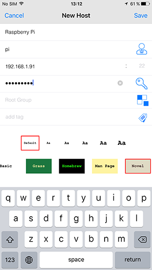
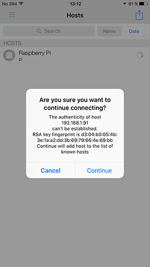
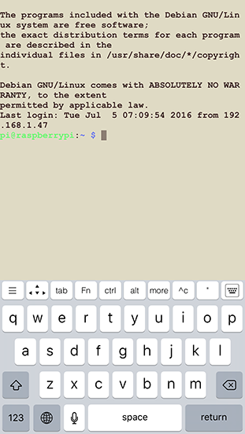

# SSH USING iOS

To use SSH on your mobile device you need to download a client. There are several good quality clients available, such as [Termius](http://www.termius.com) and [Prompt 2](https://panic.com/prompt/). 

For this tutorial we will use Termius, because it is a popular cross-platform SSH client. The process will be similar for other clients. 

## 1. Add your Raspberry Pi as a host.
Download Termius from [iTunes](https://itunes.apple.com/us/app/termius-ssh-shell-console/id549039908?mt=8), if you haven’t installed it yet. Click to open the app.

A prompt asking you to allow notifications will pop up. You should click ‘Allow’ (recommended). Now follow the instruction on the screen: `Start by adding a new host`. Tap `New Host` and a new window will pop up.



Enter an `alias`, such as ‘Raspberry Pi’. Then enter the IP address under `hostname`. Complete the `username` and `password` fields and hit ‘save’ in the top right corner. 

If you do not know the IP address, type `hostname -I` in the command line on the Raspberry Pi. See [here](../ip-address.md) for more ways to find your IP address. The default login for Raspberry Pi OS is `pi` with the password `raspberry`.


## 2. Connect

When you have saved the new host, you will be sent back to the ‘Hosts’ screen. There you will find the new entry. Make sure your mobile device has wireless connectivity turned on, and is connected to the same network as your Raspberry Pi.

Tap the new entry once. When the connection works, you will see a security warning. Don’t worry, everything is fine! Click ‘Continue’. You will only see this warning the first time Termius connects to a Raspberry Pi that it hasn’t seen before.




You should now have the Raspberry Pi prompt, which will be identical to the one found on the Raspberry Pi itself.

```
pi@raspberrypi ~ $
```

You can type `exit` to close the terminal window.



If a red exclamation mark appears, this indicates that something has gone wrong. Tap the exclamation mark to see the error description. ‘Connection establishment time out’ indicates that you have probably entered an incorrect IP address. If the IP address is correct, wireless connectivity on your mobile device might be turned off; the Raspberry Pi might be turned off; or the Raspberry Pi and your mobile device might be connected to different networks.

## 3. Modify an entry, troubleshooting, and more
A connection might be unsuccessful for various reasons. It is likely that your device or Raspberry Pi is [not connected properly](../../configuration/wireless/wireless-cli.md); [SSH is disabled](../../configuration/raspi-config.md); there is a typo in your code; or the IP address or credentials have changed. In the latter cases, you will need to update the host.

To do so, go to the ‘Hosts’ screen, swipe left on the host you need to edit, and new functions will appear. Tap edit. A new screen titled ‘Edit Host’ will pop up.
