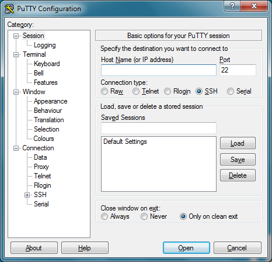
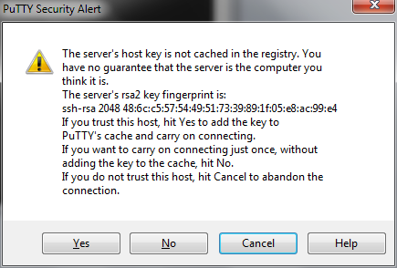
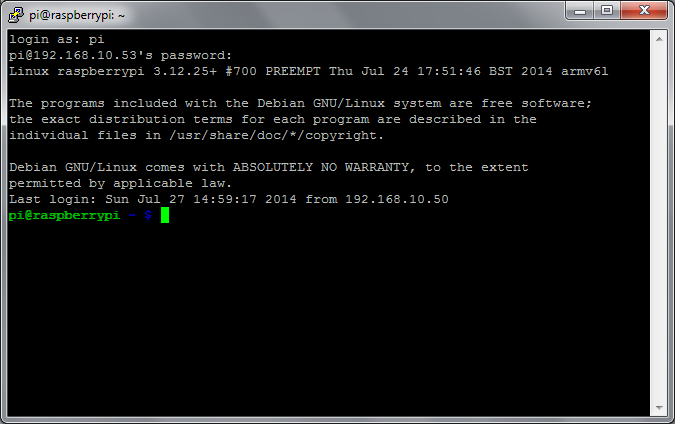

# SSH using Windows

Depending on the version of Windows you are using and what software you have already installed, you may need to download an SSH client. The most commonly used client is called PuTTY and can be downloaded from [greenend.org.uk](http://www.chiark.greenend.org.uk/~sgtatham/putty/download.html).

Look for `putty.exe` under the heading `For Windows on Intel x86`. 

## 1. Add your Raspberry Pi as a host
Start PuTTY.  You will see the configuration screen below:



Type the IP address of the Pi into the `Host Name` field and click the `Open` button. If nothing happens when you click the `Open` button, and you eventually see a message saying `Network error: Connection timed out`, it is likely that you have entered the wrong IP address for the Pi.

If you do not know the IP address, type `hostname -I` in the Raspberry Pi command line. There are more ways to find your IP address [here](../ip-address.md).

## 2. Connect
When the connection works you will see the security warning shown below. You can safely ignore it, and click the 'Yes' button. You will only see this warning the first time PuTTY connects to a Raspberry Pi that it has not seen before.



You will now see the usual login prompt. Log in with the same username and password you would use on the Pi itself. The default login for Raspberry Pi OS is `pi` with the password `raspberry`.

You should now have the Raspberry Pi prompt which will be identical to the one found on the Raspberry Pi itself.

```
pi@raspberrypi ~ $
```



You can type `exit` to close the PuTTY window.

## 3. Modification, troubleshooting, and more
Next time you use PuTTY, look for the `Saved Sessions` section in the bottom half of the configuration screen. If you use this, we recommend switching to the `Connection` page in the left hand tree, and setting the `Seconds between keepalives` value to `30`. Then switch back to the `Session` page in the tree before you click `Save`. Using this setting allows you to leave a PuTTY window open for long periods of time with no activity, without the Pi timing out and disconnecting you.

A connection might be unsuccessful for various reasons. It is most likely that your device or Raspberry Pi are [not connected properly](../../configuration/wireless/wireless-cli.md); [SSH is disabled](../../configuration/raspi-config.md); there is a typo in your code; or the IP address or credentials have changed. In the latter cases, you will need to update the host. For instructions on how to update a host, and for further PuTTY documentation, please see the [PuTTY docs](http://www.chiark.greenend.org.uk/~sgtatham/putty/docs.html).


