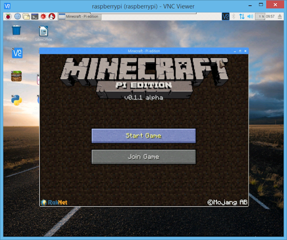

# VNC (Virtual Network Computing)

Sometimes it is not convenient to work directly on the Raspberry Pi. Maybe you would like to work on it from another device by remote control.

VNC is a graphical desktop sharing system that allows you to remotely control the desktop interface of one computer from another computer or mobile device. It transmits the keyboard and mouse, or touch, events from the controller, and receives updates to the screen over the network from the remote host.

You will see the desktop of the Raspberry Pi inside a window on your computer or mobile device. You'll be able to control it as though you were working on the Raspberry Pi itself.


By default, VNC® Server from RealVNC® gives you remote access to your Raspberry Pi's graphical desktop, as if you were sitting in front of it. 

However, you can also use VNC Server to gain visual remote access to your Pi if it headless or not running a graphical desktop, via a virtual desktop. See *Creating a virtual desktop* below. 

## Enabling VNC Server

Although VNC Server is included on the Raspberry Pi by default, you will need to enable it yourself. VNC Server will then start automatically whenever your Raspberry Pi is powered on.  

You can enable VNC Server graphically or via the command line:

### Enabling VNC Server graphically

- On your Raspberry Pi, boot into the desktop. 

- Select **Menu > Preferences > Raspberry Pi Configuration > Interfaces**. 

- Ensure **VNC** is **Enabled**. 

### Enabling VNC Server at the command line

You can enable VNC Server at  the command line using [raspi-config](../../configuration/raspi-config.md):

```bash
sudo raspi-config
```

Now, enable VNC Server by doing the following: 

- Navigate to **Advanced Options**.

- Scroll down and select **VNC > Yes**.

## Connecting to your Raspberry Pi with VNC Viewer

- On your Raspberry Pi (using Terminal or via SSH) use [these instructions](../ip-address.md) or run `ifconfig` to discover your private IP address. 

  If you have graphical access, you can alternatively double-click the VNC icon on your taskbar to open the VNC Server dialog:

  

- On the device you'll use to take control, download VNC Viewer. For best results, use the [compatible app](https://www.realvnc.com/download/viewer/) from RealVNC. 

- Enter your Pi’s private IP address into VNC Viewer. 

  **Note:** [Extra steps](../access-over-Internet/README.md) are required if you are connecting over the Internet.  

- Take control of your Pi, as if you were sitting in front of it. 

## Playing Minecraft and other directly rendered apps remotely

You can remotely access apps which use a directly rendered overlay, such as Minecraft, the text console, the Pi camera module, and more.



**Note:** Direct screen capture is an experimental feature. If you encounter problems, please [let RealVNC know](https://support.realvnc.com/Tickets/Submit/RenderForm). 

To turn this feature on:

- On your Raspberry Pi, open the VNC Server dialog. 

- Navigate to **More > Options > Troubleshooting** and select **Enable experimental direct capture method**.

- On the device you'll use to take control, run VNC Viewer and connect.

  **Note:** Existing connections must be restarted in order for these changes to take effect. 

If you are connecting from a desktop computer and experience problems controlling a Raspberry Pi app which uses a directly rendered overlay:

- On the keyboard of the device running VNC Viewer, press F8. Enable **Relative Pointer Motion** from the dropdown list.

- Control the app remotely.

- Disable **Relative Pointer Motion** when you have finished using the app.

  **Note:** You may need to [optimise your Raspberry Pi for direct capture](https://support.realvnc.com/knowledgebase/article/View/523).

## Creating a virtual desktop

If your Raspberry Pi is headless (not plugged into a monitor) or controlling a robot, it is unlikely to be running a graphical desktop.

VNC Server can create a *virtual* desktop, giving you visual remote access to a Pi running in this way. This virtual desktop exists only in your Pi’s memory.


To create and connect to a virtual desktop: 

- On your Raspberry Pi (using Terminal or via SSH), run `vncserver`. Make note of the IP Address/display number that VNC Server will print to your Terminal (e.g. `192.167.5.149:1`).

- On the device you will use to connect, enter this information into [VNC Viewer](https://www.realvnc.com/download/viewer/).

To destroy a virtual desktop, run the following command: 

```bash
vncserver -kill :<display-number>
```

This will also stop any existing connections to this virtual desktop. 
