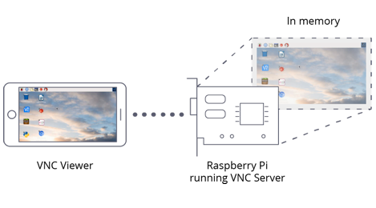

# VNC

VNC allows you to use a computer's graphical desktop remotely, on another computer or mobile device. This means you can access the graphical desktop of your Raspberry Pi even if you don't have a screen connected to it.


VNC Connect from [RealVNC](realvnc.com) is included with Raspberry Pi OS. It consists of both VNC Server, which allows you to control your Raspberry Pi remotely, and VNC Viewer, which allows you to control other computers remotely from your Raspberry Pi.

VNC Server can operate in two different ways on the Raspberry Pi. The standard method, called *service mode*, allows remote access to a display which is enabled on the Raspberry Pi itself: you will be unable to connect if there is no display enabled. A second method is to instead use a *virtual desktop*: a graphical desktop is created in memory, and remote devices connect to this.

## Install VNC

VNC Server is already installed on the standard Raspberry Pi OS image; VNC Viewer can be installed using `Recommended Software` from the `Preferences` menu. You can also install both from the command line as follows:

```bash
sudo apt update
sudo apt install realvnc-vnc-server realvnc-vnc-viewer
```


## Service mode

In this mode, VNC Server will attach to a display which is enabled on the Raspberry Pi itself: remote access to the graphical desktop will be permitted. Note that some Raspberry Pis do not have a display enabled unless a screen is attached.

If you need to change the resolution of the graphical desktop, from the menu choose `Preferences` and click on `Screen Configuration`. You can also use the command line tool `raspi-config`.

### Enable VNC Server

#### Using the graphical desktop

On your Raspberry Pi, VNC Server can be enabled as follows:

- Boot into the graphical desktop
- From the menu, point to `Preferences` and click on `Raspberry Pi Configuration`
- In the `Raspberry Pi Configuration` tool, click the `Interfaces` tab
- Find the entry for VNC and ensure that `Enabled` is selected

#### At the command line

You can enable VNC Server at the command line using [raspi-config](../../configuration/raspi-config.md):

```bash
sudo raspi-config
```

Within `raspi-config`, enable VNC Server as follows:

- Navigate to `Interfacing Options`

- Scroll down and choose `VNC`, then  `Yes`

The VNC system service is named `vncserver-x11-serviced`.


## Virtual desktop mode

In this mode, VNC Server will create a graphical desktop in the memory of the Raspberry Pi, rather than being attached to the display. This allows you to use the graphical desktop of the Pi without having its display enabled.



A virtual desktop can be created on the Raspberry Pi as follows:

- At the command line, run `vncserver`
- Make a note of the IP address and display number shown, for example `192.168.5.25:1` indicates IP address 192.168.1.215 and display number 1

You can now connect to this virtual desktop using VNC Viewer from another device, using the IP address and display number. For a list of `vncserver` options, use the command `vncserver -help`.

When you are finished using the virtual desktop, it can be removed from memory using the following command:

```bash
vncserver -kill :<display-number>
```

This will also stop any existing connections to the virtual desktop. Be sure to save any files you might have open before you issue this command.

You can also use the `vncserver-virtuald` system service to enable access to the virtual desktop.


## Connect to your Raspberry Pi

There are two ways to connect to your Raspberry Pi using VNC Viewer. You can use either or both, depending on what works best for you.

### Direct connection

Direct connections are quick and simple, provided you're joined to the same private local network as your Raspberry Pi. For example, this might be a wired or wireless network at home, at school, or in the office.

- On your Raspberry Pi (using a terminal window or via SSH) use [these instructions](../ip-address.md) or run `ifconfig` to discover your private IP address

- On the device you'll use to take control, download VNC Viewer. For best results, use the [compatible app](https://www.realvnc.com/download/viewer/) from RealVNC

- Enter your Raspberry Pi's private IP address into VNC Viewer:

  

### Cloud connection

You are entitled to use RealVNC's cloud service for free, provided that remote access is for educational or non-commercial purposes only.

Cloud connections are convenient and encrypted end-to-end. They are highly recommended for connecting to your Raspberry Pi over the internet. There's no firewall or router reconfiguration, and you don't need to know the IP address of your Raspberry Pi, or provide a static one.

- Sign up for a RealVNC account [here](https://www.realvnc.com/raspberrypi/#sign-up): it's free and it only takes a few seconds.

- On your Raspberry Pi, sign in to VNC Server using your new RealVNC account credentials:

  

- On the device you'll use to take control, download VNC Viewer. You **must** use the [compatible app](https://www.realvnc.com/download/viewer/) from RealVNC.

- Sign in to VNC Viewer using the same RealVNC account credentials, and then either tap or click to connect to your Raspberry Pi:

  

### Authenticating to VNC Server

To complete either a direct or cloud connection, you must authenticate to VNC Server. 

If you're connecting from the [compatible VNC Viewer app](https://www.realvnc.com/download/viewer/) from RealVNC, enter the user name and password you normally use to log in to your user account on the Raspberry Pi. By default, these credentials are `pi` and `raspberry`.

If you're connecting from a non-RealVNC Viewer app, you'll first need to downgrade VNC Server's authentication scheme, specify a password unique to VNC Server, and then enter that instead.
* If you are in front of your Raspberry Pi and can see its screen, open the VNC Server dialog on your Raspberry Pi, select `Menu` > `Options` > `Security`, and choose `VNC password` from the `Authentication` dropdown.
* **Or** if you're configuring your Raspberry Pi remotely from the command line, then to make the changes for Service Mode (the default configuration for the Raspberry Pi):
  * Open the `/root/.vnc/config.d/vncserver-x11` config file.
  * Replace `Authentication=SystemAuth` with `Authentication=VncAuth` and save the file.
  * On the command line, run `sudo vncpasswd -service`. This  will prompt you to set a password, and will insert it for you in the right config file for VNC Server running in Service Mode.
  * Restart VNC Server.


## Playing Minecraft and other directly rendered apps remotely

You can remotely access apps which use a directly rendered overlay, such as Minecraft, the text console, the Raspberry Pi Camera Module, and more.


To turn this feature on:

- On your Raspberry Pi, open the VNC Server dialog. 

- Navigate to `Menu` > `Options` > `Troubleshooting` and select `Enable experimental direct capture mode`.

- On the device you'll use to take control, run VNC Viewer and connect.

  **Note:** existing connections must be restarted in order for these changes to take effect.

Please note that direct screen capture is an experimental feature. If you're connecting from a desktop computer and mouse movements seem erratic, try pressing `F8` to open the VNC Viewer shortcut menu and selecting `Relative Pointer Motion`.

If performance seems impaired, try [these troubleshooting steps](https://www.realvnc.com/docs/raspberry-pi.html#raspberry-pi-minecraft-troubleshoot), or ask for help on the [Raspberry Pi Forums](https://www.raspberrypi.org/forums/).
